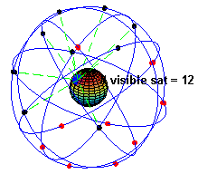
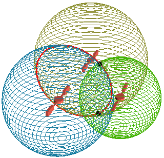
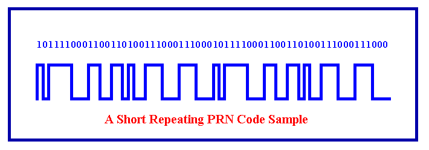

Les GPS sont ces appareils "magiques" apparus il y a 15 ans sur les bateaux, puis sur les avions, les voitures de luxe, les taxis et les camions il y a 5 ou 6 ans, et qui se répandent maintenant dans les voitures et les téléphones voire les appareils photos.

Bref, ça n'épate plus personne de savoir où on est à quelque mètres près dans une ville inconnue et d'être dirigé vers son hôtel de façon fiable par une douce voix féminine qui reste parfaitement calme même si on ne suit pas le chemin tracé. Mais si on sait comment ça marche, le GPS apparait comme l'une des 7 merveilles du monde technologique\*

Ce premier article présente la partie "Satellites et Signaux" de cette extraordinaire réalisation .

Le principe est tout simple : 24 satellites tournent autour de la Terre sur des orbites précises, en faisant "bip-bip". En tout point de la planète, on peut recevoir les signaux de 6 à 10 satellites.

On pourrait se dire que 3 satellites suffisent:

- si on sait quels satellites ont émis les bips reçus, on peut savoir où ils se trouvent sur leur orbite
- et si on sait combien de temps le "bip" à mis pour aller du satellite à l'endroit où on se trouve à la vitesse de la lumière

alors on sait qu'on se trouve à l'intersection de 3 sphères centrées sur les satellites, et dont les rayons correspondent à la distance parcourue par chaque "bip", et il n'y a que 2 tels points, dont l'un n'est probablement pas à la surface de la Terre, donc nous nous trouvons à l'autre.

La principale difficulté et de mesurer avec une grande précision le temps mis par les bips pour parcourir la distance entre le satellite et le récepteur.

Certaines pages du web prétendent que les signaux émis par les 3 satellites contiennent l'heure exacte de l'émission. C'est faux et ça serait inutile, car il faudrait aussi une horloge ultra précise au récepteur. Les satellites sont effectivement équipés d'horloges atomiques ultra précises, mais il serait beaucoup trop cher d'en mettre dans chaque récepteur.

Le truc, c'est de tenir compte d'un quatrième satellite et de calculer l'intersection de 4 sphères au lieu de 3, mais dans l'[espace à 4 dimensions](/2007/02/07/le-temps-une-4eme-dimension-imaginaire/), en tenant compte du temps : il n'existe qu'un seul endroit à un seul moment extrêmement précis où les décalages entre les bips des 4 satellites donnés peuvent correspondre aux mesures. Le GPS fournit donc non seulement la position géographique, mais aussi l'heure exacte en prime.

Reste encore quelques petits détails techniques à résoudre.

D'abord, les bips-bips doivent être reconnaissables, pour qu'on sache quel satellite l'a émis. On pourrait les émettre sur 24 fréquences différentes, mais ça ferait des récepteurs compliqués. Donc ils sont tous émis sur la même fréquence, mais alors ils doivent être clairement distincts : des bip-bips, des bop-bops, des bap-baps etc.

Ensuite, le satellite émet avec une puissance de 25W qui arrose presque la moitié de la surface de la Terre. Sur Terre, un récepteur reçoit 0.000178 pW . \[pW\] c'est "picoWatt", un millième de milliardième de Watt, la puissance d'un muscle de puceron. Cette puissance reçue est 45 fois inférieure (16 décibels) à la puissance du bruit thermique dans la gamme de fréquence du GPS. Pour éviter d'avoir à détecter des "bip-bips" minuscules noyés dans un CHCHCHCHCHCHCHCH continu, il y avait une solution : mettre sur chaque GPS une douzaine d'antennes paraboliques de 1m de diamètre, motorisées et tourniquant dans tous les sens pour suivre les satellites.

Les concepteurs du GPS ont trouvé une solution heureusement plus simple et carrément géniale. Ils se sont dit qu'en fait, la seule information qui devait réellement être transmise depuis les satellites, c'était une horloge. Un "tic-tac" plutôt qu'un "bip-bip". Et pour que le récepteur puisse distinguer les "tic-tacs" des différents satellites, chaque horloge est émise sous forme d'un "signal binaire pseudo-aléatoire" différent, une suite de 0 et de 1 comme celle-ci par exemple :

Le récepteur reçoit une dizaine de tels signaux superposés, décalés et noyés dans du bruit. Comment débrouiller tout ça ? "Facile" : en générant des signaux identiques dans le récepteur et en tentant de les "corréler" avec celui qu'on reçoit de l'espace. La corrélation consiste à comparer les bits qu'on a cru reconnaitre dans le bruit avec ceux générés dans le récepteur, puis à décaler légèrement le signal généré et à recommencer. Si pour un certain décalage on trouve un nombre statistiquement significatif de bits correspondants, on sait:

1. que l'on reçoit effectivement le signal du satellite dont la séquence pseudo aléatoire correspond à celle recréée dans le récepteur
2. que l'on a synchronisé l'horloge du récepteur avec celle du satellite.

Tout ceci prend un peu de temps, c'est pourquoi un GPS peut mettre plusieurs minutes à s'initialiser à la mise sous tension. Il peut aussi perdre un peu la boule quelques secondes lorsqu'un satellite disparait à l'horizon, avant d'en retrouver un autre, c'est pourquoi la plupart des GPS modernes sont capables de suivre 5,6,7 satellites voire plus et de choisir ceux donnant le meilleur signal voire de les combiner pour améliorer la précision de la mesure.

Mais tant que le récepteur peut identifier 4 satellites et les décalages entre leurs signaux, il peut :

- déterminer l'heure exacte
- consulter la position des satellites sur leur orbite grâce à une tabelle interne,
- calculer la position de l'observateur à la surface de la terre (latitude et longitude)
- et éventuellement son altitude, pour un avion ça peut servir.

Génial, non ?

### Références:

1. [Global Positioning System](w:Global_Positioning_System) sur la Wikipedia
2. le [GPS](http://www.meynet.ch/doc_GPS/gps.html), une page très complète sur le sujet
3. le [GPS du Mathématicien](http://web.me.com/rouxjeanbernard/Site/AM/html/amch53.html), avec formules et code Matlab
4. ["dBm" sur Answers.com](http://www.answers.com/topic/dbm)
5. [GPS explained : Runtime measurements of the Signals](http://www.kowoma.de/en/gps/signals_runtime.htm)

Note\* : pour rappel, les autres merveilles du monde technologique sont le [microprocesseur](/tags/informatique/), le télescope [Hubble](/tags/hubble/), le [LHC](/tags/LHC/) du CERN, [internet](/tags/internet/), [l'hélicoptère](/2009/07/11/comment-vole-un-helicoptere/) et le [laser](/tags/laser/).
