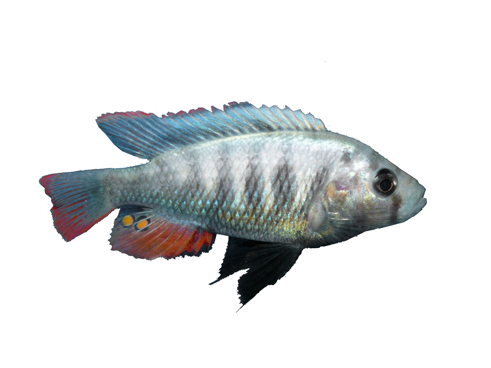
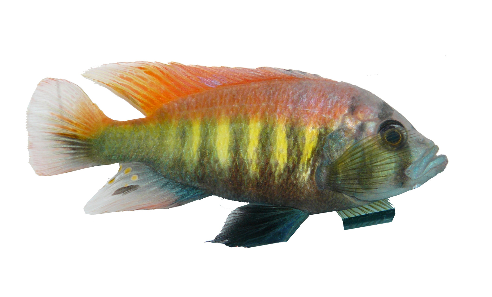

Les [cichlidés](w:) sont une famille regroupant environ 1200 espèces de poissons d'eau douce aux formes et couleurs très variées, très appréciées des aquariophiles.

L'équipe de Ole Seehausen, biologiste à l'Institut de recherche de l'eau [Eawag](http://www.eawag.ch/index) et à l'Université de Berne et vient de publier un article dans "Nature" \[1\] montrant que les femelles de cichlidés du lac Victoria dont les yeux perçoivent mieux le bleu recherchent plutôt des mâles bleus pour l'accouplement, et que les femelles dont les récepteurs sont plus sensibles à la partie rouge du spectre choisissent des mâles arborant une parure nuptiale à dominante rouge.

Or la sensibilité des yeux des poissons varie en fonction de la profondeur d'eau à laquelle ils évoluent : les femelles d'eau profonde voient mieux le rouge que leurs cousines de surface, qui perçoivent mieux le bleu.

De ce fait, les mâles ont évolué dans le même sens: les eaux profondes sont dominées par ceux qui arborent des couleurs nuptiales rouges tandis que les mâles à couleur bleue prennent l'avantage près de la surface.

Ainsi, lorsque le spectre lumineux ne se modifie que lentement avec la profondeur, le long d'une berge en pente douce par exemple, il y a ainsi suffisamment de place pour qu'une "niche écologique" permette à des poissons de se distinguer de leurs voisins suffisamment pour définir une nouvelle espèce !  

En bref, cette étude montre comment quelques gènes liés à la perception des couleurs peut s'amplifier au point de générer une grande variété d'espèces multicolores et magnifiques.

Sources:

1. Seehausen O., Y. Terai, I.S. Magalhaes, K.L. Carleton, H. Mrosso, R. Miyagi, I. van der Sluijs, M.V.Schneider, M.E. Maan, H. Tachida, H. Imai & N. Okada: Speciation through sensory drive in cichlid fish. _Nature, 2008
2. [De nouvelles espèces grâce à des différences de vue](http://www.admin.ch/aktuell/00089/index.html?lang=fr&msg-id=21744) ([version anglaise](http://www.eawag.ch/medien/bulletin/20081001/index_EN))
