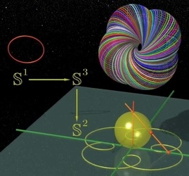



"[Dimensions](http://www.dimensions-math.org/Dim_fr.htm)" est un film sur la géométrie et en particulier sur la notion clé de dimension.

Diffusé sous licence "Creative Commons" et donc disponible gratuitement, vous pouvez soit le [télécharger](http://www.dimensions-math.org/Dim_download.htm) soit le regarder directement [en ligne](http://www.dimensions-math.org/Dim_regarder.htm).

"[Dimensions](http://www.dimensions-math.org/Dim_fr.htm)"  est divisé en 9 chapitres permettant d'aborder progressivement des notions de plus en plus avancées.

- Ca [commence très simplement](http://www.dimensions-math.org/Dim_CH1.htm) avec la cartographie et la notion de projection : comment représenter la sphère terrestre sur un plan
- On [poursuit](http://www.dimensions-math.org/Dim_CH2.htm) avec Escher, artiste géomètre ([que j'adore](http://3dmon.wordpress.com/2007/05/19/escher/)) et [FlatLand](w:), qui permet d'illustrer la notion de dimension supérieure en décrivant ce que verraient des êtres à 2 dimensions si un objet à 3 dimensions traversait leur univers.
- Les chapitres 3 et 4 présentent la 4ème dimension d'une façon plus complète et mieux illustrée que [je l'ai fait](/2007/02/06/voir-en-4-dimensions/). J'y ai surtout appris l'existence d'un illustre compatriote de plus : [Ludwig Schläfli](w:Ludwig_Schläfli) et découvert la puissance insoupçonnée de la projection stéréographique.
- Les nombres complexes font l'objet des [chapitres 5 et 6](http://www.dimensions-math.org/Dim_CH5.htm), peu intéressants si vous maitrisez déjà le sujet. Dans ce cas sautez au milieu du chapitre 6 ou on présente les transformations, puis la "dynamique holomorphe" qui donne naissance aux célèbres fractales de Julia et Mandelbrot, entre autres.
- Les [chapitres 7 et 8](http://www.dimensions-math.org/Dim_CH7.htm) présentent quelques notions de topologie, dont la fibration de Hopf. Là par contre, le contenu est très dense, il faudra que je revoie ce sujet au ralenti pour pouvoir prétendre avoir tout compris... Heureusement, j'ai pu me raccrocher aux [Cercles de Villarceau](w:) et aux [Cyclides de Dupin](w:en:Dupin_cyclide)
- Le [dernier chapitre](http://www.dimensions-math.org/Dim_CH9.htm) est un peu particulier : il traite de la preuve en mathématiques et démontre de façon illustrée mais rigoureuse la propriété essentielle de la projection stéréographique : elle transforme un cercle tracé sur la sphère, qui ne passe pas par le pôle nord en un cercle tracé dans le plan tangent au pôle sud.

"[Dimensions](http://www.dimensions-math.org/Dim_fr.htm)" est un film très instructif et bien fait, à voir pour réviser vos bases de géométrie ou pour les développer un peu.
