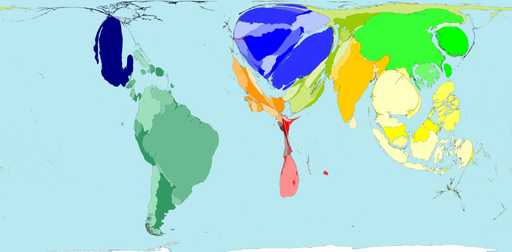

[Worldmapper.org](http://www.worldmapper.org/) fournit [plus de 360 cartes](http://www.worldmapper.org/atozindex.html) du "monde comme vous ne l'avez jamais vu" telles que celle-ci par exemple:

Ces cartes représentent des valeurs statistiques sur les pays en modifiant proportionnellement la surface des territoires concernés. Sur celle-ci dessus, c'est la proportion du PIB dévolu au service de la dette publique en 2002 qui est représenté.

On y voit par exemple que l'Afrique est beaucoup moins endettée que l'Europe de l'Est, et que la dette publique des USA , monstrueuse en chiffres absolus, ne l'est pas tant que ça...

Chaque carte est également disponible sous forme d'un poster au format pdf incluant des explications, idéal pour l'enseignement, à condition de lire l'anglais...

source: [information aesthetics](http://infosthetics.com/), un blog à suivre si vous vous intéressez à la représentation des données et la communication visuelle.

voir aussi : [NationMaster.com](http://www.nationmaster.com/index.php), le meilleur site de statistiques nationales
