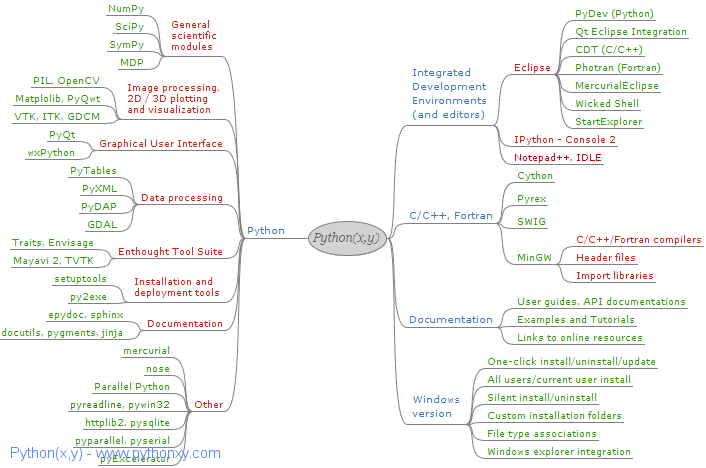

[Python](http://www.python.org/) est un langage très puissant, mais livré dans un état un peu brut. Pour l'exploiter de façon efficace, il faut y ajouter des libraires graphiques, de calcul spécialisé ou d'accès à des bases de données par exemple. Certaines ne sont que des interfaces vers des librairies en C ou C++, ce qui implique souvent des étapes d'installation, voire de compilation. De plus on se heurte souvent à des conflits de version entre les librairies et Python lui-même, ce qui ne simplifie pas les choses. Enfin et surtout, un bon IDE (Environnement de Développement Intégré, à l'envers en anglais...) est indispensable pour programmer au XXIème siècle.

[Python(x,y)](http://code.google.com/p/pythonxy/) résout tout ces problèmes en proposant un installeur unique de la Parfaite Panoplie du Petit Programmeur Scientifique. Elle inclut:

- [Python](http://www.python.org/), évidemment (version 2.5.2 actuellement)
- [Eclipse](http://www.eclipse.org/), le meilleur IDE de la Galaxie. Concu initialement pour Java, Eclipse permet de développer dans pratiquement tous les langages connus à l'aide de plugins. [PyDev](http://pydev.sourceforge.net/) est celui qui supporte Python.
- [MinGW](http://www.mingw.org/), le "Minimalist GNU for Windows" qui comprend le célèbre compilateur C++ "GCC". Grâce au plugin Eclipse [CDT](http://www.eclipse.org/cdt/) également fourni, Python(x,y) est donc en même temps un environnement de développement C++ très complet
- [PyQt](http://www.riverbankcomputing.co.uk/software/pyqt/intro) pour exploiter [Qt](http://qt.nokia.com/products), le framework d'applications multiplateforme de Nokia. Intégré à Eclipse, l'ensemble permet de créer des GUI (Interfaces Utilisateur Graphiques, à l'envers en anglais)
- une myriade de librairies scientifiques pour le traitement du signal et d'images, le calcul symbolique, la visualisation graphique 2D et 3D, le calcul parallèle etc. La liste complète est [ici](http://code.google.com/p/pythonxy/wiki/StandardPlugins) et le tout est résumé dans ce beau "mind map" :

Un avantage non négligeable de Python(x,y) est qu'elle est une oeuvre de Pierre Raybaut. Je ne le connais pas, mais c'est un français, donc toute la documentation et le support de la distribution sont dans la langue de Molière.

Que vous vouliez vous initier à Python, simplement utiliser des libriaires qui vous donneront accès à un équivalent de Matlab ou vous lancer dans le développement d'une grosse application Python, je ne peux que vous recommander chaudement d'installer Python(x,y)
