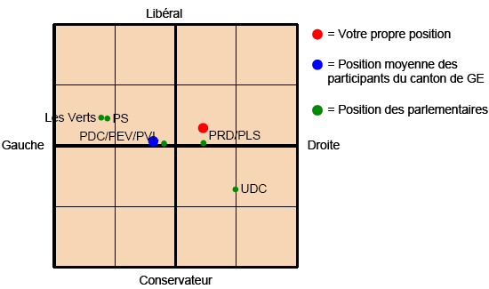

[La version 2008](http://www.vimentis.ch/umfrage/?ref2=c661989f3f) du désormais traditionnel sondage politique organisé par les principaux partis suisse est lancée. Par rapport à [l'année passée](http://drgoulu.local/2007/10/29/perspective-suisse-2007-et-2006/), les questions me semblent mieux posées et moins tendancieuses, à l'exception de “_Dans les écoles à fort taux de criminalité, la présence policière est augmentée._” qui est encore présente cette année, à ma grande stupéfaction.

Ce qui me frappe dans l'édition 2008, c'est la fréquence du mot "interdit". Que l'on parle de l'accès des mineurs à l'alcool, de l'achat de bagnoles gourmandes ou de nombreux autres sujets, les solutions envisagées partagent ce mot : interdit. Quand on trouve un "encouragement", il laisse un petit goût amer : _"Pour encourager l’économie d’énergie, la confédération prélève une taxe sur l’électricité d'une 20% du prix initial."_ ...

Une question intéressante dont je me réjouis de voir les résultats analysés et la suivante:

_Une personne mariée, sans enfant et salariée avec un revenu annuel de 100 000 francs paie en Suisse 12 300 francs (= 12,3%) en moyenne d’impôts sur le revenu (impôts fédéraux, cantonaux et communaux compris) par an._ (note pour les non Suisses : c'est un salaire "normal" pour une personne avec une formation universitaire)

- _Combien d’impôts sur le revenu (impôts fédéraux, cantonaux et communaux compris) une personne avec 60 000 francs de revenus annuels doit-elle verser? (indiquer un nombre absolu ou un pourcentage)_ (c'est pratiquement le SMIC en Suisse...)
- _Combien d’impôts sur le revenu (impôts fédéraux, cantonaux et communaux compris) une personne qui perçoit 500 000 francs de revenus annuels doit-elle verser? (indiquer un nombre absolu ou un pourcentage)_ (un bon médecin ou avocat, un directeur de PME ...)

Un certain nombre de questions concernent la "concurrence fiscale", et sur ce sujet je suis surpris que la méthode genevoise ne se généralise pas en Suisse et ne s'étende pas aux cantons. A Genève, nous payons la moitié de nos impôts communaux dans la commune de résidence, et l'autre moitié dans la commune où l'on travaille. Ceci évite, ou limite, l'apparition de banlieues (trop) chics et de zones (trop) défavorisées tout en finançant le développement des infrastructures citadines. Genève avait tenté sans succès de taxer les milliers de vaudois domiciliés dans les communes "frontalières". Peut-être que si Zürich faisait de même avec ses schwytzois on ràduirait certains écarts artificiels...

Impôts toujours : il semble qu'il y ait quelques idées dans l'air concernant la simplification des calculs et des déclarations. C'est pas trop tôt. Mais la vraie bonne idée qui manque c'est celle ci : **une déclaration unifiée pour toute la Suisse**, puis chaque canton + confédération fait son petit calcul d'apothicaire spécifique sur cette même base. Les gens qui ont un bout de chalet dans un autre canton en ont vraiment marre de remplir 3 déclarations.

Bref, si vous habitez la Suisse, [participez à cet important sondage](http://www.vimentis.ch/umfrage/?ref2=c661989f3f). En prime, en indiquant votre adresse e-mail vous recevrez un petit résumé des résultats déjà disponibles avec votre positionnement [politique sur 2 dimensions](http://drgoulu.local/2007/08/24/politique-a-2-dimensions/), la meilleure manière de comprendre la politique pour un scientifique. Mon profil est là :

Tiens, je suis noté plus à droite que la denière fois... ça doit être parce que je m'interdis d'interdire ...
