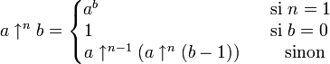

Quel est le plus grand nombre entier que vous pouvez exprimer ? neuf milliards de milliards de milliards de (répéter quelques fois) milliards ? C'est un bon début, mais chaque "milliards de" n'ajoute que 9 zéros au nombre mais vous coute 12 lettres. Cherchez plus grand et plus court, disons en 5 caractères maximum.

99^99, où ^ signifie "à la puissance", est déjà mieux : ça donne un nombre de 197 chiffres. Mais on peut faire beaucoup mieux : 9^9^9 donne un nombre monstrueux \[_à condition de considérer que 9^9^9 signifie 9^(9^9) et non (9^9)^9_ \] de 387'420'489 chiffres

> ( J’ai trouvé une merveilleuse démonstration de cette proposition. Mais la marge est trop étroite pour la contenir. DrG et [PdF](w:Dernier_théorème_de_Fermat#énoncé_de_Fermat))

A priori, de tels nombres n'ont aucune utilité : ils sont beaucoup [plus grands que le nombre de particules dans l'Univers](http://yoda.guillaume.pagesperso-orange.fr/N10P6/N10P20.htm) mais pourraient être intéressants tout de même :

> Le problème avec les entiers est que nous avons seulement examiné les plus petits. Il se pourrait que les choses les plus extraordinaires arrivent pour des entiers réellement grands, ceux que l'on ne peut appréhender ou qu'on n'a simplement pas commencé à concevoir de manière très précise

Ces mots sont de [Ronald Graham](w:), le mathématicien détenant le record du plus grand nombre entier utilisé dans une démonstration mathématique, le [nombre de Graham](w:). C'est la plus petite solution connue d'un problème apparemment simple, mais ce nombre est si extraordinairement grand qu'un ordinateur de la taille de l'Univers n'arriverait pas à le stocker en mémoire. Pourtant il figure (presque) en noir sur blanc dans la démonstration de Graham, qui utilise une notation mathématique adaptée.

Les "[puissances itérées de Knuth](w:Notation_des_puissances_itérées_de_Knuth)" consistent à généraliser la progression entre les opérateurs considérés comme des itérations :

- l'addition a+b est équivalente à b incrémentations : a+b=a+1+1+...+1+1 avec b "+1"
- la multiplication a.b est équivalente à b additions : a.b=a+a+ ... +a avec b "a"
- l'élévation à la puissance a^b est équivalente à b multiplications : a^b=a.a. ...a avec b "a"
- ensuite, Knuth définit l'opérateur ↑↑ ainsi : a↑↑b est équivalent à b élévations successives à la puissance a : a↑↑b=a^a^a...^a, avec b-1 "^a". Avec cette notation, notre 9^9^9 se note 9↑↑2, un nombre minuscule à côté de 9↑↑9, lui même ridicule comparé à 9↑↑99 qui tient en 5 caractères aussi ...
- On peut continuer en définissant a↑↑↑b = a↑↑a↑↑a↑↑...↑↑a avec b-1 "↑↑a". Cet opérateur permet d'écrire les 5 caractères 9↑↑↑9, un nombre absolument titanesque. (_qui arrivera à déterminer sa taille ?_)
- Et évidemment, on peut continuer ainsi à l'infini en ajoutant des flèches, ou plus simplement définir un opérateur généralisé ↑n ainsi: 

Outre sa beauté, cette généralisation des opérateurs mathématiques courants semble redoutablement puissante pour écrire de très très grands nombres.

Pourtant, nos amis mathématiciens ont éprouvé le besoin de manipuler des nombres encore plus grands de façon encore plus compacte et ont inventé la [flèche chaînée de Conway](w:) :

- la chaîne notée a→b→n est équivalente à a↑nb. Par exemple, notre 9^9^9 se note 9→9→2. Donc avec 5 caractères toujours, on peut écrire 9→9→9, un nombre colossalement plus grand.
- pour n=1, on ne note pas le 3ème terme de la chaîne et on retrouve l'exponentiation usuelle : 9→9=9^9
- mais on peut aussi allonger la chaîne. Les chaines de longueur 4 ou plus permettent de manipuler des nombres encore plus grands à l'aide règles bien définies.

Concluons en revenant au [nombre de Graham](w:) . Il est défini comme le 64ème élément de la suite

4, 3↑↑↑↑3,3↑(3↑↑↑↑3)3, 3↑s33,..., 3↑s(n-1)3, ... dans laquelle chaque élément donne le nombre de flèches dans l'élément suivant. Le 64ème élément a des milliards de milliards ... de milliards de flèches. On ne sait pas directement l'écrire en chaîne de Conway, mais on sait que G est compris entre 3→3→64→2 < G < 3→3→65→2

Plutôt compact pour des nombres qui n'ont pas beaucoup de chiffres à envier à l'infini ...

### sources :

- [Ronald Graham et les mathématiques discrète](http://mathblogger.free.fr/index.php?entry=entry081031-100125) sur le Blog à Maths
- [Notation des puissances itérées de Knuth](w:) sur Wikipedia
- [Flèche chaînée de Conway](w:) sur Wikipedia
- [Factoids : big numbers](http://www-users.cs.york.ac.uk/%7Esusan/cyc/b/big.htm "http://www-users.cs.york.ac.uk/~susan/cyc/b/big.htm")
- [Robert Munafo's Large Numbers](http://www.mrob.com/pub/math/largenum.html "http://www.mrob.com/pub/math/largenum.html")
