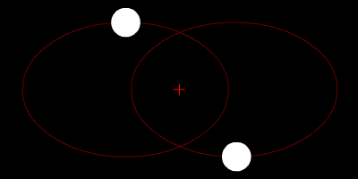

Le "problème à N corps" consiste à déterminer le mouvement de N masses sous l'effet des forces d'attraction gravitationnelles entre elles.

Pour N=2, Newton savait déjà que les [deux corps](w:Problème_à_deux_corps) décrivent des ellipses autour de leur centre de gravité commun.

Pour N=3, [Poincaré avait découvert que les trajectoires des corps pouvaient être "chaotiques"](http://www.astrosurf.com/rondi/3c/historique.htm) : une toute petite différence dans les positions et vitesses initiales des corps pouvait causer de très importantes différences dans la trajectoire des corps. Cependant, malgré ce que beaucoup croient, il existe une solution analytique au problème des trois corps découverte en 1909 par [Karl Sundman](w:Karl_Sundman). Elle n'est cependant pas utilisable en pratique pour des calculs.

Pour plus de 3 corps, il n'existe pas de solution analytique. Ceci signifie entre autres qu'il n'est pas possible de démontrer la stabilité d'un système avec quelques corps, comme le Système Solaire par exemple. Des mathématiciens comme [Laplace](w:Pierre-Simon_Laplace) ou [Lyapunov](w:Alexandre_Liapounov) s'y sont cassés les dents : rien ne prouve que les planètes suivront toujours leurs orbites actuelles dans quelques centaines de millions d'années. Encore moins qu'un astéroïde viennent percuter notre belle planète beaucoup plus tôt.



Il est aujourd'hui facile de simuler quelques millions d'années d'évolution du Système Solaire sur un PC, par exemple avec [Universe Sandbox](http://universesandbox.com/), le chouette programme dont j'ai [déjà parlé ici](/2008/09/06/universe-sandbox/). Comme on connait avec une très grande précision la position, la vitesse et la masse des planètes et de leurs principaux satellites, on estime que l'on peut calculer leur position dans 5 millions d'années à 150m près. Pour arriver à cette précision, mais aussi tout simplement pour réaliser une simulation réaliste, il faut tout particulièrement veiller à la [l'intégration numérique](w:Intégration_numérique) utilisée, pour garantir la conservation de l'énergie totale du système. Selon [cette étude](http://www.artcompsci.org/msa/web/vol_1/v1_web/v1_web.html), la méthode de [Gauss-Hermite](w:Méthodes_de_quadrature_de_Gauss#M.C3.A9thode_de_Gauss-Hermite) donne les meilleurs résultats.

D'autre part, pour chacun des N corps, il faut calculer les N-1 forces exercées par les autres corps. Au total, il faudra calculer \[N.(N-1)\]/2 forces (le /2 vient du fait qu'il suffit de ne calculer qu'une fois la force entre deux corps). On dit que la complexité est O(N²) : il faut effectuer un nombre d'opérations proportionnel au carré de N. Pour quelques dizaines de corps, ça ne pose aucun problème, mais si l'on veut simuler des galaxies ou même la collision de galaxies avec N=1'000'000, on se retrouve avec mille milliards de forces à évaluer, ce qui nécessite beaucoup de temps de calcul.



On pourrait se dire qu'une petite étoile à un bout de la galaxie n'attire pratiquement pas une autre petite étoile très distante, mais négliger cette force n'est pas une bonne idée. D'une part, l'énergie totale du système ne serait plus conservée, et d'autre part il faudrait trouver un critère permettant de savoir quelles forces sont négligeables, sans les calculer.

[Barnes et Hut](w:en:Barnes-Hut_simulation) ont proposé en 1986 un algorithme dont la complexité est O(N.log N). Pour N=1'000'000, il n'y a environ que 20'000'000 de forces à évaluer, ce qui rend le calcul possible. L'algorithme consiste à diviser l'espace en une structure arborescente appelée [octree](w:) et à y répartir les corps. On ne calcule les forces qu'entre les corps situé dans la même zone de l'octree, puis l'algorithme calcule les interactions entre les zones. Reste une difficulté : en se déplaçant, les corps changent de zone, et l'algorithme nécessite d'adapter l'octree de l'adapter à la distribution des corps.

 interaction de 2 amas de 50 galaxies. N=160'000

Dès 1987, [Leslie Greengard](http://www.math.nyu.edu/faculty/greengar/) a développé un algorithme baptisé "[Fast Multipole Method](w:en:Fast_Multipole_Method)" (FMM), dont la complexité est O(N) seulement, et qui ne nécessite pas d'adaptation de la division de l'espace utilisée. Il est assez facile d'[illustrer cette méthode en 2D](http://www.umiacs.umd.edu/~ramani/fmm/), mais en 3D l'interaction entre zones est beaucoup plus complexe.

La FMM est considérée par certains comme l'un des algorithmes les plus importants du XXième siècle, car il peut être appliqué à des problèmes beaucoup plus généraux que les N corps, comme certains problèmes de [mécanique des fluides ou de mécanque traités jusqu'ici par des méthodes de type "éléments finis"](http://urbana.mie.uc.edu/yliu/Software/) ou de [simulation de molécules](http://www-theor.ch.cam.ac.uk/people/ross/thesis/thesis.html). Inutile de dire que je vais regarder ça de plus près ...

### Références:

- [NEMO A Stellar Dynamics Toolbox](http://bima.astro.umd.edu/nemo/), le logiciel développé par Barnes et Hut, site avec énormément de liens sur le domaine
- Dossier "[le chaos dans le système solaire](http://astrosurf.com/luxorion/chaos-systemesolaire.htm)" sur AstroSurf
- [Problème à N corps](w:) sur la Wikipedia
- [N-body Methods](http://view.eecs.berkeley.edu/wiki/N-Body_Methods) à Berkeley
- [The Art of Computational Science](http://www.artcompsci.org/)
- [VPNBody](http://www.longwood.edu/staff/dunningrb/vpnbody/download.html) : code VPython
- [Fast Multipole Method](w:en:Fast_Multipole_Method) sur Wikipedia
- Guy Blelloch and Girija Narlikar "[A Practical Comparison of N-Body Algorithms](http://www.cs.cmu.edu/afs/cs.cmu.edu/project/scandal/public/papers/dimacs-nbody.pdf)" Parallel Algorithms. Series in Discrete Mathematics and Theoretical Computer Science, Volume 30, 1997.
- [CUNBody](http://progrape.jp/cs/), une librairie de simulation N corps parallélisée sur GPU (processeur graphique)
- [Parallel N-Body Simulations](http://www.cs.cmu.edu/~scandal/alg/nbody.html) : comparaisons et implémentation sur super ordinateurs

### Logiciels N corps sur PC:

- [Universe Sandbox](http://universesandbox.com/) : le plus beau et le plus fun
- [Gravit](http://gravit.slowchop.com/) : utilise l'alogrithme de Barnes Hut
- [AstroGrav](http://www.astrograv.co.uk/)
- [Gravity 6](http://www.andersson-design.com/gravity/index.shtml)
- [Gravity Simulator](http://www.orbitsimulator.com/gravity/articles/what.html), un peu ancien
