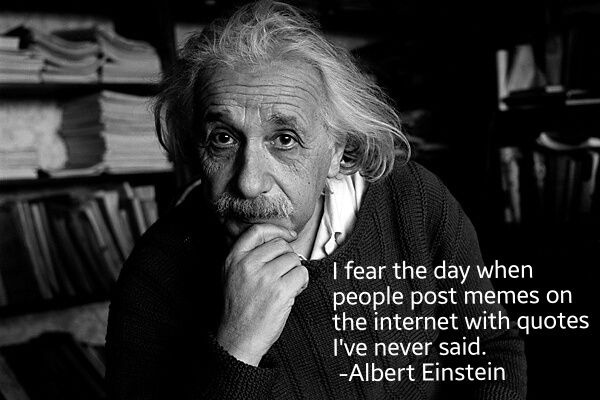

L'autre jour, un titre de journal de boulevard a retenu mon attention : "_Ce que Cécilia n'a jamais dit_". Merveilleux : un article entier sur ce qu'une célébrité n'a pas dit !  Ca laisse songeur ... Puis Annick m'a expliqué que l'article est un interview ou elle révèle des choses qu'elle n'avait jamais dites avant. Ah! Trop facile... Je peux faire mieux!

Voici donc un article sur ce qu'Einstein n'a jamais dit, et ne dira jamais, mais qu'un grand nombre de personnes croient qu'il a dit.

Commençons par la pire "citation" d'Einstein:

> L’[astrologie](/2004/06/30/astrologie/) est une science en soi illuminatrice. J’ai appris beaucoup grâce à elle, et je lui dois beaucoup. Les connaissances géophysiques mettent en relief le pouvoir des étoiles et des planètes sur le destin terrestre. A son tour, en un certain sens, l’astrologie le renforce. C’est pourquoi c’est une espèce d’élixir de vie pour l’humanité .

Qui peut ne serait-ce qu'imaginer un fondateur de la physique moderne prononcer une telle stupidité ? Pourtant cette phrase figure dans la "thèse" d'Elisabeth Teissier, sans référence d'aucune sorte et personne n'a songé à demander au "docteur" de la vérifier. En fait, il s'agit d'une "citation" non seulement totalement bidon [[1]](#ref-1), [[2]](#ref-2), mais malhonnête. Ce qu'il a vraiment écrit sur l'astrologie, c'est :

> Le lecteur est prié de noter les remarques sur l'astrologie. Elles démontrent que l'ennemi intérieur \[chez Kepler\], vaincu et devenu inoffensif, n'était pas encore complètement mort. [[3]](#ref-3)

Génial Albert qui définit la croyance comme "ennemi intérieur" du scientifique...

Une autre qui fait bien peur:

> Si l’abeille disparaissait de la surface du globe, l’homme n’aurait plus que quatre années à vivre

[Benjamin a consacré un billet](http://bacterioblog.over-blog.com/article-12234638.html) à cette phrase attribuée à Albert sans aucune référence crédible. La aussi, il est peu probable qu'un scientifique sérieux ose une assertion aussi définitive à propos d'un sujet qui n'est pas le sien.

Il y a des citations plus inoffensives attribuées à Albert sans source avérée, comme :

> Si les faits ne concordent pas avec la théorie, alors changez les faits
> 
> Remplir une feuille d’impôt est plus compliqué que la théorie de la relativité

et une ribambelle d'autres du même niveau.

D'autres "citations" sont des raccourcis compressés qui trahissent la pensée d'Einstein, comme

> Croire en Dieu est un superstition enfantine

dont [j'ai parlé à l'époque](/2008/05/15/le-dieu-deinstein/). Dans le même domaine :

> Le Mal est l'absence de Dieu

est une [légende urbaine](https://www.snopes.com/fact-check/false-einstein-humiliates-professor/) récente, totalement inventée, mais qui circule partout sur le net...

Enfin beaucoup de phrases attribuées à Einstein sont très similaires à des citations réelles, mais dues à d'autres :

> Tout doit être fait aussi simple que possible, mais pas plus simple

qui n'est qu'une formulation du [rasoir d'Occam](w:)

> Deux choses m’inspirent crainte et respect : le ciel étoilé et l’univers moral à l’intérieur de moi

qui est du à Emmanuel Kant, environ 150 ans plus tôt.

> La seule chose qui interfère avec mon apprentissage est mon éducation.

Ca c'est de Mark Twain, et enfin :

> Si vous ne pouvez expliquer un concept à un enfant de six ans, c'est que vous ne le comprenez pas complètement

est parfois attribué aussi à Richard Feynman (ça aurait pu être lui), mais on trouve une phrase très similaire dans le roman "le berceau du chat" de Kurt Vonnegut [[4]](#ref-4)

Et pour clore ce petit survol de ce qu'Einstein n'a jamais dit, voilà ce qu'il a entendu de la part de Charlie Chaplin :

> Moi, on m'acclame parce que tout le monde me comprend et vous, on vous acclame parce que personne ne vous comprend.

et enfin , la prochaine fois que vous verrez une Vérité Suprême signée Albert Einstein, rappelez-vous de cet aveu de [Louis "Studs" Terkel:](w:en:Studs_Terkel "Studs Terkel")

> J'aime citer Einstein. Vous savez pourquoi ? Parce que personne n'ose vous contredire.

### références:

1. Jean-Paul Krivine "[Einstein et l’astrologie : une citation fausse qui a la vie dure: un jury de La Sorbonne victime d’un vieux canular d’astrologues](http://www.pseudo-sciences.org/spip.php?article644)", SPS n° 250, décembre 2001
2. Denis Hamel "[Les grands esprits manipulés par les astrologues](http://www.sceptiques.qc.ca/assets/docs/qs57p31.pdf)", Le Québec sceptique, Numéro 57
3. préface de  "Johannes Kepler: Life and Letters", Carola Baumgardt, New York, Philosophical Library, 1951.
4. _(ajoutée le 3.12.2013)_  : la phrase exacte est "_Le Dr Hoenikker disait volontiers qu’un scientifique incapable d’expliquer ce qu’il fait à un enfant de huit ans est un charlatan._"

### Sources:

- [Albert Einstein "misattributed" sur WikiQuote](http://en.wikiquote.org/wiki/Albert_Einstein#Misattributed)
- ["13 Famous Quotes of Albert Einstein :Did Einsten Really Say It" sur Knoll](http://knol.google.com/k/13-famous-quotes-of-albert-einstein)
- _(ajoutée le 7.1.2013)_  : [Albert Einstein sur Quote Investigator](http://quoteinvestigator.com/category/albert-einstein/)
