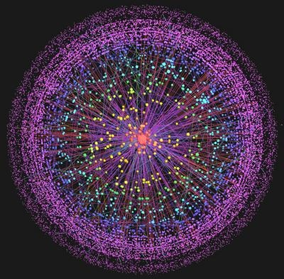

Vu cette passionnante [présentation au TED de Kevin Kelly intitulée "Prédiction sur les 5000 prochains jours du web"](http://www.ted.com/talks/kevin_kelly_on_the_next_5_000_days_of_the_web.html), disponible aussi sur YouTube :



Le début reprend des chiffres et notions de "[Dimensions of the One Machine](http://www.kk.org/thetechnium/archives/2007/11/dimensions_of_t.php)", un article sur le blog de Kelly qui commence par ce postulat :

_La prochaine étape dans l'évolution technologique humaine est un unique ordinateur/réseau/pensant de dimension planétaire. Cet ordinateur planétaire sera la plus grande, complexe et chère machine jamais construite. Ce sera aussi la plateforme principale du monde des affaires et de la culture. Le web est l'OS (système d'exploitation) initial de cette nouvelle machine globale, et tous nos gadgets personnels seront des fenêtres (windows...) donnant sur son coeur. Les gadgets futurs seront des portes sur la même machine unique. Concevoir des produits et des services pour cette nouvelle machine demande un état d'esprit unique._

Puis il donne quelques dimensions de La Machine : aujourd'hui, elle contient environ

- 1.2 milliards d'ordinateurs personnels [[1]](#ref-1),
- 2.7 milliards de téléphones portables [[2]](#ref-2),
- 1.3 milliards de téléphones fixes [[3]](#ref-3),
- 27 millions de serveurs [[4]](#ref-4),
- et 80 millions de PDA sans fil.

Au total, les microprocesseurs fournissant la puissance de calcul totalisent environ 1018 transistors ( un milliard de milliards de transistors). Kevin Jelly se risque ensuite, un peu trop à mon avis, à comparer ce nombre aux 100 milliards de neurones d'un cerveau humain [[5]](#ref-5), où les quelque 55'000 milliards de liens du web (900 milliards de pages web [[6]](#ref-6) contenant en moyenne 62 liens [[7]](#ref-7)) seraient analogues à des synapses.

Kelly évalue ensuite la bande passante de La Machine en comptant:

- 196 milliards d'emails (y compris les spams....) envoyés chaque jour [[8]](#ref-8). Soit 2.2 millions par seconde, ou une fréquence d'envoi de 2 megahertz.
- 1012 sont envoyés par an [[9]](#ref-9). Ca correspond à 31'000 per second, ou 31 kilohertz.
- 14 milliards de messages instantanés sont échangés par jour [[10]](#ref-10), soit 162 kilohertz.
- Le nombre de requêtes de recherche correspond à 14 kilohertz [[11]](#ref-11).
- Les liens sont cliqués à la fréquence de 0.52 megahertz [[12]](#ref-12).

En fin de compte, tout ceci donne environ 7 terabytes par seconde de bande passante internationale [[13]](#ref-13)

Il y avait environ 5 exabytes (1018, ou 260) d'information stockée dans le monde en 2003 [[14]](#ref-14), mais la plupart était gardée hors-ligne, sur papier, film, CD et DVD. Depuis, le stockage en ligne a proliféré. Aujourd'hui, la mémoire totale de la machine contient environ 246 exabytes d'information (246 milliards de gigaoctets!). Cette capacité devrait atteindre 600 exabytes en 2010 [[15]](#ref-15).

A cela on peut ajouter les flux audio et video  qui ne sont pas stockés de manière permanente. Ils sont estimés à 255 exabytes en 2007 [[15]](#ref-15), soit plus que le contenu stocké, et il est prévu que cet écart va s'accentuer de 20% par an.

Pour son fonctionnement, La Machine consomme approximativement 800 milliards de kilowatt.heures par an, soit 5% de la production globale d'électricité [[16]](#ref-16).

Kevin Kelly insiste sur le fait qu' "_un problème que nous avons en parlant de La Machine est que ses dimensions excèdent de beaucoup celles auxquelles nous sommes habitués, donc nous n'arrivons pas à nous rendre compte de sa taille_". Par exemple, une bibliothèque très complète contient environ 10 terabytes d'information, un volume très faible pour La Machine. Ca tiendra sur votre iPod dans 10 ans et ca se transmet en une seconde à l'autre bout du monde. Comment mesurerons nous le traffic dans 15 ans ?

Considérant que la puissance totale de La Machine actuelle est proche de celle d'UN cerveau humain ( et d'autres comparaisons [dont j'ai parlé ici le confirment)](/2008/06/19/moore-toujours/), Kelly propose d'utiliser le "HB" (human brain) comme unité de mesure pour les prochaines années. Si la croissance rapide imposée (ou mesurée...) par la Loi de Moore se poursuit encore quelques décennies ([et je pense que ce sera les cas](/2008/06/19/moore-toujours/ "Loi de Moore … toujours ?")), entre 2020 et 2040, La Machine atteindra la puissance de calcul de l'Humanité.

### Références:

1. "[Stats - Web Worldwide](http://www.clickz.com/stats)" sur clickZ
2. "[Mobile Messaging Futures 2007-2012](http://www.portioresearch.com/MMF07-12.html)", Portio Research
3. "[World Factbook](https://www.cia.gov/library/publications/the-world-factbook/index.html)", CIA
4. Jonathan G. Koomey, "[Estimating Total Power Consumption by Servers in the U.S. and the World](http://enterprise.amd.com/Downloads/svrpwrusecompletefinal.pdf)", AMD, February 15, 2007
5. "[Number of Neurons in a Human Brain](http://hypertextbook.com/facts/2002/AniciaNdabahaliye2.shtml)",  [The Physics Factbook](http://hypertextbook.com/facts/)
6. [Marcus P. Zillman](http://www.llrx.com/authors/398), "[Deep Web Research 2007](http://www.llrx.com/features/deepweb2007.htm)", December 17, 2006
7. Andrei Z. Broder, Marc Najork, Janet L. Wiener, "[Efficient URL Caching for World Wide Web Crawling](http://research.microsoft.com/en-us/projects/sv-pubs/p96-broder/p96-broder.pdf)", WWW2003, May 20–24, 2003, Budapest, Hungary.
8. "[The Radicati Group, Inc. Releases Q2 2007 Market Numbers Update](http://www.marketwire.com/mw/rel_us_print.jsp?id=752247)"
9. "[IT Facts](http://www.itfacts.biz/?id=P7846)"
10. [Sean Michael Kerner](http://www.internetnews.com/feedback.php/http://www.internetnews.com/stats/article.php/3521456) "[IM Accounts to Number in The Billions](http://www.internetnews.com/stats/article.php/3521456)", InternetNews.com, July 19, 2005
11. Kevin Kelly "[How much does one search cost?](http://www.kk.org/thetechnium/archives/2007/10/how_much_does_o.php)"
12. [Nielsen Online](http://www.nielsen-online.com/press.jsp?section=pr_netv&nav=3)
13. "[Global Bandwidth Research Service](http://www.kk.org/reCCearch/Executive_Summary.pdf)", Primetrica, 2007
14. [Peter Lyman](http://people.ischool.berkeley.edu/~plyman) et al. "[HOW MUCH INFORMATION 2003?](http://www2.sims.berkeley.edu/research/projects/how-much-info-2003/printable_report.pdf)", Université de Berkeley
15. "[The Diverse and Exploding Digital Universe](http://www.emc.com/collateral/analyst-reports/diverse-exploding-digital-universe.pdf) - An Updated Forecast of Worldwide Information Growth Through 2011", IDC
16. Kevin Kelly "[How Much Power Does the Internet Consume?](http://www.kk.org/thetechnium/archives/2007/10/how_much_power.php)", 17 octobre 2007

### Autres articles sur ce thème

- [Loi de Moore … toujours ?](/2008/06/19/moore-toujours/ "Loi de Moore … toujours ?")
- [Le Top 500 des Supercalculateurs](/2007/11/27/le-top-500-des-supercalculateurs/)
- [le Big Bang Numérique](/2008/04/10/le-big-bang-numerique/ "le Big Bang Numérique") (basé sur la référence \[15\] ci dessus)
