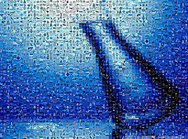
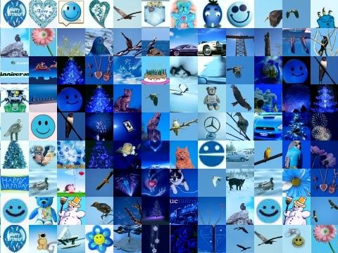

C'est très facile de faire une [photomosaïque](http://drgoulu.local/2007/08/19/grandes-images/) comme celle ci-contre. Des sites comme [Pictosaic juxtaposent](http://www.pictosaic.com/photo-mosaic.html) en quelques secondes des centaines d'images pour approximer une image de base.

Par exemple, voici un détail du goulot du bécher ci-contre:

Mais combien de petites images distinctes sont utilisées pour produire la mosaïque ? Pour répondre à cette question, j'ai développé un petit programme avec [Python(x,y)](http://drgoulu.local/2008/10/17/pythonxy/) en utilisant la ["Python Imaging Library" (PIL)](http://www.pythonware.com/products/pil/)

Le programme produit un [résultat sous forme d'une image composée d'une ligne pour chaque image unique](http://drgoulu.files.wordpress.com/2008/12/result_mosaic_chimie.jpg), avec à côté toutes les copies de cette image identifiées par le programme.

Le programme Python est ci-dessous, il est relativement simple, à l'exception de la fonction permettant de comparer les images pour laquelle j'ai pas mal ramé, et il reste un seuil numérique à ajuster au cas par cas, mais dans l'ensemble ça marche...

A quoi ça sert tout ça ? Outre à tester le traitement d'image en Python avec PIL, c'est pour gagner un concours, mais je ne vous dirai pas (encore) lequel [;-)](http://drgoulu.local/wp-content/uploads/2008/12/result.jpg)

\[code lang="python"\]import Image; #PIL import ImageChops; import ImageStat; import math;

im = Image.open("mosaic.jpg") smallx=40; smally=40;

border=1; #ignore border of picture print im.size\[0\],im.size\[1\] n=(im.size\[0\]/smallx)\*(im.size\[0\]/smally) nx=math.sqrt(n)

res=Image.new(im.mode,(smallx\*nx,smally\*n)) L=\[\]; jmax=0; y=0; while y&lt;im.size\[1\]: x=0; while x&lt;im.size\[0\]: box = (x+border, y+border, x+smallx-border, y+smally-border) mini = im.crop(box) mininb=ImageOps.equalize(mini.convert('L')) min=1000; for i in range(len(L)): rms=ImageStat.Stat( ImageChops.difference( mininb,L\[i\]\[0\] ) ).mean\[0\] if rms&lt;min: f=i; min=rms; if min&lt;30: #this must be tuned for each case ... j=L\[f\]\[1\] L\[f\]\[1\]=j+1 else: j=0 f=len(L) L.append(\[mininb,1\]) if j&gt;jmax: jmax=j; box = (smallx\*j+border, smally\*f+border) res.paste(mini,box); x=x+smallx print '.', y=y+smally

res.crop((0,0,(jmax+1)\*smallx,len(L)\*smally)).save('result.jpg') print 'DONE!' print len(L),'different images over',n,'max',jmax+1,'copies'

res.crop((0,0,(jmax+1)\*smallx,len(L)\*smally)).save('result.jpg') print len(L),'different images over',n,'max',jmax+1,'copies'\[/code\]
