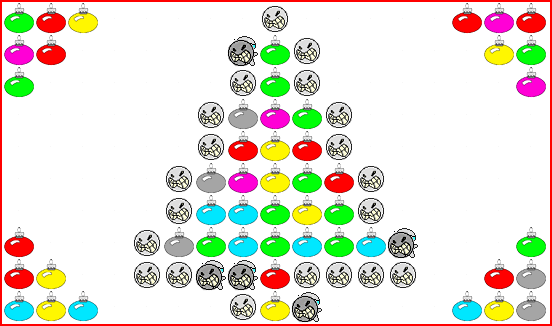
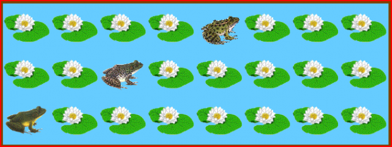

Trop mangé ? trop dépensé ? trop dormi ? trop culpabilisé ? Prenez de bonnes résolutions et nourissez votre cerveau et celui de vos enfants avec quelques casse-tête et jeux amusants trouvés pour vous sur le Web.

Pour les petits dès 4 ans et jusqu'à 10, 15, 20, 30, 45 , [Lulu le Lutin Malin](http://jeux.lulu.pagesperso-orange.fr/) offre une ribambelle de jeux intelligents à jouer seul ou à deux. Certains jeux de Lulu sont directement en rapport avec l'activité scolaire, d'autres développent simplement une réflexion logique, comme "[un peu de couleur](http://jeux.lulu.pagesperso-orange.fr/html/couleur/couleSom.htm)". En fait, le [tableau de Noël](http://jeux.lulu.pagesperso-orange.fr/html/couleur/couleuF5.htm) de ce jeu tout simple m'énerve un petit peu car je n'ai pas encore réussi à colorier les 51 boules après quelques essais... Je finis l'article et j'y retourne...

Pour les plus grands, il y a [GoMaths.ch](http://www.gomaths.ch/), site créé par un enseignant suisse. on y trouve de nombreux jeux assez scolaires, mais aussi une [page de liens illustrés](http://www.gomaths.ch/jeux/index.php) vers de nombreux jeux de logique trouvés sur le web. Il y a les classiques Reversi, Solitaire, Tetris et autres Pentominos, mais aussi les excellents Rush Hour, et "La Bonne Face", un exercice de vision dans l'espace indispensable aux futurs mécaniciens.

Au bas de la page, les 5 "jeux pour bien s'arracher les cheveux" méritent un détour, avec mention spéciale pour "[le jeu des nénuphars](http://www.echecsetmaths.com/enigme/pap/1.htm#)", un petit casse-tête très énervant sur lequel j'ai perdu déjà un jour de vacances (merci J.-C...)

On joue contre l'ordinateur. Chacun son tour on peut faire avancer une grenouille d'autant de cases que l'on veut vers la droite. Le joueur qui place la dernière grenouille à droite a gagné. Le problème c'est qu'on perd tout le temps, et qu'on n'arrive même pas à comprendre la stratégie suivie par l'ordinateur pour gagner (à moins de visualiser le code JavaScript du programme... et encore...). Mais là je commence à comprendre. Solution bientôt.

Plusieurs liens de [GoMaths.ch](http://www.gomaths.ch/) renvoient sur le merveilleux site ["Maths Magiques" de Thérese Eveilleau](http://therese.eveilleau.pagesperso-orange.fr/). Ce site est bourré d'explications, mais aussi d'animations et de programmes en Java illustrant une foultitude de problèmes plus ou moins connus et plus ou moins liés aux maths. Il y a tellement de choses là que je l'ajoute immédiatement à [ma liste des sites à explorer en détail](http://www.delicious.com/Goulu/todo) et je vous en recause. (Un magnifique site de plus qui mériterait d'être modernisé, doté d'un flux RSS, d'un système de commentaires, bref "bloguifié"...)

Le niveau au dessus, c'est "[la feuille à problèmes](http://irem-fpb.univ-lyon1.fr/feuillesprobleme/)", qui porte bien son nom. Les problèmes proposés "dans nos classes" sont déjà bien corsés, mais la catégorie "remue-méninges" est clairement réservée aux pros des maths...

Si vous avez lu l'article jusque là, vous êtes un adepte des jeux mathématiques et donc un compétiteur en puissance. Quel que soit votre niveau en maths, que vous soyez à l'école primaire ou Docteur ès Sciences, vous pouvez encore vous inscrire au Championnat International de Jeux Mathématiques organisé par les fédérations [Française](http://www.ffjm.org/), [Suisse](http://fsjm.ch/) (et autres ?). Il suffit de résoudre une [série de problèmes](http://fsjm.ch/files/23_Quarts_ind_Enonces.pdf) correspondant à votre catégorie et de renvoyer [ce bulletin de réponse](http://www.ffjm.org/upload/fichiers/QuartsdeFinale2009.pdf) avant le 1er janvier si vous êtes Français, et [celui-ci](http://fsjm.ch/files/23_Quarts_ind_Instructions.pdf) avant le 15 janvier si vous êtes Suisse (on n'est pas plus lents, on est plus rapides à dépouiller les résultats...)
