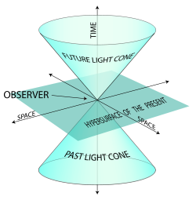

Malgré les fantastiques progrès de la physique depuis la théorie de la relativité et l'avènement de la mécanique quantique, le débat fait toujours rage autour de la question "**qu'est-ce que le temps?**"

L' "institut des questions fondamentales en physique et cosmologie" [fq(x)](http://fqxi.org/) a organisé un  [concours d'essais](http://fqxi.org/community/forum/category/10) (en anglais...) sur ce thème. Les auteurs étaient invités à soumettre un article d'un niveau intermédiaire entre "Pour la Science" et "Science" ou "Nature". Ce concours vise donc surtout les spécialistes de la physique théorique, option cosmologie, mécanique quantique et/ou thermodynamique, mais certains passionnés ont aussi soumis leurs idées. A noter que [Lee Smolin](w:), un précurseur de la question "[What is Time](http://community.fortunecity.ws/underworld/continue/56/whattime.html)" est membre de la fondation fq(x).

C'est un succès : [une bonne centaine d'articles ont été soumis](http://fqxi.org/community/forum/category/10), les forums de discussion attachés à certains article sont très animés, et le public peut [voter](http://fqxi.org/community/essay) jusqu'au 1er janvier 2009 pour désigner la meilleure contribution.

La plupart des essais tentent de réconcilier les deux conceptions du temps fondamentalement différentes (déja esquissées dans "[Peut-On Voyager dans le Temps](/2008/06/19/peut-on-voyager-dans-le-temps/)"):

1. l' "[éternalisme](w:)", ou théorie de l'Univers-Bloc, qui découle logiquement de la théorie de la relativité.
2. le "[présentisme](w:)", résultant d'une vision quantique du monde.

### l'Univers-bloc [éternaliste](w:éternalisme)

Dans la sa version la plus simplifiée,  l'Univers-bloc ressemble à un "flipbook" :



Si on considère le  "flipbook" comme un "univers" à 2 dimensions spatiales (où l'on dessine) + 1 temporelle (les pages qu'on feuillette) , on peut imaginer l'Univers-bloc comme ayant 3 dimensions spatiales,plus la fameuse 4ème dimension du temps.  Le "présent" ne serait alors qu'une "tranche" à 3 dimensions traversant l'Univers selon l'axe du temps à la vitesse d'une seconde par seconde.

L'Univers-bloc est une solution de l'[équation d'Einstein](w:), dans lequel [le temps est une 4ème dimension imaginaire](/2007/02/07/le-temps-une-4eme-dimension-imaginaire/ "le temps, une 4ème dimension imaginaire") au sens mathématique du terme. Ceci permet de très bien décrire la relativité, au point que Ken Wharton considère dans "[Lessons from the Block Universe"](http://fqxi.org/community/forum/topic/311) ,  que

> L'univers-bloc est de loin le meilleur cadre (framework) pour les théories physiques, du fait que la relativité générale est simplement incompatible avec toute alternative

En effet, dans l'Univers-bloc, chaque point de l'Univers peut avoir son propre "présent", défini par le "[cône de lumière](w:causalité_(physique)) du passé", sur lequel se trouvent tous les objets que nous voyons à cet instant. Plus ces objets sont éloignés, plus ils mettent de temps à agir sur nous, et toutes les actions ou interactions qui surviennent ici et maintenant n'influenceront le futur qu'à l'intérieur du "cône de lumière du futur". De ce fait, nous n'avons aucune idée de ce qu'est le "présent" sur la Galaxie d'Andromède depuis 2.5 millions d'années, et nous n'avons aucune façon de le savoir avant 2.5 millions d'années.

De plus, comme non seulement la théorie d'Albert, mais aussi de nombreuses expériences montrent que le temps ne s'écoule pas partout à la même vitesse, nous sommes amenés à imaginer que le passé et le futur sont aussi des notions "locales", et que le seul moyen de rendre le passé d'un point cohérent avec le futur des autres est de considérer que tout "préexiste".

Dans l'Univers-bloc, le passé existe encore et le futur existe déjà. Ils sont prédéfinis. L'Univers-bloc est déterministe, figé, et notre libre-arbitre est une magnifique illusion. Notons en passant que le [voyage dans le temps](/2008/06/19/peut-on-voyager-dans-le-temps/) n'est pas exclu dans l'Univers-bloc, mais il est limité à des particules "tournant en rond" sur de boucles figées, ce qui exclut toute possibilité de "modifier le passé".

Outre une réalité difficile à accepter par les "animaux prétentieux" que nous sommes, l'Univers-bloc est totalement contradictoire avec la mécanique quantique, qui démontre par de très nombreuses expériences aussi que le hasard est fondamental en physique.

### Le [Présentisme](w:)

Radicalement opposés à l'Univers-bloc, les "présentistes" soutiennent que seul le présent existe. L'univers est défini par un seul "état" que l'on peut imaginer comme un très grand vecteur contenant les positions, vitesses charge électrique etc. de toutes les particules de l'Univers. Les variations de ce vecteur selon les lois statistiques de la mécanique quantique définissent la "flèche du temps" qui  pointe en direction d'un Univers plus probable à chaque instant, expliquant ainsi comment les phénomènes fondamentalement réversibles de la mécanique quantique produisent des phénomènes aussi irréversibles que la dilution d'un nuage de lait dans votre thé de Noël.

Le voyage dans le temps dans l'Univers présentiste est beaucoup plus délicat, voir impossible : il n'y a nulle part où aller car le vecteur d'état n'est "mémorisé" nulle part. En fait le présentisme pose la question même de l'existence du temps : que représente la variable t de nos cours de physique dans un monde sans passé ni futur ? A quoi bon se fatiguer à compter 9 192 631 770 périodes de la radiation correspondant à la transition entre les niveaux hyperfins F=3 et F=4 de l’état fondamental 6S½ de l’atome de césium 133 pour décréter qu'une seconde s'est écoulée, alors que le vecteur d'état n'en a rien à battre ?

C'est notamment le point de vue de Carlo Rovelli, professeur de physique à l'Université de Marseille dans "[Forget Time](http://fqxi.org/data/essay-contest-files/Rovelli_Time.pdf)" selon qui

> Dans la nature, il n'y a pas de variable préférentielle t pour un temps physique. Il n'y a pas d'états d'équilibre préferés ρo a priori. Plutôt, toutes les variables sont équivalentes; nous pouvons trouver le système dans un état arbitraire ρ ; si le système est dans un état ρ, alors une variable préférentielle est rendue célibataire ("singled out") par l'état du système. C'est cette variable que nous appelons "temps".

### Essais de réconciliation

Peu de textes proposés défendent bec et ongles l'une ou l'autre position, et c'est une bonne nouvelle : chaque tendance reconnait des points forts dans l'autre et comprend la nécessité de proposer une vision du temps englobant les acquis des deux théories indestructibles de la physique moderne : la mécanique quantique et la relativité. Cet effort est très semblable (identique ?) à celui tentant d'unifier la gravitation aux autres forces "atomiques". Je n'ai hélas pas eu le temps de lire en détail les dizaines d'articles que j'aurais souhaité étudier, mais voici déjà quelques mots sur ceux qui m'ont intéressé jusqu'ici :

- Commençons par Sean Carroll, qui maintient l'excellent blog "[Cosmic Variance](http://blogs.discovermagazine.com/cosmicvariance/)" grâce auquel j'ai découvert ce concours et où se trouve notamment une [FAQ sur la flèche du temps.](http://blogs.discovermagazine.com/cosmicvariance/2007/12/03/arrow-of-time-faq/) Dans son essai, il [What if Time Really Exists?](http://fqxi.org/data/essay-contest-files/Carroll_fqxitimecontest.pdf) il propose de considérer tout de même le temps explicitement dans l'univers présentiste ce qui permettrait, si j'ai bien compris car son article est tout de même très technique, de considérer la mécanique quantique comme une théorie "duale" de l'univers relativiste.
- Cette idée de dualité se retrouve dans un article plus accessible, "[Time Complementarity in the Inflaton Spacetime Model](http://fqxi.org/data/essay-contest-files/Dolan_timecomp.pdf)" de Richard P. Dolan selon qui
    
    > Dans le modèle de l'espace-temps "[inflaton](w:)", il y a une dualité inhérente entre le concept  "univers-bloc" du temps et notre sensation d'un temps qui s'écoule. Ces visions sont complémentaires dans le même sens que la nature corpusculaire et ondulatoire du photon. Alors que les lois de la physique voient l'univers-bloc, nous ne voyons que le temps qui s'écoule car nous somme faits du flux du temps.
    

- Elliot McGucken aka "Dr. E" a intensivement utilisé les forums de pratiquement tous les autres articles pour promouvoir son propre essai baptisé [Time as an Emergent Phenomenon: Traveling Back to the Heroic Age of Physics](http://fqxi.org/data/essay-contest-files/McGucken_Time_as_an_Emergen.pdf)" dont l'abstract est très attrayant :
    
    > Dans son manuscrit sur la relativité de 1912, Einstein n'a jamais dit que le temps est la 4ème dimension, mais il a plutôt écrit x4=i.c.t. 4ème dimension n'est pas le temps, mais i.c.t. Malgré ceci, des physiciens réputés égalent le temps et la 4ème dimension, conduisant à des paradoxes insolubles et des confusions sur la nature physique du temps car les physiciens projettent faussement des propriétés des 3 dimensions spatiales sur une dimension temporelle, arrivant à des concepts curieux comme le "temps gelé" ou "l'univers-bloc" dans lesquels le passé et le futur sont omni-présents, niant le libre arbitre tout en permettant des voyages temporels vers le passé, que des visiteurs venus du futurs doivent encore prouver. Commençant avec le postulat que le temps est un phénomène émergent, résultant d'une quatrième dimension en expansion par rapport aux dimensions spatiales à la vitesse c, divers phénomènes comme la relativité, la mécanique quantique et la mécanique statistique sont pris en compte.(...) La théorie présentée postule que la 4ème dimension se déplace indépendamment des 3 dimensions spatiales, ce qui distribue la localité et donne naissance au temps.
    
    Dr. E. tente donc de découpler la relativité de la conception de l'Univers-bloc, en considérant l'Univers en expansion également dans la dimension imaginaire du temps. En gros il propose une cosmologie autorisant le présentisme, ce qui est très intéressant. Mais la démonstration de la compatibilité avec les théories physiques (relativité, quantique, thermodynamique) semble un peu courte, comme en témoigne une avalanche de commentaires.
- A l'inverse, pour les défenseurs de l'Univers Bloc comme Ken Wharton dans "[Lessons from the Block Universe"](http://fqxi.org/community/forum/topic/311), la mécanique quantique pourrait être reformulée dans l'Univers bloc.
- Mark Stuckey suit une approche similaire dans ["Time, Space and Matter in the Relational Blockworld: A New Approach to the Problems of Time](http://fqxi.org/community/forum/topic/332)". Il étend la notion d'espace-temps à l'espace-temps-matière et ajoute une notion de graphe relationnel à l'univers-bloc pour y intégrer la mécanique quantique.

### De la théorie à la pratique

Tous ces articles sont bien théoriques... Seuls quelques auteurs ont suggéré des validations expérimentales possibles :

- Dans "[Flowing with a Frozen River](http://fqxi.org/community/forum/topic/322)" Cristinel Stoica propose une expérience permettant de tester l'existence du libre arbitre, et donc de confirmer ou d'invalider l'Univers-bloc. Je n'ai encore pas tout compris...
- "[No Time for Quarks!](http://fqxi.org/data/essay-contest-files/Potter_NatureOfTime.pdf)" de Franklin Potter prédit l'observation prochaine au LHC de quarks b', qui prouveraient que les leptons et les quarks se déplacent sur une grille d'espace-temps discrète.
- Dans "[A Practical Experiment to Observe the Direction of Time.](http://fqxi.org/data/essay-contest-files/Sasaki._TDoT.pdf)" by Kenneth M. Sasaki propose une expérience destinée à confirmer une version modernisée de la théorie de l'Ether, qui n'est donc toujours pas morte ...

### Conclusion

Cet article m'en a pris beaucoup, du temps. Initialement je voulais lire (et comprendre) tous les essais proposés, mais sans machine à remonter le temps je n'aurais rien publié avant la fin des votes. Donc n'hésitez pas à butiner aussi dans les essais que je ne mentionne pas ici et à faire part de vos découvertes dans les commentaires. Il y aura d'autres articles sur le temps bientôt sur Dr. Goulu car

- soit c'est certain car nous vivons dans un Univers-Bloc et ils sont déjà écrits, il faut juste que le cône de lumière les éclaire ...
- soit la flèche du temps pointe dans la direction où l'entropie les force à sortir de mon cerveau à 37° pour les étaler sur un écran à 20° ...
