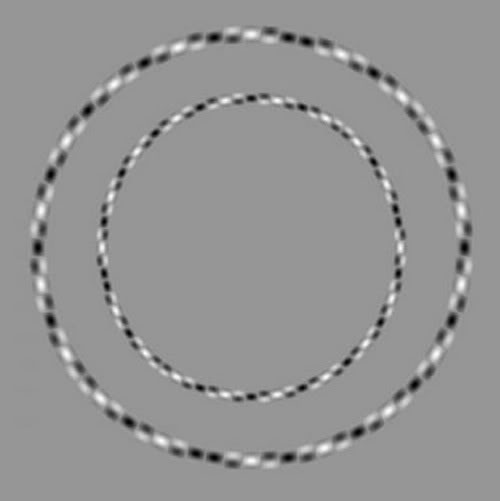

Le Web regorge de magnifiques illusions d'optiques, mais sur Dr. Goulu il n'y a [que les meilleures](/tag/culture/graphisme/illusion/), comme celle-ci :

Ne vous laissez pas distraire par les petits points noirs et blancs, ce sont bien deux cercles concentriques parfaits. Si si !

source : [Mighty Optical Illusions](https://web.archive.org/web/20080917115833/http://www.moillusions.com/2008/06/irregular-circles-illusion.html)
