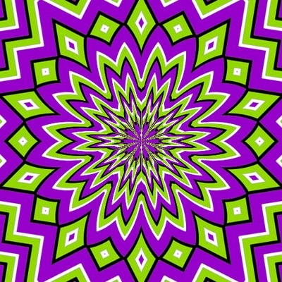

Trouvé cette superbe [illusion d'optique ici:](https://web.archive.org/web/20080219014444/http://www.moillusions.com/2007/12/3-moving-patterns-optical-illusion.html)

Spectaculaire, n'est-ce pas ? (papa, ça marche aussi sur les daltoniens ?)

[Ce site](https://web.archive.org/web/20071202081643/http://ophtasurf.free.fr/illusion.htm) donne des explications scientifiques intéressantes sur les illusions d'optique, mais je n'en ai pas trouvé une simple concernant le mouvement apparent sur des images fixes.
