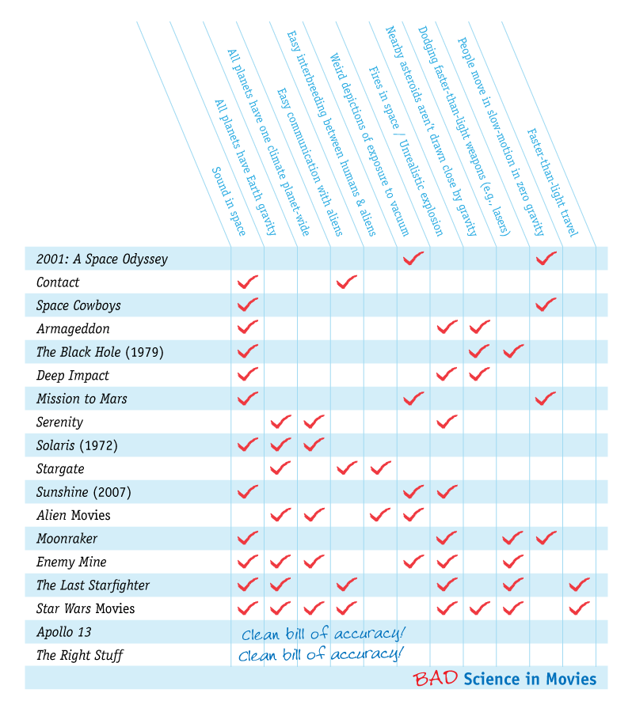

[Bad Astronomy](https://web.archive.org/web/20080702175758/http://blogs.discovermagazine.com/badastronomy/) reprend un sujet du [blog de science fiction io9](http://io9.com/367792/bad-movie-physics-a-report-card) consacré à la physique dans les films dont l'action a lieu dans l'espace, illustré par ce tableau très incomplet des violations des lois de la physique commises dans chacun: (cliquer dessus pour l'agrandir)

Seuls les films "historiques" comme "Apollo 13" et "l'Etoffe des Héros" respectent parfaitement les lois de la physique spatiale

Le génial "2001 l'Odyssée de l'Espace" est le seul film de science-fiction pratiquement parfait. Sa seule imperfection concerne le mouvement des acteurs en apesanteur, et il est du à l'âge du film : avant l'apparition des effets numériques, la solution typique était de passer les mouvements des acteurs "au ralenti".

L'autre défaut de "2001" mentionné dans le tableau est incorrect : la scène de l'exposition au vide du Dr. Floyd lorsqu'il utilise le sas de secours est très réaliste. [Cette page](http://www.geoffreylandis.com/vacuum.html) basée sur des documents et expériences de la NASA explique qu'un être humain placé dans le vide n'explose pas, ne gèle pas, mais meurt "simplement" asphyxié après avoir souffert de quelques phénomènes très désagréables, en principe similaires à la remontée rapide d'un plongeur depuis une profondeur de 10m.

Deux films s'en sortent bien avec 2 problèmes de physique seulement : "Space Cowboys" est une sorte d' "Apollo 13" de fiction mais n'évite pas l'effet "apesanteur au ralenti", et tombe dans une autre erreur typique : le bruit dans l'espace. Beaucoup ignorent le slogan des "Alien": dans l'espace, personne ne vous entend crier...

L'autre est l'excellent "Contact". Là, c'est plutôt le contact trop facile avec les extra-terrestres qui dérange : après un petit casse-tête initial, Jodie Foster discute en anglais non sous-titré avec le représentant d'une civilisation avancée... Plutôt que le "bruit dans l'espace" mentionné dans le tableau, il me semble que ce film souffre plutôt du syndrome du "plus vite que la lumière".

Non, on ne peut pas et on ne pourra pas aller plus vite que la lumière. Jamais. Dieu et son prophète Albert l'ont interdit. Il sera peut-être [possible de voyager dans le temps](/2006/06/16/comment-contruire-un-machine-a-voyager-dans-le-temps/)  et d'aller [aussi vite que la lumière](/2004/08/09/acceleration/) , mais pas plus vite.

D'autres films comme "Armageddon" et "Deep Impact" combinent les fautes mentionnées avec d'autres, notamment une mauvaise représentation du feu et des explosions dans le vide (rien ne peut réellement bruler dans l'espace) et le non respect de la gravité dans des champs d'astéroïdes (qui s'attirent mutuellement)

Finalement, il y a des films de "space opera" comme StarWars dans lesquels le réalisme scientifique est totalement négligé, mais est-ce bien important ?

Si le sujet vous intéresse, consultez aussi le site [Intuitor](http://intuitor.com/moviephysics/) (en anglais) qui traite du respect des lois de la physique dans les films en général, avec notamment une page très intéressante sur les effets spéciaux irréalistes mais très communs comme:

- les balles qui ricochent en faisant des étincelles
- les voitures qui explosent en cas de choc
- les gens qui sautent sans mal à travers des fenêtres de verre
- les rayons laser visibles
- etc.

Intuitor fait aussi de nombreuses critiques scientifiques de films, et même de documentaires comme pour "[Qui a tué la voiture électrique ?](http://intuitor.com/moviephysics/electricCar.htm)", censé montrer comment l'industrie du pétrole à éliminé la gentille voiture électrique EV1 de GM...
