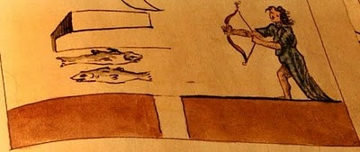

Après Superman, James Bond et Georges W. Bush, de nouveaux super-héros sont en train de [sauver le monde](/2008/04/17/on-va-tous-mourir/) de la destruction totale par les méchants.

N'écoutant que leur courage, les Catastrophysiciens Luis Sancho et Walter Wagner ont pointé leur [Super-Arme](https://web.archive.org/web/20090225220447/http://www.lhcdefense.org/pdf/Sancho%20v%20Doe%20-%20Complaint.pdf) contre les savants fous qui se préparent à donner la Terre à avaler au micro trou noir qu'ils vont produire avec le LHC du CERN.

A l'appui de leur théorie, les amis de Catastrophysiciens citent une référence de poids : [Nostradamus](w:)! Voici le quatrain qui annonce la catastrophe :

> Migrés, migrés de Geneue trestous, Saturne d'or en fer se changera, Le contre Raypoz exteriminera tous, Auvant l'aruent le ciel signes fera.

En clair ça donne : Fuyez, fuyez tous de Genève, Saturne se changera d'un truc qui brille en truc qui brille pas et les rayons positifs contraires extermineront tout le monde, mais avant, le ciel deviendra tout rouge par Effet Doppler. (Je suis pas mauvais en interprétation de Nostradamus, je trouve... )

Notez comme l'énigmatique mot "Raypoz" de la prédiction trouve tout son sens avec les faisceaux de protons. D'ailleurs, il y a un même un petit dessin prophétique qui confirme cette interprétation :

(détail d'une illustration du "[Vaticinia Nostradami](http://with-heart-and-hands.blogspot.com/2007/10/updated-lost-book-of-nostradamus-images.html)", le "livre perdu de Nostradamus". Cliquer dessus pour le dessin complet)

On voit bien les deux poissons (Nostradamus ne savait pas bien dessiner les protons...) qui se croisent en sens inverse, lançés avec un arc à supraconducteur, et le trou dans le sol creusé par le micro trou noir qui descend au centre de la Terre, d'où il absorbera tout, comme dans ce joli film :



Tout est limpide n'est ce pas ? Sauf que d'après le texte on peut s'en tirer en fuyant Genève, ce qui fait que d'autres voient plutôt une annonce d' [attaque terroriste nucléaire sur Genève](https://web.archive.org/web/20080314221433/http://nostradamus.nostradamia.com/1cGrandConflit/Default.php) d'après le même texte...

Concrètement donc, des juges américains ont considéré comme recevable la plainte de Luis Sancho et Walter Wagner, et assigné le [FermiLab](https://web.archive.org/web/20080509134700/http://www.fnal.gov/) partenaire du CERN en justice.  Les physiciens du monde entier vont devoir probablement prouver que leurs expériences au LHC sont sans danger, alors que c'est justement le but du LHC de valider scientifiquement les prédictions de la théorie du "modèle standard" et/ou de ses diverses ramifications.

Et les super-héros qui reçoivent une publicité mondiale, que risquent-ils, eux ? A mon avis, on ne devrait que les obliger à avoir le même courage que Paco Rabanne, qui s'était engagé à ne plus faire de prédictions si [la station Mir ne tombait pas sur Paris en 1999](http://picoti.free.fr/findumonde/interview.htm) comme l'avait prédit Nostradamus (déjà...). Il s'est [confondu en excuses](https://web.archive.org/web/20080617231434/http://prevensectes.com/prabane.htm#2) et ne la ramène plus.

Les scientifiques signent tous implicitement ce que j'appelle le "Serment de Paco Rabanne" : si les prédictions de ma théorie ne se vérifient pas, c'est que je me suis planté alors après je me fais très discret. Pour être pris au sérieux, les catastrophysiciens et leurs amis devraient être forcés à le signer explicitement : si le CERN ne détruit pas la Terre, on fait amende honorable et on ne la ramène plus.

### Références :

1. Alan Gillis "[Nostradamus and the LHC](http://bigsciencenews.blogspot.com/2008/05/nostradamus-and-lhc.html)", the Science of Conundrum
2. ["Lost Book of Nostradamus: Images and Quatrains"](https://web.archive.org/web/20080514004905/http://www.crystalinks.com/lostbookofnostradamus.html)
3. ["Nostradamus : The Lost Book" video](https://web.archive.org/web/20100307174518/http://www.history.com/shows/nostradamus-effect/videos) (en anglais) sur history.com
4. "[le CERN au banc des accusés](http://zebrablog.net/sugus/index.php/2008/06/08/916-le-cern-au-banc-des-accuses)" sur le ZebraBlog de Sugus, qui a trouvé le document juridique et motivé ce second article, merci !
5. Alan Boyle, "[Doomsday fears spark lawsuit](https://web.archive.org/web/20100611091622/http://cosmiclog.msnbc.msn.com/_news/2008/03/27/4350402-doomsday-fears-spark-lawsuit)" sur CosmicLog
6. [http://www.lhcconcerns.com/](https://web.archive.org/web/20080516211732/http://www.lhcconcerns.com/) un forum initié par les catastrophysiciens avec un début de débat
