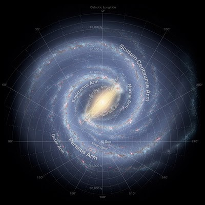
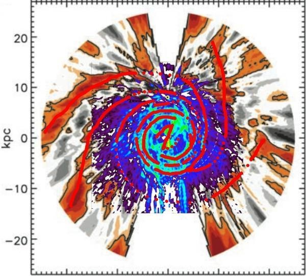

Ce n'est qu'au début du XXème siècle qu'on a réalisé que de nombreuses "nébuleuses" observées étaient des "galaxies" regroupant des milliards d'étoiles, et que la trainée blanche qui barre notre ciel les nuits bien noires est la Galaxie à laquelle appartient notre Soleil, vue de l'intérieur.

Notre position à l'intérieur de la Voie Lactée rend impossible son observation directe et difficile la mesure de certains paramètres importants, comme sa masse et sa densité. En fait, on connait mieux la [Galaxie d'Andromède](http://fr.wikipedia.org/wiki/Galaxie_d%27Androm%C3%A8de) voisine que [notre Voie Lactée](http://fr.wikipedia.org/wiki/Notre_Galaxie). Si on sait depuis 1953 que la Voie Lactée est une [galaxie spirale](/2008/02/08/galaxie-spirale-et-sequence-principale/), ce n'est qu'en 1991 que sa "barre" a été confirmée et en 2007 qu'on a formellement [identifié son trou noir central.](/2007/06/26/le-trou-noir-central-de-la-voie-lactee-revele/)

D'ailleurs, une image récente du centre de la Galaxie [[1]](#ref-1) montre que la zone de 300 années-lumière voisine du trou noir central (la tache blanche sur la photo) est extrêmement active, avec des nuages de gaz chaud et des étoiles massives, comme [une récente simulation](/2008/09/06/les-trous-noirs-des-moteurs-de-lunivers/) le prévoit :



En 2008, la structure de la Voie Lactée est enfin illustrée sur cette magnifique carte [[2]](#ref-2):

mais est-ce correct ? Une équipe suisso-germano-américaine [[3]](#ref-3) vient de confirmer cette structure à l'aide de mesures faites dans l'infrarouge par les satellites observant le fond du ciel. La représentation graphique de ces mesures est celle-ci:

Avec un peu d'imagination, on voit que ça correspond assez bien : la Voie Lactée possède deux bras spiraux principaux et deux plus ténus.

D'autre part, une équipe a récemment mesuré les vitesses de nombreuses étoiles de notre galaxie à l'aide du [VLBA](http://www.vlba.nrao.edu/) et découvert qu'elles tournent plus vite que prévu autour du centre galactique, ce qui signifie que la Voie Lactée est plus vaste et environ 50% plus massive qu'on ne l'imaginait jusqu'ici [[4]](#ref-4).

### Références:

1. "[Gros plan sur le centre galactique](http://www.techno-science.net/?onglet=news&news=6170)", 9 janvier 2009, techno-Science.net
2. Francis Reddy "[Astronomers update our galaxy's structure](http://www.astronomy.com/en/sitecore/content/Home/News-Observing/News/2008/06/Astronomers%20update%20our%20galaxys%20structure.aspx)", 4 juin 2008
3. Englmaier P., Pohl M., Bissantz N. "[The Milky Way Spiral Arm Pattern](http://de.arxiv.org/abs/0812.3491)", in: “Tumbling, Twisting, and Winding Galaxies: Pattern Speeds along the Hubble Sequence”, E. M. Corsini and V. P. Debattista (eds.), Memorie della Società Astronomica Italiana, 2008
4. "[Milky Way a swifter spinner and more massive, new measurements show](http://www.astronomy.com/en/sitecore/content/Home/News-Observing/News/2009/01/Milky%20Way%20a%20swifter%20spinner%20and%20more%20massive%20new%20measurements%20show.aspx)", 5 janvier 2009
