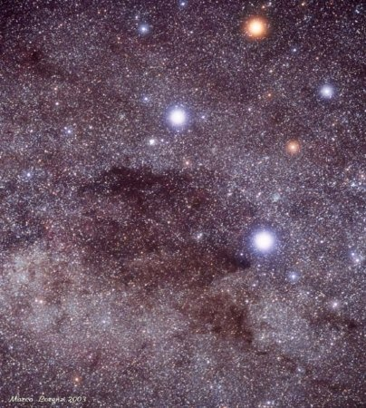
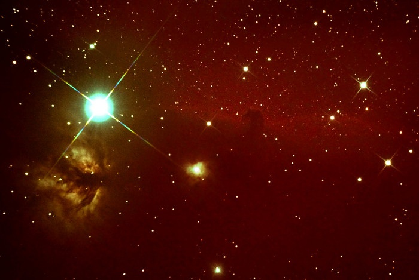
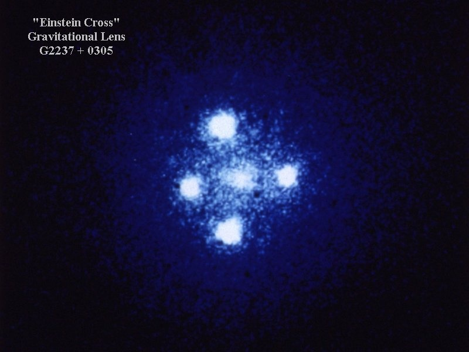

Cet article multipack regroupe deux sujets intéressants, et un qui sert juste à rendre l'inventaire exhaustif. Commençons par celui-là:

### La Croix du Sud, et celle du Nord

Deux constellations ont "une forme de croix" :

- la [Croix du Sud](http://fr.wikipedia.org/wiki/Croix_du_Sud) permet de repérer le Sud approximatif si vous êtes perdus la nuit dans le désert australien, ou sur un voilier retourné au Cap Horn.
- Dans l'hémisphère Nord, on appelle parfois "Croix du Nord" la constellation du [Cygne](http://fr.wikipedia.org/wiki/Cygne_\(constellation\)), une belle croix bien visible dans le ciel d'été hébergeant plusieurs nébuleuses intéressantes et faciles à observer, comme la [magnifique Voile](http://www.skyfactory.org/vela/vela.htm) dont j'ai déjà causé [ici.](/2007/12/13/meilleures-photos-astronomiques-2007/)

mais ce dont je voulais principalement parler c'est...

### Pourquoi les étoiles brillantes ont une forme de croix sur les photos astronomiques.

Les étoiles sont tellement éloignées qu'à part le Soleil, elles nous apparaissent toutes comme des points. Il n'y a que les [géantes comme Bételgeuse ou Antares](/2008/02/01/on-est-peu-de-chose/) qui apparaissent comme de vagues petites boules de quelques pixels sur les images des plus puissants télescopes. Mais alors pourquoi voit-on de grosses étoiles brillantes ornées de jolis "rayons" en forme de croix sur les photos astronomiques comme celle-ci :



C'est la faute de la [diffraction](http://fr.wikipedia.org/wiki/Diffraction), ou plutôt des inévitables imperfections optiques des instruments d'observation qui causent ce [phénomène optique compexe](http://fr.wikipedia.org/wiki/Th%C3%A9orie_de_la_diffraction).

Sur un télescope, c'est principalement "l'araignée" composée des tiges fixant le miroir secondaire qui causent les "aigrettes", ces lignes formant une croix parfaite. Cet effet peut être parfois utile, par exemple pour détecter des étoiles doubles, mais il est souvent néfaste, en particulier lorsque les [aigrettes trop nombreuses](http://hubblesite.org/newscenter/archive/releases/2006/37/image/a/) pourraient masquer des objets moins lumineux.

En observant les étoiles avec une lunette astronomique, composée de lentilles et non de miroirs, les étoiles n'ont en principe pas d'aigrettes. Certains amateurs trouvent ça dommage et ajoutent des fils de pêche croisés devant leur instrument pour [créer des aigrettes artificielles sur leurs belles photos](http://www.planete-powershot.net/photos/21747-nebuleuses.html).

A l'inverse, certains tentent d' [éliminer les aigrettes](http://serge.bertorello.free.fr/antiaigr/antiaigr.html) en cachant l'araignée avec des masques bien pensés, mais ils créent inévitablement d'autres effets de diffraction comme l'agrandissement de la tache constituant l'image de l'étoile.

Car même sans aigrettes, c'est toujours la diffraction qui transforme les points lumineux que sont les étoiles en taches lumineuses de tailles variables sur les photos astronomiques : la moindre imperfection, la plus petite poussière sur le miroir cause de la diffraction. Et même avec un instrument parfait, une étoile lumineuse ne sera jamais un point car le simple fait que la taille de l'instrument soit limitée cause de la diffraction. En effet, le [pouvoir de résolution](http://fr.wikipedia.org/wiki/Pouvoir_de_r%C3%A9solution) des instruments optiques dépend de l'ouverture de leur objectif.

Pour faire des télescopes encore plus grands (sujet d'un prochain article), on assemble plusieurs miroirs hexagonaux, ou on combine plusieurs télescopes distants de dizaines de mètres. De nouvelles figures de diffraction vont en résulter, avec des étoiles à 6,8,12 branches voire plus.

### La Croix d'Einstein

Autre phénomène physique créant une croix dans notre ciel : la ["lentille gravitationelle" très bien expliquée et illustrée sur la Wikipedia](http://fr.wikipedia.org/wiki/Lentille_gravitationnelle).

La présence d'une masse importante entre un objet lumineux très éloigné et nous forme une gigantesque loupe naturelle, mais d'une piètre qualité : l'objet distant nous apparait fortement déformé, copié à de multiples exemplaires sur un motif en forme d'anneau dit "[anneau d'Einstein](http://en.wikipedia.org/wiki/Einstein_ring)" en l'honneur du Suisse qui [prédit](http://fr.wikipedia.org/wiki/Tests_exp%C3%A9rimentaux_de_la_relativit%C3%A9_g%C3%A9n%C3%A9rale#Pr.C3.A9diction_de_la_relativit.C3.A9_g.C3.A9n.C3.A9rale) que les rayons lumineux sont déviés par des masses, entre autres choses...



Dans le cas particulier ci-dessus, une galaxie se trouve pile dans l'axe d'un [quasar](http://fr.wikipedia.org/wiki/Quasar) très lointain, dont l'image se retrouve en 4 exemplaires autour du noyau de la galaxie, formant une magnifique "Croix d'Einstein"

Récemment, une équipe Suisso-Germano-Etatsunienne \[3\] a combiné des images de la Croix d'Einstein observée pendant 3 ans pour tenir compte de la rotation de la galaxie, et de celles de la Terre autour du Soleil, qui causent de petites variations par "microlensing" de la Croix résultant du "macrolensing". Le principe est expliqué dans cette vidéo :

\[youtube tTLqlgFOxcU\]

mais la qualité n'est pas terrible, téléchargez plutôt le film en HD directement depuis le [site de l'ESO](http://www.eso.org/public/news/eso0847/).

Le résultat c'est qu'ils ont réussi à prouver que le quasar fait moins de quelques jours-lumière de diamètre, ce qui est compatible avec un [disque d'accrétion de trou noir supermassif](/2008/04/18/ca-cest-du-trou-noir-du-vrai/). Donc cette lentille gravitationnelle nous permet de "voir" avec une résolution d'un jour lumière un objet distant de 10 milliards d'années lumière. Il suffit d'une division pour obtenir la résolution de l'instrument : 3.10^-13 radians. C'est mille fois mieux que le meilleur télescope existant. Mais moins maniable, c'est vrai.

### Sources:

1. Philippe Boeuf  "[Pourquoi est-ce que sur les photos, les étoiles ont des branches?](http://philippe.boeuf.pagesperso-orange.fr/robert/physique/diffraction-lux.htm)"
2. Dante Bissiri "[Notice sur l'image de diffraction](http://www.geocities.ws/dantebissiri/FRANCAIS/Diffraction-FRA.html)"
3. "[Des astronomes analysent un trou noir supermassif avec une "loupe" naturelle](http://actualites.epfl.ch/presseinfo-com?id=671)", news EPFL, 15 décembre 2008
4. "[Une loupe naturelle pour analyser un trou noir supermassif](http://www.techno-science.net/?onglet=news&news=6139)" sur Techno Science, 29 décembre 2008

Voir aussi "[optique ondulatoire](http://ressources.univ-lemans.fr/AccesLibre/UM/Pedago/physique/02/mnoptiondu.html)", une collection d'applets Java illustrant la diffraction et d'autres phénomènes, par l'Université du Mans
