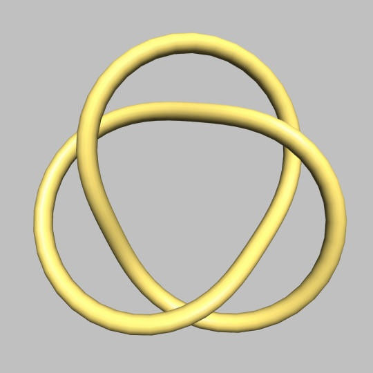
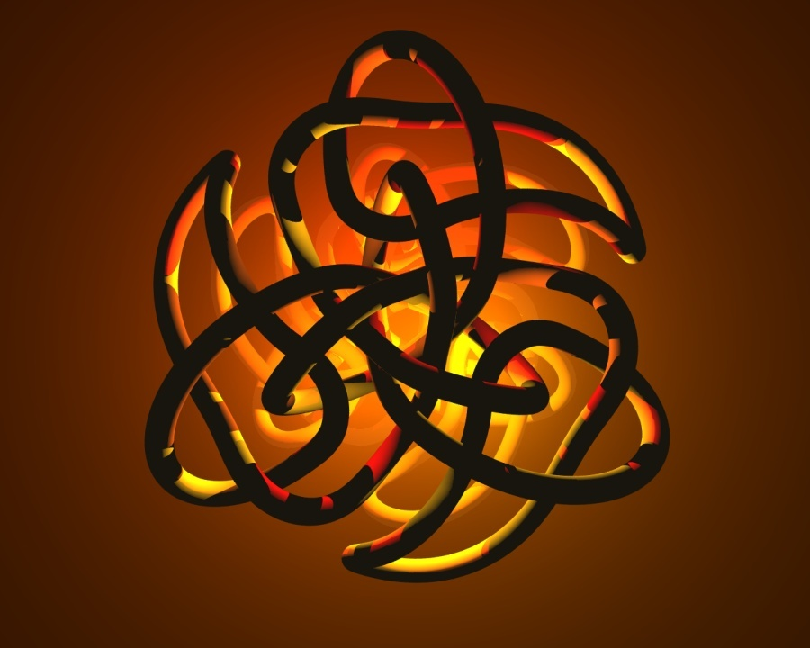
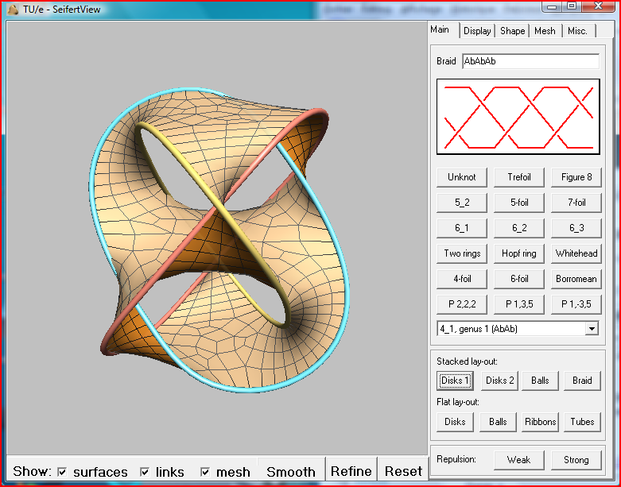

Le noeud le plus simple que l'on puisse imaginer est la "[demi clé](http://www.lesnoeuds.com/noeud-98.html)", et si l'on rejoint les deux bouts de la ficelle nouée, on obtient le "trêfle" ci-contre, un être mathématique étudié par la [théorie des noeuds](http://fr.wikipedia.org/wiki/Th%C3%A9orie_des_n%C5%93uds), une branche de la topologie aussi intéressante qu'esthétique.

Le logiciel [KnotPlot](http://knotplot.com/) permet d'explorer ce monde étonnant et de représenter en 3D des noeuds très complexes, comme celui ci-contre. KnotPlot est cependant complexe à utiliser, aussi son auteur [Rob Scharein](http://hypnagogic.net/rob/) a-t-il créé également [KnotZoo,](http://knotplot.com/zoo/) un catalogue de noeuds "simples" que l'on peut visualiser en 3D de manière interactive. L'applet Java de KnotZoo permet aussi de visualiser des [noeuds plus complexes](http://newweb.cecm.sfu.ca/cgi-bin/KnotPlot/fgetknot?knot=d3%2F7.k&rand=1&ncur=5&nseg=12&ncyl=12&twist=0&vcn=3&vcA=0.640&vcphi=2.094) et de télécharger les modèles 3D des noeuds au format .OBJ

Pour certains noeuds comme notre "demi clé", on peut créer une surface délimitée par la corde, un peu comme si on la trempait amidonnée dans de l'eau savonneuse pour créer une pellicule. Dans certains cas cette surface n'a qu'une face, comme un [ruban de Moebius](http://fr.wikipedia.org/wiki/Ruban_de_M%C3%B6bius). Mais est-ce possible pour tous les noeuds ?

|    |    |
| --- | --- |
|    |    |

En 1934  le mathématicien allemand Herbert Seifert montra comment créer une surface à deux faces pour n'importe quel noeud. Ce résultat permet de caractériser un noeud à l'aide de sa [surface de Seifert](http://en.wikipedia.org/wiki/Seifert_surface) qui peut être déformée selon les lois de la topologie.

Pour explorer cet univers surprenant, le logiciel [SeifertView](http://www.win.tue.nl/~vanwijk/seifertview/) est très simple d'emploi et ne demande aucune installation. Il permet aussi d'explorer les [tresses](http://fr.wikipedia.org/wiki/Th%C3%A9orie_des_tresses), un domaine connexe aux noeuds.

Bathsheba, un sculpteur [dont j'ai déjà parlé ici](http://drgoulu.local/2007/09/19/maths-et-art/) réalise même de [magnifiques oeuvres](http://www.bathsheba.com/math/borromean/) basées sur les surfaces de Seifert

### Référence

1. ["Théorie des noeuds" sur Sciences.ch](http://www.sciences.ch/htmlfr/algebre/algebrethnoeuds01.php)
