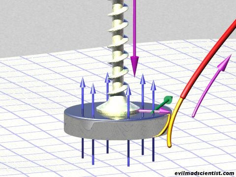

Yves m'a soumis une nouvelle colle : comment fonctionne ce moteur électrique ultra simple, formé de 4 pièces y compris la batterie ?



La pièce cruciale est le petit aimant cylindrique collé sous la tête de la vis. Plus il est puissant, mieux c'est car c'est la [force de Lorentz](http://fr.wikipedia.org/wiki/Force_de_Lorentz) qui fait tourner le moteur : cette force (en vert sur l'illustration ci-dessous) est perpendiculaire au champ magnétique (bleu) et au courant électrique (violet) par la "règle du tire-bouchon"

Les plus malins auront noté que la vis ne sert à rien, donc qu'il devrait être possible de réaliser un moteur en 3 pièces seulement : un pile, un rotor et un stator. La preuve:



Il existe une foule d'[autres variations de ces moteurs](http://www.youtube.com/view_play_list?p=CE35CBBBFEF6E365) dits "homopolaires" désormais très accessibles grâce à la disponibilité d'[aimants puissants](http://www.supermagnete.ch/fre/index.php?switch_lang=1) (c'est pas pour faire de la pub, mais s'ils veulent bien m'en envoyer quelques uns...)

### Références:

1. H. Joachim Sschlichting, Christian Ucke, "[Der einfachste Elektromotor der Welt](http://www.supermagnete.ch/projects/pu3.pdf)", 2004, Phys. Unserer Zeit Nr. 6 p 272, Wiley-VCH Verlag
2. "[MHD I: Demonstrate Magnetohydrodynamic Propulsion in a Minute](http://www.evilmadscientist.com/article.php/SimpleMHD)" sur EvilMadScientist.com
