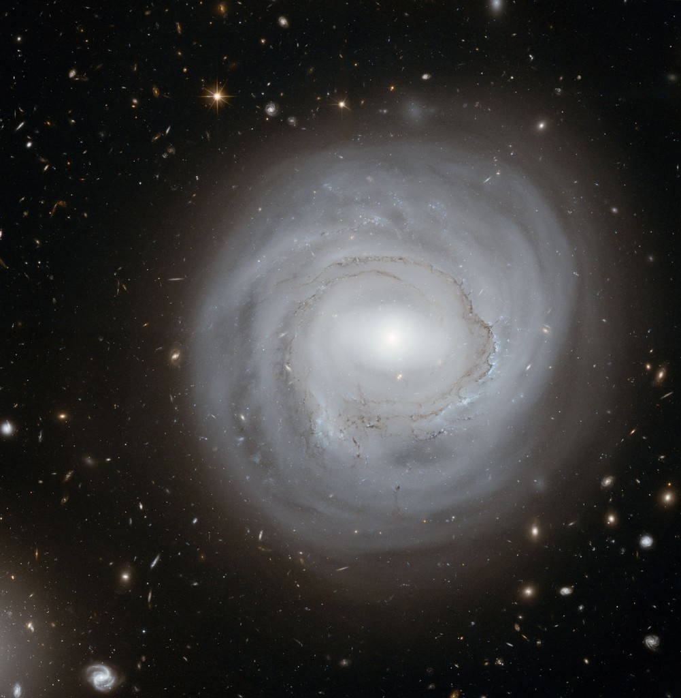
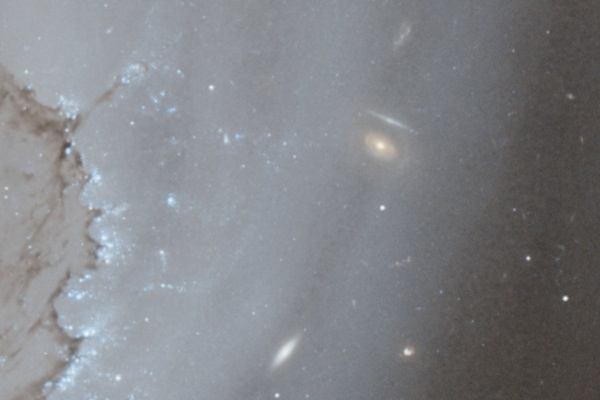
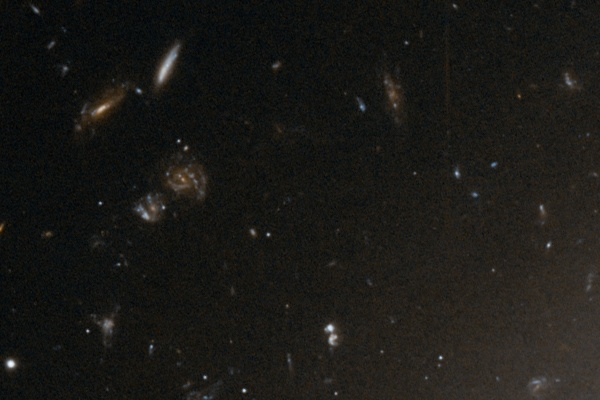

Hubble nous fournit une fois encore une [image magnifique](http://www.spacetelescope.org/news/heic0901/) :

La galaxie NGC 4921 est distante de 320 millions d'années lumière, et présente la particularité d'être peu dense et peu lumineuse. Pour les besoins d'une étude scientifique sur l'expansion de l'univers, le télescope spatial a réalisé 80 prises de vues de cette galaxie totalisant un temps d'exposition d'environ 27 heures! On a ainsi obtenu ainsi cette image qui révèle non seulement NGC 4921, mais aussi des centaines de galaxies plus distantes tapissant le fond du ciel\*.

Il est même possible d'en distinguer certaines à travers les bras spiraux de NGC 4921 et obtenant ainsi une image à tel point qu'il est possible de distinguer à travers elle d'autres galaxies, plus lointaines:

Comme sur d'autres clichés, le "[fond du ciel](/2008/04/25/un-festival-de-galaxies/)" de cette photo révèle également des objets de forme irréguliers, peut-être de jeunes galaxies en formation ou le résultat de leurs collisions:

Voilà donc encore quelques centaines de galaxies de plus à classifier et à étudier. Mais comme il n'y a pas assez d'astronomes pour suivre le rythme des découvertes, vous pouvez les aider en utilisant [Galaxy Zoo](http://www.galaxyzoo.org). Je vous en avais déjà parlé [ici](/2008/04/25/galaxy-zoo-lastronomie-collaborative/), mais je remets la compresse car ils viennent de passer en "version 2". Peut-être deviendrez-vous aussi célèbre que [Hanny](/2008/08/09/grosse-decouverte-grace-a-galaxy-zoo/) (qui a désormais [son blog](http://www.hannysvoorwerp.com/).)

\*Rappel : une galaxie est formée de milliards d'étoiles... il y a donc quelque chose comme 10'000'000'000'000 étoiles sur cette photo, à quelques zéros près...

Source : "[La galaxie NGC 4921 photographiée par le télescope Hubble](http://www.lecosmographe.com/blog/?p=836)" sur Le Cosmographe, un bon blog d'astro que je découvre à l'instant

Mise à jour du 21.2.09 : Le [HubbleCast](/2008/04/26/hubblecast/) #26 est consacré à cette image:

\[embed\]http://www.spacetelescope.org/static/archives/videos/medium\_flash/heic0901c.flv\[/embed\]
