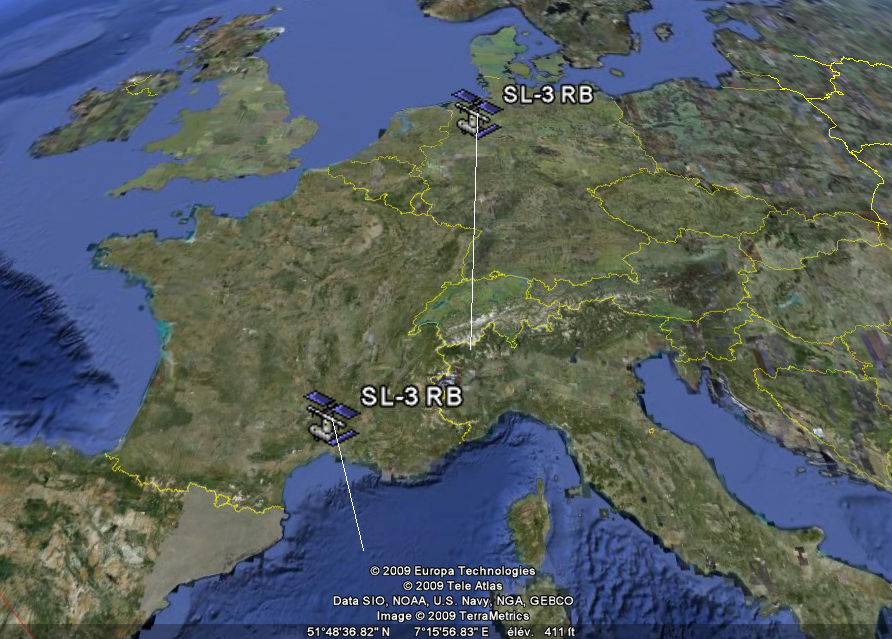

L'ouverture des produits Google permet des choses merveilleuses. Par exemple, [Orbiting Frog](http://orbitingfrog.com/) a réalisé des [scripts KML permettant de tracer suivre en temps réel la position de nombreux satellites en orbite](https://orbitingfrog.com/satellites-on-google-earth/).

A l'aide de [ce fichier](http://resources.orbitingfrog.com/ISSLocator.kmz) par exemple, on peut rapidement savoir si  un ovni qui traverse le ciel ne serait pas la Station Spatiale Internationale, par hasard. En cliquant sur un satellite dans GoogleEarth, on obtient immédiatement son nom et un lien vers une [description dans une base de données](http://www.n2yo.com/satellite/?s=25544).

Par exemple en ce moment je peux voir que les deux objets en orbite  les plus proches de chez moi sont deux... déchets : des étages de fusées soviétiques lancées en [1964](http://www.n2yo.com/satellite/?s=00877) et [1982](http://www.n2yo.com/satellite/?s=13403)

Dans le même registre, le [dernier fichier](http://resources.orbitingfrog.com/google_earth_files/IridiumCosmosDebris.kmz) mis à disposition par Orbiting Frog trace un panache d'orbites rouges et blanches :

[")](images/66690695d4329010c715feb9ff575d3e.png)

Ce sont les [orbites des débris de la collision](http://resources.orbitingfrog.com/google_earth_files/IridiumCosmosDebris.kmz) survenue le 10 février entre le Cosmos-2251 russe et le satellite Iridium-33, du moins les plus gros, qui ont pu être reprérés au radar.

On voit qu'ils suivent globalement les orbites initiales des satellites, donc que le choc n'a pas du être "en plein dedans", mais que les engins se juste assez touchés pour se désintégrer. Mais tout de même, puisqu'au bout de 10 jours les orbites forment des faisceaux de 10° à vue d'oeil, dans 6 mois déjà ces orbites seront réparties sur toutes les longitudes.

Ces satellites ayant des périodes de révolution de l'ordre de 100 minutes, les débris ont déjà parcouru plus de 100 tours de la Terre, et leurs légères différence de vitesse au moment du choc ont suffi à les répartir déjà sur une moitié d'orbite environ. Encore 10 jours et ils ceintureront la Terre en permanence...

Qui économise pour [faire un p'tit voyage en fusée](/2007/03/08/tourisme-spatial-et-risques/) ?
