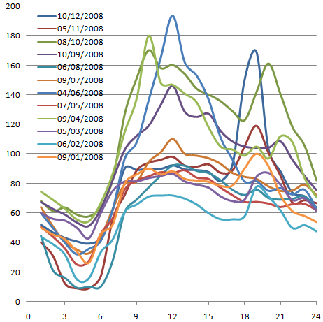
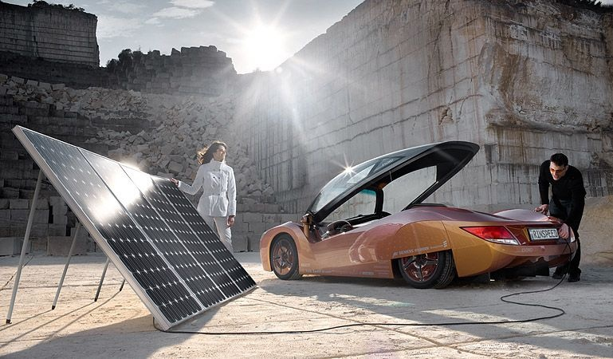

S'il devient techniquement possible de réaliser des [voitures électriques performantes](/2008/05/06/le-roadster-tesla-disponible-en-europe/), encore faudra-t-il produire proprement l'électricité pour les alimenter (ou l'hydrogène, ça revient pratiquement au même) .

Certains imaginent que l'énergie solaire pourrait être une solution, mais ils oublient de tenir compte de quelques éléments essentiels:

- le prix de l'électricité sur le [marché européen](http://www.powernext.fr/) varie d'un facteur 3 à 10 (!) chaque jour : entre 3h et 6h du matin, la surproduction des centrales thermiques (et nucléaires) est disponible à très bas prix, alors que la puissance est très recherchée lors des pointes de midi et du début de soirée.

- Une installation photovoltaïque produit de l'électricité justement pendant la journée, ce qui fait que le kWh peut être vendu [autour de 60 centimes d'Euros](/2007/08/26/energie-eolienne-et-solaire-a-prix-coutant/), soit à un prix permettant de couvrir les couts "seulement" 4 à 10 fois plus cher que le prix du marché ...

- En principe, on roule la journée avec nos voitures, et la nuit elles sont parquées. Ca tombe très bien : on rechargera les voitures électriques avec de l'électricité bon marché pendant le creux de consommation.

Pour minimiser le nombre de nouvelles centrales thermiques qui devront être construites, il faut combler la baisse de demande nocturne en exploitant toutes les formes de stockage d'énergie : recharger les voitures, produire de l'hydrogène, ou comprimer de l'air et pomper de l'eau dans les lacs alpins pour produire les pics du lendemain.

Mais n'en déplaise à mes compatriotes de [Rinspeed](http://www.motorlegend.com/actualite-automobile/rinspeed-ichange/3039.html) et de [Belenos Clean Power](http://fr.wikipedia.org/wiki/Belenos_Clean_Power) (lancé par M.Hayek [que j'admire beaucoup par ailleurs](/2007/05/15/montre-mecanique-contre-quartz/)), stocker de l'électricité solaire dans une bagnole est une aberration.

### Sources:

1. [Powernext.fr](http://www.powernext.fr/) : il suffit de s'inscrire (gratuit) pour obtenir les prix de l'électricité heure par heure depuis 2001
2. Blog "[Outils solaires](http://outilssolaires.blog.ca/)"
