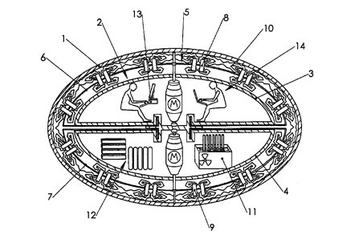
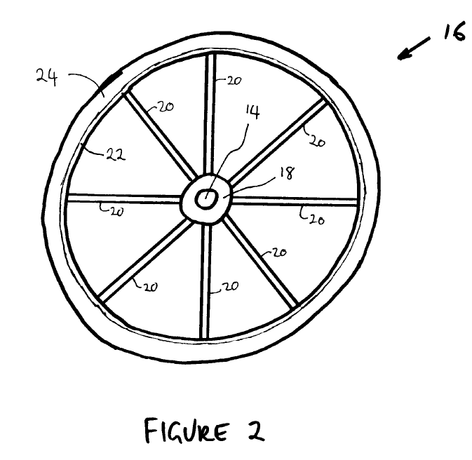
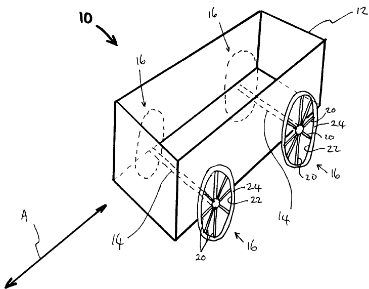

Je suis membre d'une société secrète dont voici le logo ci-contre.

Sur la société secrète je ne peux rien dire. Mais sur le logo je peux : c'est l'illustration du [brevet US 6,960,975](http://www.google.com/patents/US6960975) accordé le 1er novembre 2005 à Boris Volfson pour un "véhicule spatial propulsé par l'état du vide inflatoire" ("space vehicle propelled by the pressure of inflationary vacuum state")

Un [brevet](w:) garantit à un inventeur un monopole sur l'utilisation de son invention pour une période pouvant aller jusqu'à 25 ans dans certains pays, pour autant que l'invention satisfasse trois conditions:

1. La nouveauté, évaluée par rapport à l'état de la technique au moment du dépôt.
2. Etre le résultat d'une activité inventive, et non le résultat d'une déduction ou d'une combinaison évidente d'éléments existants.
3. Etre réalisable, ce qui signifie que quelqu'un possédant les connaissances de base nécessaire doit être capable de réaliser l'innovation décrite par le brevet à l'aide des informations figurant dans celui-ci.

Le vaisseau spatial de Volfson satisfait assez clairement les conditions 1 et 2, mais est-il "réalisable" ? Etonnament, oui. Il faut des éléments peu abondants au Bricorama du coin tels qu'une coque supraconductrice et un réacteur nucléaire, mais la Nasa devrait être capable de construire ce bidule.

Notez bien que la "réalisabilité" ne suppose pas la fonctionnalité. Le brevet décerné à Volfson ne permet pas de l'attaquer en justice si d'aventure le vaisseau que vous construisez dans votre jardin en suivant scrupuleusement ses plans ne parvient pas à [atteindre la vitesse de la lumière](/2004/08/09/acceleration/). Par contre, si ça marche, c'est Volfson qui peut vous attaquer en justice et se prévaloir du succès de l'opération...

A part les frais (élevés) de dépôt du brevet, Volfson n'a donc rien à perdre en déposant son invention. Le bureau d'avocats spécialisés qui l'a aidé à le rédiger a même tout à gagner. Et le bureau des brevets ? Aurait-il eu une raison de refuser ce brevet ?

En y regardant de plus près, probablement. Les premières pages du brevet décrivent la théorie physique sur laquelle se base le fonctionnement du vaisseau. Si l'examinateur avait considéré cette théorie comme faisant partie du brevet, il aurait du le rejeter car on ne peut breveter des théories.

Le fait d'avoir accepté le brevet signifie donc que la théorie physique sur la structure de l'espace-temps qu'il contient, appuyée par force références, est considérée comme l'état de l'art de la physique actuelle.

Examiner sérieusement un tel brevet demanderait des connaissances avancées en physique. Il y a un siècle,  [Albert Einstein travaillait au bureau suisse des brevets à Berne](https://www.ige.ch/fr/portrait/histoire-de-lipi/einstein.html), mais aujourd'hui les scientifiques ont l'impression que les brevets sont accordés beaucoup trop facilement, et essentiellement sur des considérations juridiques et économiques, voire politiques. Il faut dire:

1. qu'un brevet accepté, c'est des sous qui entrent à l'office, et des politiques contents parce qu'ils y voient un résultat de l'investissement dans la recherche
2. un brevet refusé, c'est des sous qui sortent si l'inventeur dépose un recours, et un [pays dont la recherche est moins productive que celle de ses voisins](http://www.senat.fr/questions/base/1998/qSEQ980508659.html).

Bref, un office des brevets n'a aucune raison de passer un temps couteux à examiner un brevet. La preuve extrême se trouve dans le brevet australien [2001100012](http://www.tuv.com/media/germany/50_trainingandconsulting/pdf/patente/Circular_transportation_facilitation_device.pdf) de 2001 à John Keogh un pour un "appareil circulaire facilitant le transport" ("circular transportation facilitation device") dont voici les deux figures illustrant l'invention :

 

On assiste donc à un formidable boum du nombre de brevets accordés, mais est-ce réellement l'image d'un boum de l'innovation ?



En parallèle on constate un boum encore plus colossal des actions en justice sur des questions de propriété intellectuelle.

En effet, si le brevet de John Keogh n'avait pas été annulé lorsqu'on s'aperçut que c'était un canular, il aurait fallu lui intenter un procès pour prouver que son "invention" n'était pas vraiment nouvelle puisqu'un autre appareil nommé "roue" remplit la même fonction depuis quelques millénaires. Facile contre un individu, mais contre une grande entreprise ?

Alors que le but des brevets était précisément de protéger les petits inventeurs contre l'appétit de grosses entreprises, cette protection n'est plus suffisante si la validité même du brevet peut être attaquée devant un tribunal.

Aujourd'hui on dit ouvertement dans les formations spécialisées qu'un brevet n'a de valeur que si on est (financièrement) capable de le défendre devant un tribunal, ce qui coute des millions et des années que seules les entreprises solides peuvent assumer.

Alors, combien vaut le brevet de Volfson ? Absolument rien, car à supposer que son vaisseau puisse fonctionner avant 2025, il sera construit par une organisation tellement puissante qu'il n'aura aucune possibilité de défendre son brevet face à elle, le pauvre.

A mon huble avis,  Boris Volfson aurait du écrire un roman décrivant son vaisseau spatial au lieu d'en déposer le brevet. Ses idées auraient dès lors été protégées par le droit d'auteur, qui présente de nombreux avantages sur un brevet:

- il ne coute rien et s'applique automatiquement dès la création, il n'y a même pas de formalités administratives à effectuer.
- il est valable 70 ans après la mort de l'auteur, donc souvent plus d'un siècle...
- on peut commercialiser des idées anciennes, évidentes ou irréalisables sous forme de nombreux bouquins vendus pas cher au lieu d'un énorme contrat très difficile à faire signer.
- la copie et la reproduction des oeuvres étant interdite, je n'aurais pas eu le droit d'intégrer l'illustration en tête de cet article sans l'autorisation de son auteur, ou sans lui payer des droits. Mais comme c'est publié dans un brevet, je peux. (du moins je crois)

### Liens

1. [L'Office européen des brevets en grève pour dénoncer les abus](http://www.numerama.com/magazine/10718-l-office-europeen-des-brevets-en-greve-pour-denoncer-les-abus.html) sur Numerama, 25 septembre 2008
2. [Statistiques sur les brevets](http://www.wipo.int/ipstats/fr/statistics/patents/) au WIPO
3. [Brevet](w:) et [Droit d'auteur](w:) sur Wikipedia
4. "[Patentabilty](http://www.uspto.gov/web/offices/pac/mpep/documents/2100.htm)" sur uspto.gov : règles de "brevetabilité" aux usa
5. [le droit des brevets](http://www.hautehorlogerie.org/fr/fondation/fight-against-counterfeiting/propriete-intellectuelle/droit-des-brevets/) sur hautehorlogerie.org, un résumé très bien fait
6. [page sur les mouvements perpétuels](http://www.quanthomme.info/energielibre/machines/MVP.htm) avec beaucoup d'illustrations et de références de brevets rigolos.
7. quelques recueils de brevets exotiques et amusants:
    - [CrazyPatents.com](http://www.crazypatents.com/)
    - [Crazy Patents](http://www.freepatentsonline.com/crazy.html) sur [freepatentsonline.com](http://www.freepatentsonline.com)
    - [The Null's Top Ten Crazy Patents](http://www.null-hypothesis.co.uk/science/strange-but-true/patent-lunacy/top_ten_bizarre_crazy_patents)
