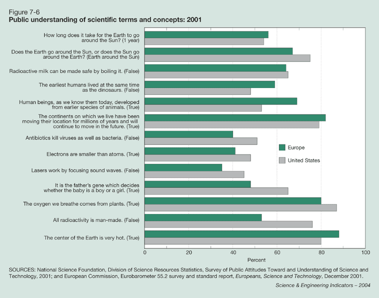
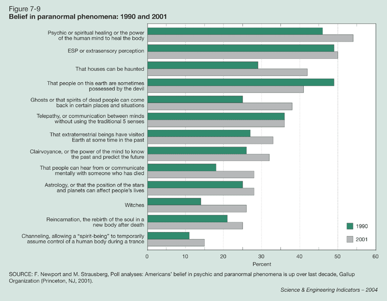

Selon un [récent sondage effectué aux USA](http://www.calacademy.org/newsroom/releases/2009/scientific_literacy.php) par la [California Academy of Sciences:](http://www.calacademy.org/)

- Seuls 53% des adultes américains savent en combien de temps la Terre tourne autour du Soleil.
- 59% savent que les premiers humains et les dinosaures ne vivaient pas en même temps.
- 47% peuvent approximativement dire quel pourcentage de la Terre est recouvert d'eau (71%, réponse admise à 5% près)
- Et seuls 21% ont répondu correctement aux 3 questions ci-dessus.

Hélas, il semblerait que les étatsuniens n'aient pas grand chose à nous envier, car les scores européens en matière de culture scientifique sont assez similaires, selon une étude datant de 2001 \[3\]:

Paradoxalement, une grande majorité des sondés pensent que la recherche et l'enseignement scientifique sont importants. Pour 4 adultes sur 5, l'enseignement des sciences est "absolument essentiel" ou "très important" pour le système de santé des USA (86%), la réputation du pays (79%), et l'économie (77%).

On pourrait voir ceci comme une bonne nouvelle  si on ne constatait pas simultanément une augmentation générale de la croyance au paranormal, à l'exception notable des cas de possession par le diable :

Comme le note BadAstronomer \[2\], les résultats du sondage ne montrent pas non plus d'amélioration de la situation depuis 1997, date de la parution du livre "Worlds Apart" \[4\] qui traite de ce sujet et est disponible en ligne.

Si vous lisez l'anglais, vous pouvez tester votre culture scientifique sur des questions plus fondamentales [sur cette page](http://www.infidels.org/library/modern/richard_carrier/SciLit.html) \[5\]. On y trouve une approche intéressante : faire découvrir ce qu'est la science plutôt que ce qu'elle dit. Peut-être que c'est une voie pour une meilleure culture scientifique : plutôt que d'apprendre des choses que l'on oubliera peut-être à l'age adulte, commencer par faire découvrir la méthode scientifique. Il me semble que c'est un peu la tendance de ce qui se fait à l'école pour mes filles aujourd'hui. On verra si ça marche mieux que pour moi ;-)

### Sources et Références:

1. [Science Literacy - American Adults 'Flunk' Basic Science, Says Survey](http://www.science20.com/news_releases/science_literacy_american_adults_flunk_basic_science_says_survey) sur Scientific Blogging
2. ["47% of Americans need to be launched into a heliocentric orbit"](http://blogs.discovermagazine.com/badastronomy/2009/03/13/47-of-americans-need-to-be-launched-into-a-heliocentric-orbit/ "Permanent Link: 47% of Americans need to be launched into a heliocentric orbit") sur BadAstronomy
3. National Science Board "Science and Technology: [Public Attitudes and Understanding](http://www.nsf.gov/statistics/seind04/c7/c7s2.htm)", 2004
4. Jim Hartz, Rick Chappel "[Worlds Apart](http://www.freedomforum.org/publications/first/worldsapart/worldsapart.pdf) : How the distance between science and journalism threatens America's future" , 1997, First Amendment Center ([_livre complet en ligne_](http://www.freedomforum.org/publications/first/worldsapart/worldsapart.pdf))
5. Richard Carrier "[Test Your Scientific Literacy! (2001)](http://www.infidels.org/library/modern/richard_carrier/SciLit.html)" sur infidels.org
