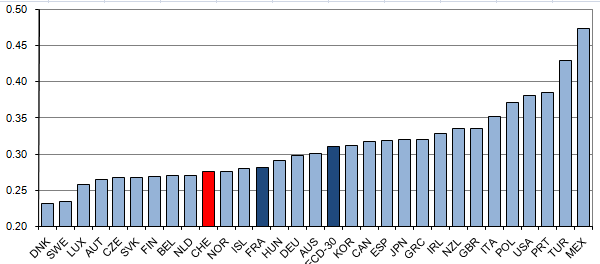
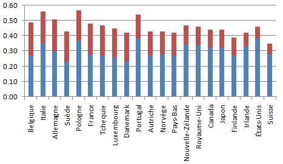

Le récent rapport de l'OCDE "Croissance et inégalités : Distribution des revenus et pauvreté dans les pays de l’OCDE" [[1]](#ref-1) me permet de revenir sur le thème abordé dans "[les inégalités s'accroissent. vraiment ?](/2007/01/09/les-inegalites-saccroissent-vraiment/)" et dans "[inégalités et croissance](/2007/09/26/inegalites-et-croissance/)" : comment mesurer les inégalités de revenu de manière scientifique, et comment mesurer les variations des inégalités.

### Mesures

Il existe plusieurs manières de mesurer les inégalités [[2]](#ref-2), les plus utilisées sont :

- le rapport interquantile : on compare la moyenne des 20% plus hauts revenus à celle des 20% plus bas. Ce rapport est très intuitivement compréhensible, mais ne dit rien de ce qui se passe pour 60% de la population considérée. On trouve  aussi des rapports interdéciles, basés sur le rapport entre des tranches de 10% de la population.
- les indices de Theil et de Hoover ont une magnifique [description mathématique totalement incompréhensible](w:Indice_de_Theil) pour le public.
- L'indice de Gini traduit de manière simple [[3]](#ref-3) la distribution des revenus de toute une population en un seul nombre compris entre 0 (= égalité parfaite) et 1 (=1 seule personne touche 100% du revenu). On trouve parfois des "coefficients de Gini" variant de 0 à 100.

L'indice de Gini est l'indicateur adopté par la plupart des organisations nationales et internationales. Voici par exemple les indices de Gini des pays membres de l'OCDE

Encore faut-il convenir de ce que l'on considère comme "revenu" pour effectuer des comparaisons, car le Gini d'une population dans laquelle les enfants seraient considérés comme ayant un revenu nul est bien différent de celui qui serait calculé sur le revenu des ménages. De même, comme nous le verrons plus bas, les inégalités mesurées sur le revenu avant impôts ou après impôts sont (heureusement) fort différentes.

Pour l'OCDE, "l_e concept de revenu utilisé est celui de revenu disponible du ménage, corrigé de la taille du ménage avec une élasticité de 0.5_."

Selon cette mesure, la Suisse est légèrement plus égalitaire que la France. A ceux que celà surprend, je concède que les classements dépendent beaucoup de la méthode utilisée. Selon [ce tableau](http://books.google.ch/books?id=8JH1YsIVS4sC&pg=PA56&hl=fr&source=gbs_selected_pages&cad=0_1#PPA57,M1), on voit que la Suisse se classe entre les rangs 4 et 11 suivant la méthode, et la France entre les rangs 7 et 13. Donc effectivement , si on considère le rapport interdécile D9/D1, la France est plus égalitaire. Contents ?

### Variations

Comme je l'avais remarqué lors des [deux](/2007/01/09/les-inegalites-saccroissent-vraiment/) [articles](/2007/09/26/inegalites-et-croissance/) précédents, il est difficile de trouver des mesures de l'indice de Gini sur de longues périodes. L'OCDE met désormais à disposition un tableau [[4]](#ref-4) dans lequel on trouve entre 1 et 6 valeurs par pays membre, étalées sur 30 ans, mais moyennées sur 5 ans.

J'en ai tiré le graphique suivant (en enlevant le Mexique, et la Turquie, au dessus de 0.4, et en interpolant certaines valeurs pour obtenir des courbes continues):



Sur 23 pays, 16 ont enregistré une augmentation des inégalités internes sur la période mesurée. La tendance à l'accroissement des inégalités est claire, mais il existe d'importantes variations. Les hausses les plus marquées sont en Nouvelle-Zélande, au Royaume Uni et aux Etats Unis, qui commencent à considérer ceci comme un problème [[5]](#ref-5). L'Irlande, la Belgique, le Luxembourg, le Danemark et la Suisse [[6]](#ref-6) ont maintenu le même niveau d'inégalités. Seuls la Grèce, l'Espagne et la France ont réussi à diminuer leur coefficient de Gini. Bravo !

Paradoxalement, le fait que les inégalités augmentent dans une majorité de pays n'implique pas qu'elles augmentent globalement. Considérons deux pays A et B de populations égales et dont les coefficients de Gini seraient rigoureusement égaux, mais en augmentation. Admettons que A soit un pays riche, mais à croissance nulle alors que B serait un pays pauvre mais en développement économique rapide. Si les deux pays fusionnaient, l'indice de Gini de A+B bondirait initialement à une valeur plus élevée que le Gini de A ou B, mais serait ensuite en baisse rapide même si les inégalités internes à A et à B augmentent.

C'est exactement ce qui se passe au niveau mondial, ce que montre de façon magistrale Hans Rosling dans ce [GapCast](/2008/03/07/les-gapcasts-geniales-videos-sur-les-statistiques-mondiales/) :



Si vous ne comprenez pas l'anglais, regardez [une variante de la présentation en français](http://www.gapminder.org/downloads/human-development-trends-2005/), ou utilisez [cette version interactive](http://www.gapminder.org/downloads/income-distribution-2003/) qui permet de  visualiser l'évolution de la distribution des revenus dans le monde en mettant en évidence certains pays. Vous comprendrez ainsi pourquoi les inégalités diminuent au niveau mondial, comme l'indiquent la plupart des études [[2]](#ref-2).

### L'effet des impôts

Les données de l'OCDE [[4]](#ref-4) permettent d'aborder une question soulevée dans les [commentaires de l'article "inégalités et croissance"](/2007/09/26/inegalites-et-croissance/) : l'effet des impôts. En effet le tableau contient les indices de Gini calculés d'après les revenus "avant" et "après" "impôts et transferts", ce qui permet de calculer de combien le système fiscal de chaque pays réduit les inégalités et de produire graphique dont je suis très fier, car je crois que c'est une première (merci de garder un lien vers cet article si vous le reprenez...):

Le classement horizontal est fait selon l'amplitude de la réduction de l'indice de Gini avant-après impôts. On voit que ce n'est pas (plus?) les pays du Nord qui aplanissent le plus les inégalités , mais plutôt le centre et l'est de l'Europe. La Suisse partage la queue du classement en compagnie des USA : leurs systèmes fiscaux ne réduisent que très peu les inégalités des revenus bruts. Mais à la décharge de mon beau pays, c'est celui où ces revenus bruts sont les moins inégaux...

### Références

1.  ([document complet](http://medias.lemonde.fr/mmpub/edt/doc/20081021/1109272_croissanceetinegalites.pdf), [résumé de 10 pages en ligne](http://www.oecd.org/dataoecd/48/9/41530189.pdf))
2. "[Inégalités de revenu](w:)" sur Wikipedia
3. Daniel Martin "[Inégalités : courbe de Lorenz, indice de Gini](http://www.danielmartin.eu/Cours/Gini.htm)", Medias et Democratie
4. Version [Google Docs](https://docs.google.com/spreadsheet/pub?hl=fr&hl=fr&key=0Al_D4zS2T4QodFpxYzNMZnktNDdwcEwzYnoxT3cycHc&single=true&gid=1&output=html) de la [feuille Excel de l'OCDE](http://statlinks.oecdcode.org/812008052P1G001.XLS)
5. Jean-Claude Péclet "[La chasse aux inégalités est relancée](http://letemps.ch/Page/SysConfig/WebPortal/letemps/jsp/paywall/error/usersession.jsp;jsessionid=7328634BAE32168A40DC9DDB4595ABDE)", Le Temps, Jeudi 19 mars 2009
6. Jean-Claude Péclet, "[Le fossé social ne s’est pas creusé](http://letemps.ch/Page/SysConfig/WebPortal/letemps/jsp/paywall/error/usersession.jsp;jsessionid=B83A8C614EFA7DBCF6AD13635FEB8530)", Le Temps, Jeudi 19 mars 2009
7. "Inégalité de la croissance mondiale, un risque conjoncturel ?", Secrétariat d'Etat (Suisse) à l'Economie ([SECO](http://www.seco.admin.ch)) ([pdf](https://www.seco.admin.ch/dam/seco/fr/dokumente/Wirtschaft/Wirtschaftslage/Konjunkturtendenzen/Ungleiches%20Weltwirtschaftswachstum%20als%20Konjunkturrisiko.pdf.download.pdf/spezialthemaherbst04_f.pdf)) (utilise le coefficient de Gini d'une façon non standard)
