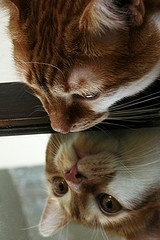
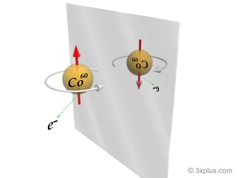

Un long article divisés en quelques Pourquois, Comments et Combiens. On commence en douceur:

## Pourquoi un miroir inverse-t-il la gauche et la droite et pas le haut et le bas ?

cette question "bête" en soulève deux autres moins triviales :

1. comment marche un miroir ?
2. comment définir la "gauche" et la "droite" ?

Un miroir réfléchit simplement la lumière en n'inversant rien du tout : en face d'un miroir, la lumière issue de votre main droite rebondit sur le miroir et arrive à vos yeux par la droite. La lumière venant de vos pieds vous parvient de même par le bas : tout est à sa place. Tout, sauf la "profondeur" : c'est en fait la distance des objets au miroir, autrement dit "l'avant" et "l'arrière" qui sont "inversés" par [réflexion](w:Réflexion_(mathématiques)) [[1]](#ref-1) :



Notre image dans un miroir est donc "retournée comme un gant" : un gant droit retourné devient un gant gauche, comme nos mains dans le miroir [[2]](#ref-2).

Même si nous nous regardons dans des miroirs artificiels ou naturels depuis pas mal de miliers d'années, nous avons toujours de la peine à comprendre que la symétrie ne correspond pas à une rotation (sauf dans un espace de dimension supérieur, comme le note  [Xochipilli dans son très chouette article](http://webinet.blogspot.com/2008/10/tes-tu-dj-demand-pourquoi-les-miroirs.html) [[1]](#ref-1) ). Ce fait bien [connu des joueurs de Tetris](w:tétromino) n'empêche pas certaines de tenter avec obstination d'orienter leurs mèches de cheveux à gauche ou à droite alors que personne ne les verra jamais comme elles se voient dans un miroir...

Ce qui nous amène à la seconde partie de la question : les notions de "gauche" et de "droite" ont-elles une réalité physique ? Autrement dit, existe-t'il des objets ou phénomènes dont l'image dans un miroir serait impossible ?

On pense tout de suite à l'écriture : un texte vu dans un miroir est illisible, ou du moins pas facilement. Mais ce n'est qu'une question de convention : on aurait très bien pu écrire de droite à gauche comme certaines langues, en utilisant des lettres "retournées"  comme dans cette jolie affiche:



## Comment expliquer la gauche et la droite aux extraterrestres ?

La question de la transmission de cette convention est d'ailleurs un problème intéressant :  les messages que certains ont envoyé aux extra-terrestres [[2]](#ref-2) ([une grave erreur](/1999/10/23/psc/)) sont composés de bits que les destinataires sont censés assembler en lignes et en colonnes pour produire des images en noir et blanc. Comment leur dire que les points doivent être disposés de gauche à droite plutôt que de droite à gauche ?

(On admet qu'on ne dispose pas de points de repère communs avec les extra-terrestres, sinon ça serait trop simple... Disons qu'ils vivent sous une couverture nuageuse perpétuelle et ne connaissent rien à l'astronomie ...)

Cette question est équivalente à celle posée plus haut : il suffirait de décrire dans le message un objet ou un phénomène physique dont l'image dans un miroir ne peut pas exister dans la réalité .

Il existe bien quelques objets déroutants en version "miroir", comme les tire-bouchons "tourne à gauche"  vendus dans les farces et attrapes, mais ils sont tous aussi possibles à réaliser que leur version "normale".

Une molécule chimique ? Il en existe beaucoup qui ont une forme différente de leur image dans le miroir. Par exemple le sucre existe sous forme de [dextrose](w:) qui fait tourner le plan de polarisation de la lumière à droite et sous sa forme [énantiomère](w:) [lévogyre](w:). La [chiralité](w:chiralité_(chimie)) des molécules détermine donc parfois leur propriétés physiques, mais ...  tout reste cohérent vu dans un miroir.

Les effets de ces molécules peuvent être très différents selon leur forme dans le miroir : la catastrophe de la [thalidomide](w:) est due à l'énantiomère d'un bête calmant, et la L-métamphétamine débouche juste le nez,  alors que  la D-[métamphétamine](w:) a d'autres effets...



La raison de ceci est que ces molécules interagissent différemment avec les molécules de notre organisme, qui ont elles-mêmes une certaine géométrie plutôt que leur image dans le miroir. Ainsi les êtres vivants sur Terre produisent ou consomme beaucoup plus de D-glucose (ou dextrose) que de L-glucose, et  l'ADN présent dans tous les être vivants à la forme d'une double hélice tournant dans à droite. Mais il n'y a pas de raison fondamentale à ceci : la vie a probablement "préféré" une forme plutôt qu'une autre à ses débuts, et cette "brisure de symétrie" s'est propagée par contagion, mais une biochimie "dans le miroir" est parfaitement cohérente.

L'électromagnétisme alors ?  Si on fait passer un courant électrique dans une bobine, on crée un champ magnétique avec un pôle Nord et un pôle Sud. Si la bobine est bobinée à l'envers, les pôles Nord et Sud sont inversés.

{{< figure src="images/0ae97d9c721ca421636f9fb86cbe6547.jpg" alt="La main droite, pouce écarté, tient le solénoïde. Le courant sort par les doigts et le pouce oriente le vecteur champ mégnétique." caption="La main droite, pouce écarté, tient le solénoïde. Le courant sort par les doigts et le pouce oriente le vecteur champ mégnétique." link="http://www.intellego.fr/soutien-scolaire-1ere-s/aide-scolaire-physique/fiche-physique-premiere-18-champ-magnetique-dans-un-solenoide-/20653" align="aligncenter" width="600" >}}

Oui... mais les notions de pôles magnétiques "Nord" et "Sud" sont tout à fait conventionnelles (jusqu'à ce qu'on trouve un [monopôle magnétique](w:)) : le schéma ci-dessus reste parfaitement cohérent vu dans un miroir.

## Combien de fêlures dans les miroirs de la physique ?

Jusqu'en 1956,  l'Univers observé dans un miroir était parfaitement cohérent. De fait, 3 des [4 forces fondamentales](w:interaction_élémentaire) ont une ["Symétrie-P" ou "Parité"](w:parité_(physique)) parfaite. Mais en 1956,  Mme [Chien-Shiung Wu](w:) démontra une [violation de parité](http://www.laradioactivite.com/fr/site/illustration/images/ViolationParite.htm) concernant la 4ème force, l'[interaction faible](w:). Lors de désintégration β d'un noyau de Cobalt 60, un électron est émis dans une direction aléatoire. Mais il y en a statistiquement [1 sur un million](http://irfu.cea.fr/Phocea/Vie_des_labos/Ast/ast_technique.php?id_ast=444) de plus qui part dans la direction opposée à celle du spin du noyau que dans la direction du spin (le spin indique le sens de rotation du noyau). En regardant l'expérience dans un miroir le spin change de sens et l'électron irait très légèrement plus souvent dans la direction du spin, ce qui est contraire à l'expérience. L'interaction faible "préfère" très légèrement la rotation à gauche et  on pourrait donc expliquer aux extraterrestres notre convention gauche/droite en leur transmettant ce dessin:

Mais si par malheur nos extraterrestres vivent dans une Galaxie (hypothétique) formé d'[antimatière](w:), on a un gros problème : l'antimatière peut également être considérée comme "vue dans un miroir". Chaque particule de la physique possède son antiparticule dont toutes les caractéristiques sont les mêmes sauf la charge électrique, qui est inversée. Le "miroir" de la "[Symétrie C](w:)" (C comme charge) est très semblable à celui de la symétrie P : toute la physique et la chimie est parfaitement identique avec de l'antimatière qu'avec de la matière, sauf pour l'interaction faible, exactement comme ci-dessus.

Autrement dit, si nos extraterrestres font l'expérience avec un noyau de ce que nous appellerions de l'anti-Cobalt 60 et observent la direction d'émission du [positron](w:), tout marchera parfaitement bien mais ils comprendront absolument tout à l'envers : la gauche et la droite, le signe des charges électriques, les pôles Nord/Sud magnétiques etc. Et la rencontre des deux civilisations fera des étincelles ...

Le problème est que notre dessin implique en fait 2 miroirs, le C et le P qui inversent tous deux de la même manière l'expérience, et comme chacun sait, si on regarde notre reflet dans un miroir à l'aide d'un autre miroir, tout se remet en place.



On appelle "[Symétrie CP](w:)" l'image de l'Univers qu'on obtient en inversant à la fois la gauche et la droite et les charges électriques, et cette symétrie était parfaite. Mais dans les années 1960, on a découvert une très légère brisure de la symétrie CP : la transformation d'un kaon en antikaon est 1 milliardième de fois  plus rare que la transformation d'un antikaon en kaon.

Cette nanoscopique (10\-9) fêlure a une conséquence pratique assez importante: nous existons.

En effet, c'est la violation de la symétrie CP qui fait que le Big Bang a eu la bonne idée de produire un milliardième de plus de matière "normale" que d'antimatière, et c'est ce milliardième qui ne s'est pas annihilé avec l'antimatière qui constitue tout ce qui nous entoure, sans quoi il n'y aurait pas eu grand chose après "que la lumière soit".

## Comment transformer une caméra vidéo en miroir temporel

Réponse : c'est très facile et amusant :



Même un extra terrestre très différent de nous devinerait assez vite qu'il regarde le film à l'envers parce que beaucoup de phénomènes macroscopiques ont une préférence pour le futur. Ce n'est pas le cas à petite échelle : toutes les interactions entre particules peuvent se produire "en sens inverse" : la mécanique quantique possède une "[symétrie T](w:)" que l'on retrouve dans les [diagrammes de Feynman](w:diagramme_de_Feynman) dont [Benjamin a causé ici](http://science-for-everyone.over-blog.com/article-27328860.html).

Voici donc un troisième miroir légèrement imparfait, qui peut se combiner avec les autres ! D'ailleurs, pour réaliser le film ci-dessus, je suppose que la demoiselle qui va "à l'endroit" regarde dans un miroir pour marcher à l'envers sans se heurter à la foule. En quelque sorte, la symétrie PT a permis de rendre le film plus réaliste qu'avec la symétrie T seule.

Mais à propos... pour la violation de la symétrie CP on a dit que la transformation d'un kaon en antikaon plus rare que son contraire, mais si on passe le film de l'expérience à l'envers ? On verra plus de kaons se transformer en antikaons, donc l'Univers observé dans les trois miroirs C,P et T sera parfaitement cohérent avec les observations dans l'Univers "normal".

La "[symétrie CPT](w:)" est aujourd'hui considérée comme une loi fondamentale de la physique car c'est une des rares qui soit compatibles à la fois avec la mécanique quantique et la théorie de la relativité via le principe d'[invariance de Lorentz](w:). Mathématiquement, on a même réussi à montrer que la symétrie T était identique à la symétrie CP et donc que toute violation de la symétrie CP devait causer une violation de T équivalente, et vice-versa.

## Les conséquences de la symétrie CPT

_Avertissement : dans ce paragraphe, je m'avance un peu en terrain dangereux, mais c'est pour mieux vous faire réagir si vous maîtrisez le sujet mieux que moi ..._

Une conséquence fondamentale de la symétrie CPT est qu'il est impossible de distinguer:

- une particule qui se promène entre les points A et B
- son antiparticule qui suivrait la même trajectoire entre A et B, filmée dans un miroir, et dont on passe le film à l'envers (où on la verrait donc aller de B en A)

Si on suppose que [le temps existe](/2008/12/24/la-nature-du-temps-2/) comme une [4ème dimension](/2007/02/07/le-temps-une-4eme-dimension-imaginaire/), on peut aller un peu plus loin en disant que ces deux observations sont parfaitement indiscernables :

- une particule qui se promène entre les points A et B
- son antiparticule qui remonte le temps entre B et A, vue dans un miroir.

Donc lorsqu'on reçoit par exemple un [rayon cosmique](w:) sous forme d'un antiproton à haute énergie, ne devrait-on pas vérifier s'il ne s'agirait pas d'un proton généré par un événement futur et qui remonte le temps? Est-ce que des installations comme l'[observatoire Pierre Auger](w:) ont un "miroir" permettant d'observer la brisure de symétrie P qui distingue les deux cas ?

Dans le même ordre d'idée, l'[effet Casimir](w:) est décrit par des phénomènes quantiques représentés par des diagrammes de Feynman ressemblant à la figure ci-contre, et qui surviennent des milliards de fois chaque seconde dans chaque millimètre cube de vide de tout l'Univers...

La lecture classique est que 2 particules virtuelles, dont l'une est l'antiparticule de l'autre apparaissent spontanément par les fluctuations du [vide quantique](w:), et leur annihilation mutuelle un court instant plus tard restitue "l'énergie du vide" empruntée par les particules.

Mais là aussi, je me demande comment distinguer cette interprétation de celle d'une particule tournant "en rond" dans le temps : pendant sa phase de retour dans le passé, la particule nous apparait exactement comme son antiparticule allant vers le futur ... Existe-t-il une expérience permettant de vérifier la symétrie P du phénomène pour exclure cette interprétation ?

## Références:

1. "[Jeu de réflexion](http://webinet.blogspot.com/2008/10/tes-tu-dj-demand-pourquoi-les-miroirs.html)" sur le Webinet des Curiosités
2. Michel Thévoz "L['homme retroussé](http://www.culturactif.ch/inedits/thevoz.htm)"
3. [Message de Dutil et Dumas](http://www.astrosurf.com/luxorion/Documents/seti-dutil-dumas.pdf) [sur Astrosurf](http://www.astrosurf.com/luxorion/seti-messages.htm)
4. ["La chimie prébiotique" sur Astrosurf](http://www.astrosurf.com/luxorion/bioastro-prebiotique2.htm)
5. Tom Roud "[Symétries I : de l’importance des symétries en physique](http://tomroud.cafe-sciences.org/2008/01/06/symetries-i-de-limportance-des-symetries-en-physique/ "Permanent Link: Symétries I : de l’importance des symétries en physique")"
6. Tom Roud "[Symétrie II : Groupes de symétries](http://tomroud.cafe-sciences.org/2008/01/13/symetrie-ii-groupes-de-symetries/ "Permanent Link: Symétrie II : Groupes de symétries")"
7. Tom Roud "[Symétries III : symétrie miroir, vecteurs et brisure de symétrie](http://tomroud.cafe-sciences.org/2008/01/27/symetries-iii-symetrie-miroir-vecteurs-et-brisure-de-symetrie/ "Permanent Link: Symétries III : symétrie miroir, vecteurs et brisure de symétrie")"
