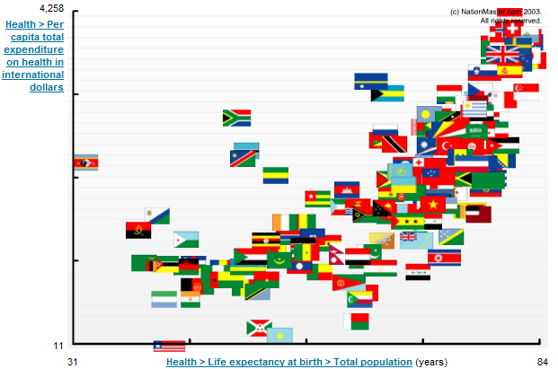
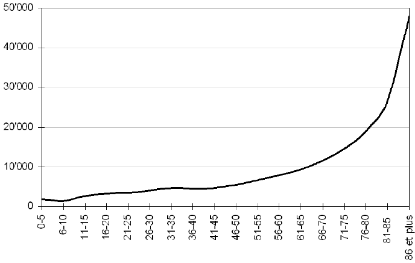

A l'occasion de la réouverture du débat sur le financement de l'assurance maladie en Suisse, épeluchons quelques chiffres avant d'esquisser quelques idées.

### Combien ça coûte chez les autres

Selon les données extraites du rapport "[Eco-Santé OCDE 2008](http://www.oecd.org/document/56/0,3343,fr_2649_34631_32566008_1_1_1_37407,00.html)" [[1]](#ref-1) et de ses "[notes par pays](http://www.oecd.org/document/55/0,3343,fr_2649_34631_35046839_1_1_1_1,00.html)", la situation n'a pas beaucoup évolué depuis [depuis 2004](/2007/02/09/les-couts-de-la-sante-en-suisse/) : la [Suisse](http://www.oecd.org/dataoecd/45/41/38980890.pdf) est toujours le pays de l'OCDE consacrant la plus grande part de son PIB (11.6% en 2004) à la santé, à part les [USA](http://www.oecd.org/dataoecd/46/2/38980580.pdf) (15.3%):



On voit également que l'augmentation des coûts a été générale, à l'exception de la [Finlande](http://www.oecd.org/dataoecd/42/44/40904932.pdf), seul pays qui est parvenu à stabiliser ses coûts sur 14 ans, le [Canada](http://www.oecd.org/dataoecd/46/33/38979719.pdf), la [Suède](http://www.oecd.org/dataoecd/46/6/38980334.pdf) et de [Danemark](http://www.oecd.org/dataoecd/42/44/40904932.pdf) y parvenant presque aussi. L'augmentation des coûts en Suisse est très nette jusqu'en 2004, mais les [chiffres des dernières années](http://www.bfs.admin.ch/bfs/portal/fr/index/themen/14/05/blank/key/internationaler_vergleich.html) montrent une stabilisation autour de 11% du PIB. Cette valeur est très proche de celle trouvée chez nos voisins de [France](http://www.oecd.org/dataoecd/45/20/38980771.pdf) ou [d'Allemagne](http://www.oecd.org/dataoecd/45/55/38979836.pdf). Les différences de pouvoir d'achat modifient légèrement la donne lorsqu'on compare les dépenses par habitant, en dollars [PPA](w:Parité_de_pouvoir_d'achat). Un [Norvégien](http://www.oecd.org/dataoecd/43/23/40905066.pdf) dépense autant en santé qu'un Suisse, mais nettement moins qu'un [Luxembourg](http://www.oecd.org/dataoecd/45/43/38980822.pdf)eois, comme on le voit ci-dessous :



Mais ce graphique montre un autre aspect intéressant : la répartition entre les coûts couverts par la collectivité (violet) et les dépenses privées (en bleu) varie beaucoup d'un pays à l'autre, sans qu'une corrélation visible ne permette de trouver un avantage à une solution plutôt qu'à une autre.

Aux USA, moins de la moitié (46%) de la facture de la santé est couverte par l'Etat. Suit la Suisse à 60%, puis seuls la [Grèce](http://www.oecd.org/dataoecd/45/54/38979850.pdf) (62%) et les [Pays-Bas](http://www.oecd.org/dataoecd/46/8/38980162.pdf) (62.5%) et le Canada (70%) sont en dessous de la moyenne de l'OCDE à 73%. A l'exception de la Grèce, tous ces pays se situent au dessus de la moyenne de l'OCDE à $2550/habitant, ce qui semble indiquer que le secteur privé ne maitrise pas mieux les coûts que le public.

### Pourquoi la santé coûte si cher

Grâce à la médecine, on vit plus longtemps. On s'attend donc à une corrélation entre les dépenses de santé et l'espérance de vie, mais elle n'est pas très nette\*:

Certains pays comme la [Jordanie](http://www.nationmaster.com/country/jo-jordan/hea-health) atteignent aussi 80 ans d'espérance de vie, mais la santé n'y coûte que $140/habitant et par an seulement (soit 9.3% du PIB jordanien tout de même...), alors que plusieurs pays africains dépensent plus alors que les nouveaux-nés ne peuvent [espérer](/2007/06/26/statistiques-et-esperance-de-vie/) y vivre que 50 ans. Est-ce donc bien parce qu'on dépense de l'argent dans la santé qu'on vit plus vieux ? Ou est-ce parce qu'on vit vieux que la santé coûte cher ? La question est délicate à plus d'un titre, mais une chose est certaine : le cout de la santé varie énormément avec l'âge, comme le montre ce graphique tiré des statistiques suisses [[2]](#ref-2):

La conséquence de ceci est qu'une petite augmentation de la part de personnes âgées dans la population correspond (dans les deux sens) à une forte augmentation des coûts de la santé. Ce n'est peut-être pas parce qu'il y a plus de médecins ou d'IRM que la santé coûte cher, mais parce qu'il y a plus de personnes (âgées) qui en ont besoin...

### Comment réduire les coûts de la santé

Le scénario démographique [[2]](#ref-2) prédit que les coûts continueront à augmenter au rythme de 2% par an en moyenne et atteindront 16% du PIB suisse vers 2030, où l'espérance de vie atteindra 90 ans.

Pour ralentir cette croissance, un modèle potentiellement  intéressant est celui du [Japon](http://www.oecd.org/dataoecd/45/51/38979974.pdf). Les japonais jouissent d'un niveau de vie très élevé, de la plus grande espérance de vie du monde (82.6 ans), et leur population est particulièrement âgée. Pourtant leurs dépenses de santé sont inférieures à la moyenne de l'OCDE. Comment font-ils ?

On trouve très peu d'information sur le sujet (si vous en avez, elles sont les bienvenues dans les commentaires) mais selon le [document de l'OCDE](http://www.oecd.org/dataoecd/45/51/38979974.pdf), leur situation est très différente de celle de la Suisse, voire de l'Europe:

- En raison d'un numerus clausus, il n'y a que 2.1 médecins japonais et 9.3 infirmiers-ères pour 1000 habitants, contre 3.8 médecins et 14.1 infirmiers-ères en Suisse (3.1 médecins et 9.7 infirmiers en moyenne dans l'OCDE).
- Par contre il y a 8.2 lits de soins intensifs pour 1000 japonais, contre 3.5 en Suisse (moyenne OCDE : 3.9)
- De plus le Japon possède près de 4x plus d'appareils [IRM](w:Imagerie_par_résonance_magnétique) par million d'habitants que la moyenne de l'OCDE, la Suisse juste un peu plus que la moyenne.

### Comment financer les coûts de la santé

Comme on l'a vu plus haut, les faits ne donnent pas raison à ceux qui prétendent que les lois du marché sont plus efficaces que le financement public dans le domaine de la santé. A mon humble avis, ceci est du au fait que la "demande" de santé n'a pas de limite. A partir de quel tarif direz-vous à votre médecin : "c'est trop cher, je préfère crever..." ?

L'introduction de la Lamal en 1994 a introduit une solidarité entre générations : désormais les jeunes paient pour les vieux. (Pourvu que ça dure jusqu'à ce que je sois vieux moi aussi...).  Mais la solidarité économique existe aussi, via les 60% de contribution publique d'une part et par les [subsides accordés au tiers](http://www.assurance-info.com/caisse_maladie_subsides.htm) le moins favorisé de la population.

Plutôt que de définir des [primes variables en fonction du revenu](http://www.lematin.ch/actu/economie/suisses-penchent-primes-revenu-111368) impliquant encore plus de paperasse et d'administration, on peut obtenir exactement le même effet en augmentant la part publique dans les dépenses de la santé. En l'augmentant de 60% à 80%, la Suisse se retrouverait dans une situation proche de la Norvège ou du Japon, et **les primes seraient divisées par deux!**

_Note\* :_ [_la corrélation "espérance de vie/part de la santé du PIB_](http://www.nationmaster.com/plot/hea_lif_exp_at_bir_tot_pop-life-expectancy-birth-total-population/hea_exp_tot_of_gdp-health-expenditure-total-of-gdp/flag)_" est encore moins nette._

### Références:

1. "[Eco-Santé OCDE 2008 : Statistiques et Indicateurs pour 30 pays](http://www.oecd.org/document/56/0,3343,fr_2649_34631_32566008_1_1_1_37407,00.html)", OCDE, 2008
2. Mathieu Vuilleumier, Sonia Pellegrini et Claude Jeanrenaud "[Evolution des coûts de la santé en Suisse à l’horizon 2030 / Explosion des coûts de la santé: mythe ou réalité?](http://www2.unine.ch/repository/default/content/sites/irene/files/shared/documents/ABSTRACTS-PAPIER/CJ-evol-couts-sante-08.pdf)", Institut de recherches économiques, Université de Neuchâtel 31 octobre 2008
