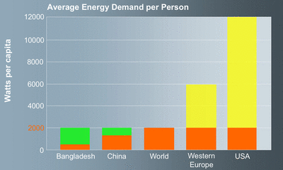
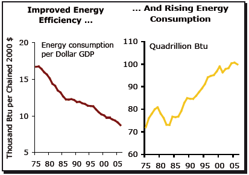

La "[société à 2000 Watts](http://www.societe2000watts.com/)" est un concept élaboré à l'EPFZ consistant uniformiser la consommation totale d'énergie de chaque habitant de la planète à 2000 Watts de puissance continue, soit  une énergie de 17'500 KWh ou 2'700 litres de pétrole par an. L'étude estime qu'en couvrant la production d'énergie correspondante avec 75% d'énergie renouvelable, les 25% issus d'énergies fossiles seront écologiquement supportables. La "société à 2000 Watts" est ainsi devenue le principe directeur du programme énergétique suisse, sous l'impulsion de  Moritz Leuenberger [[1]](#ref-1) . En Europe, la consommation d'énergie correspond à environ 6000W par personne. Il s'agirait donc de réduire notre consomation d'énergie de 2/3, alors que les états-uniens devraient diminuer la leur d'un facteur 6, tout en laissant le reste du monde se développer un peu:

Les presque 7 milliards d'humains consomment actuellement une puissance de l'ordre de 15 TeraWatt, soit à peine plus que 2000 W par personne en moyenne [[3]](#ref-3). Nous avons donc déjà une "société à 2000 Watts" à l'échelle planétaire.

Le "challenge" posé par le modèle est donc essentiellement de limiter l'utilisation de l'énergie fossile à 25%, soit 500W / personne. Mais si on y arrive, pourquoi se limiter à 2000W par personne ?

Les promoteurs des énergies renouvelable nous le répètent à l'envi :

- avec 200 m² de panneaux solaires par personne, on peut facilement produire les 17'500 KWh/an correspondant à la puissance continue de 2000W requise.
- il suffirait d'équiper quelques pourcents de la surface de nos pays (3% de la Suisse) pour produire la  totalité de l'énergie requise au niveau national, ou de déporter cette production dans des zones désertiques comme le Sahara

Le même raisonnement existe avec les éoliennes, qui pourraient fournir 5x la consommation mondiale d'énergie à elles seules [[2]](#ref-2) . Alors pourquoi ne pas tripler la surface de panneaux ou le nombre d'éoliennes et utiliser 6000W comme aujourd'hui , si on pouvait les produire proprement au même prix que l'énergie que nous consommons actuellement ? Il n'y a qu'une seule justification à la société à 2000W : c'est l'aveu qu'on n'arrivera pas à réduire le coût des énergies renouvelables au niveau des énergies fossiles et nucléaires.  On nous prépare donc à une hausse du prix de l'énergie (à vue de nez un un triplement) en tentant de nous convaincre que notre [efficacité énergétique](/2009/02/15/manicore/) peut être améliorée d'un facteur 3 sans que notre niveau de vie n'en soit affecté.

### Le paradoxe de Khazzoom-Brookes

Le problème, c'est que de nombreuses données montrent qu'une amélioration de l'efficacité énergétique crée une augmentation de la consommation d'énergie, et non sa diminution ! Ce paradoxe est connu sous le nom de "postulat de Khazzoom-Brookes" [[5]](#ref-5)

L'idée est la suivante : en augmentant l'efficacité énergétique d'un produit ou d'un service, il devient moins cher, donc plus de personnes peuvent se l'offrir, donc on consomme plus que ce qu'on économise ... Parmi les nombreux exemples, on peut citer le [procédé de Bessemer](w:) qui permit  de réduire d'un facteur 3 la quantité de charbon cramée par tonne d'acier, ce qui sonna le début de la production en masse d'acier au début de l'ère industrielle.

Plus près de nous, pensez aux voyages en avion : une traversée de l'Atlantique dans un petit coucou était réservée au gratin dans les années 1950, et aux personnes aisées dans les années 1970. Après le choc pétrolier, les avions deviennent plus gros, initialement dans l'idée de réduire le nombre de vols. De ce fait, ils consomment moins par passager (dommage pour le Concorde) et aujourd'hui presque tout le monde peut se payer un voyage transatlantique. L'amélioration énergiétique de nos maisons, voitures, ampoules et ordinateurs n'est donc pas un objectif écologique, mais d'une logique purement économique qui vise à diminuer le cout des produits pour en élargir le marché. Si nous sommes capables de réduire notre consommation d'énergie, que ferons-nous avec l'argent économisé si ce n'est d'acheter d'autres produits et services, nécessitant de l'énergie ?

### En route pour la société à 2 MegaWatts !

En 1964, l'astronome russe [Kardashev proposa une échelle](w:échelle_de_Kardashev) de mesure du niveau technologique des civilisations terrestres et extra-terrestres par l'énergie dont elles disposent:

- Niveau I : toute l'énergie solaire disponible sur leur planète  (~1016 W)
- Niveau II : toute l'énergie de leur étoile, captée par une [sphère de Dyson](w:) par exemple  (~1026 W)
- Niveau III : toute l'énergie de leur galaxie (~1036 W)

[Carl Sagan](w:) proposa la fonction suivante pour obtenir une échelle continue, W étant la consommation d'énergie en Watts :

$K = \frac{\log_{10}{W}-6}{10}$

Sur cette échelle, l'humanité se situe actuellement autour de K=0.7, avec un taux de croissance de 0.1 / siècle environ. D'ici 300 ans, nous devrions nous approcher du niveau I en consommant 1000x plus d'énergie qu'aujourd'hui. Pour produire autant d'énergie à une fraction du coût actuel, nous ne couvrirons pas la planète d'éoliennes ou de panneaux solaires. Nous pourrions mettre en orbite, mais la [fusion thermonucléaire](/tags/fusion/) sera plus probablement la source primaire. Comment peut-on imaginer utiliser tant d'énergie ? Peut-être en désalinisant la mer pour arroser des déserts. En construisant des tunnels intercontinentaux ou des trains circuleraient sous vide (efficacité énergétique oblige) à plus de 1000 km/h. En transformant le Lune en station touristique (mon rève depuis le 20 juillet 1969). En [allant beaucoup plus loin](/2004/08/09/acceleration/).

La société à 2 Kilowatts n'est pas un objectif, c'est l'aveu anticipé d'une défaite. Pour un objectif réaliste, ambitieux et qui fait rêver, visez la société à 2 MegaWatts !

### Références

1. Moritz Leuenberger ["Le but et le chemin : la société à 2000 watts"](http://www.uvek.admin.ch/dokumentation/00474/00492/index.html?lang=fr&msg-id=12194 "Le but et le chemin : la société à 2000 watts") allocution à la Conférence du G8-UE sur l’efficacité énergétique , 20.04.2007
2. Archer, C. L., and M. Z. Jacobson "[Evaluation of global wind power"](http://www.agu.org/pubs/crossref/2005/2004JD005462.shtml) , 2005, J. Geophys. Res., 110
3. "[L'énergie dans le monde : le passé et les avenirs possibles](http://www.cna.ca/wp-content/uploads/CNA_CERI07_FR.pdf)", 2007, Canadian Energie Research Institute
4. [Manicore](http://www.manicore.com), Jean-Marc Jancovici, le site de référence en matière d'énergie
5. Harry D. Saunders, "[Khazzoom-Brookes Postulate and Neoclassical Growth](http://ideas.repec.org/a/aen/journl/1992v13-04-a07.html)" , 1992, The Energy Journal, 13(4), p.130-147
6. Jeff Rubin, "[The Efficiency Paradox](http://research.cibcwm.com/economic_public/download/snov07.pdf)", Novembre 2007, StrategEcon
7. [Postulat de Khazzoom-Brookes](w:)sur Wikipedia (traduit de l'anglais par Dr. Goulu)
    
    L’énergie dans le monde :
    
    le passé et les avenirs possibles
