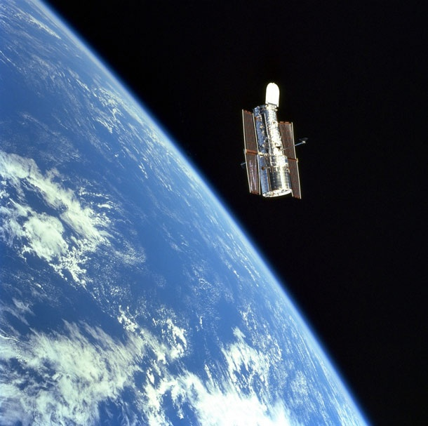
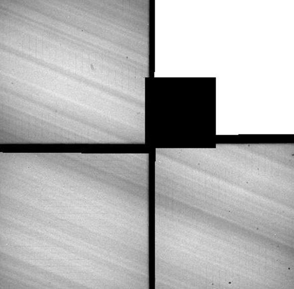
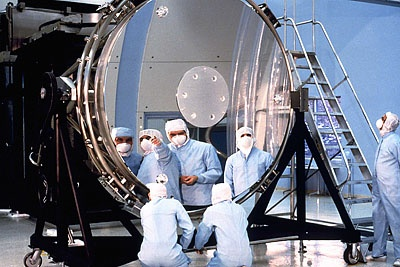
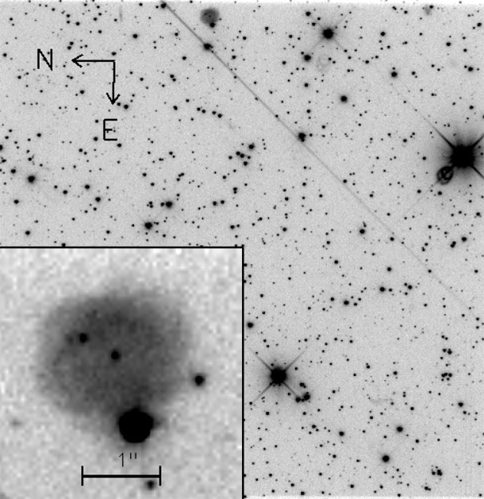

[](http://drgoulu.local/wp-content/uploads/HLIC/f27bb316dce873819e14d3686b47616e.jpg " 
<strong>Introduction</strong>
 
On April 24, 1990, the Space Shuttle <em>Discovery</em> roared into space, carrying on board a revolution: The Hubble Space Telescope. It was the largest and most sensitive optical-light telescope ever launched into space, and while it suffered initially from a focusing problem, it would soon return some of the most amazing and beautiful astronomical images anyone had ever seen. 
 
 Hubble was designed to be periodically upgraded, and even as I write this, astronauts are in the Space Shuttle <em>Atlantis</em> installing two new cameras, fixing two others, and replacing a whole slew of Hubble's parts. This is the last planned mission, ever, to service the venerable 'scope, so what better time to talk about it?
 
 Plus, it's arguably the world's most famous telescope (it's probably the only one people know by name), and yet I suspect that there are lots of things about it that might surprise you. So I present to you Ten Things You Don't Know About the Hubble Space Telescope, part of my <a href=\"http://blogs.discovermagazine.com/badastronomy/category/10-things/\">Ten Things series</a>. I know, my readers are smart, savvy, exceptionally good-looking, and well-versed in things astronomical. Whenever I do a Ten Things post some goofball always claims they knew all ten. But I am extremely close to being 100% positive that no one who reads this blog will know <em>all</em> ten things here (unless they've used Hubble themselves). I have one or two big surprises in this one, including some of my own personal interactions with the great observatory!
 
 So enjoy. Use the nav buttons under the pictures to go through the gallery, and see how well you score. Note: due to a software glitch with the gallery, the commenting has been turned off temporarily for this blog post. It will be turned back on soon. My apologies.
")J'ignorais aussi  beaucoup de choses sur le vénérable mais extraordinaire télescope spatial avant de lire [cet article de Phil Plait, le "Bad Astronomer",](http://blogs.discovermagazine.com/badastronomy/2009/05/13/ten-things-you-dont-know-about-hubble/) que je résume ici en français pour vous :

### 1 Hubble a pris la photo la moins lumineuse\*

En 2003, l'astronome Tom Brown [a pointé Hubble](http://hubblesite.org/newscenter/archive/releases/2003/15/text/) vers le bord de la Galaxie d'Andromède et a pris une photo avec un temps d'exposition de trois jours et demi. Il a ainsi détecté  les étoiles les moins lumineuses d'Andromède (de [magnitude apparente](http://fr.wikipedia.org/wiki/Magnitude_apparente) 31, 10 milliards de fois moins lumineuses que celles qu'ont distingue à l'oeil nu) mais aussi obtenu l'image optique la plus "profonde" de l'univers, que vous pouvez [downloader ici](http://hubblesite.org/newscenter/archive/releases/2003/15/image/a/warn/).

### 2 la Lune n'est pas trop claire pour Hubble.

A part certains détecteurs spéciaux, la plupart des cameras de Hubble peuvent observer des astres lumineux sans risque de destruction, comme le montre [cette image du cratère Copernic](http://hubblesite.org/newscenter/archive/releases/1999/14/image/a/format/web/), un impact de 90km de diamètre sur la Lune.

Par contre Hubble n'arrive pas à suivre un objet bougeant aussi rapidement dans le ciel que la Lune. les images doivent être prises en "mode embuscade"  :  on programme Hubble pour qu'il vise la direction où va se trouver le cratère quelques minutes plus tard et au bon moment on fait la photo avec une pose courte.

Ca ne marche pas à tous les coups : en 1999 on a voulu observer [l'impact de Lunar Prospector à haute vitesse au pôle sur de la Lune](http://science.nasa.gov/science-news/science-at-nasa/1999/ast13oct99_1/), mais le pointage de Hubble n'était pas parfait si bien que la détection d'eau par spectroscopie n'a pas pu être effectuée.

### 3 Hubble observe la Terre très souvent

En fait Hubble a observé la Terre des milliers de fois, tout simplement pour calibrer ses cameras !  En orbitant à 8 km/s, la Terre défile à toute vitesse. De plus, elle est trop près pour qu'Hubble puisse mettre au point, ce qui fait que les images de la Terre sont floues et "sillonnées". Mais on peut les [traiter mathématiquement](http://stsdas.stsci.edu/cgi-bin/gethelp.cgi?streakflat) pour obtenir la sensibilité de chaque pixel de la camera.

### 4 Hubble a même observé le Soleil !

Hubble ne peut absolument pas observer le Soleil directement. Le télescope spatial est muni d'un système de sécurité qui l'empêche de se transformer en four solaire vaporisant des millions de dollars de silicium si un [professeur Calys](https://tintinomania.com/a-lorigine-professeur-calys) faisait une petite erreur de calcul.

Mais Glenn Schneider a exploité de manière originale un système qui utilise la lumière UV solaire pour éliminer des électrons restés piégés dans les détecteurs, et réussi à produire une "image" mosaïque du Soleil. Tous les détails sont [sur son site](http://nicmosis.as.arizona.edu:8000/UVFLOOD/HST_SUN_IMAGE.html), mais c'est pas simple. L'image est de très mauvaise qualité et sans intérêt scientifique, mais montre l'ingéniosité sans borne des expérimentateurs, qui réussissent à tirer d'un appareil plus que ce pourquoi il avait été prévu.

### 5 Hubble ne peut pas voir les restes d' Apollo sur la Lune

Pourquoi Hubble n'a-t-il pas fait taire les adeptes de la [conspiration Apollo](http://fr.wikipedia.org/wiki/Accusation_de_canular_relative_au_programme_Apollo) en prenant des images des sites d'alunissages ? Une raison est que les astronomes ont autre chose à faire que de tenter de faire taire des illuminés qui prétendront de toutes façons que les images sont aussi truquées.

Mais aussi, Hubble ne peut pas voir ces objets ! Ils sont beaucoup trop petits. Ca surprend beaucoup de monde car nous sommes désormais habitués à voir des images ultra nettes de nébuleuses et de galaxies. Mais si ces objets sont très lointains, ils sont aussi très très grands : des années-lumière, ou parfois des milliers d'années lumière de diamètre.

Or les restes du [LEM](http://fr.wikipedia.org/wiki/Module_lunaire) ne font que 4 mètres... Mais la Lune est beaucoup plus proche, n'est-ce pas ? Oui, mais [pas assez](http://blogs.discovermagazine.com/badastronomy/2008/08/12/moon-hoax-why-not-use-telescopes-to-look-at-the-landers/).

La [résolution](http://fr.wikipedia.org/wiki/Pouvoir_de_r%C3%A9solution) de Hubble est de 0.1 [seconde d'arc](http://fr.wikipedia.org/wiki/Seconde_d%27arc), ce qui correspond à 200 mètres sur la Lune. C'est surprenant, mais il faudrait un télescope 50x plus puissant que Hubble pour voir le LEM sur un seul pixel...

### 6 Hubble a observé toutes les planètes sauf Mercure.

Pas de problème pour les planètes extérieures à l'orbite terrestre : Hubble a observé [Mars](http://hubblesite.org/newscenter/archive/releases/solar-system/mars/), [Jupiter](http://hubblesite.org/newscenter/archive/releases/solar-system/jupiter/), [Saturne](http://hubblesite.org/newscenter/archive/releases/solar-system/saturn/), [Uranus](http://hubblesite.org/newscenter/archive/releases/solar-system/uranus/), [Neptune](http://hubblesite.org/newscenter/archive/releases/solar-system/neptune/) et même [Pluton](http://hubblesite.org/newscenter/archive/releases/solar-system/pluto/).

Mais le système de sécurité mentionné plus haut empêche de pointer Hubble vers Venus et Mercure. La marge de sécurité de 50° a été une seule fois exceptionnellement réduite à 45° pour [observer Venus](http://hubblesite.org/newscenter/archive/releases/1995/16/image/g/), à la recherche (infructueuse) de SO2 d'origine volcanique.

Mercure se situe au maximum à 28° du Soleil, trop près pour que Hubble puisse l'observer sans dommages. Mais la sonde [Messenger](http://drgoulu.local/2008/01/19/mercure-de-mariner-a-messenger/) est en train de nous en apprendre beaucoup plus sur Mercure que tout ce que nous aurions pu imaginer voir depuis la Terre ou son voisinage immédiat.

### 7 Hubble  n'utilise pas de lentilles. Enfin presque.

19 ans après le lancement de Hubble, il n'est pas rare d'entendre parler de la "lentille de Hubble", même dans un show produit par _le  Space Telescope Science Institute_, l'agence qui exploite Hubble!

Il faut dire qu'en anglais on utilise le terme "telescope" également pour une [lunette astronomique](http://fr.wikipedia.org/wiki/Lunette_astronomique) à lentilles (un "[refracting telescope](http://en.wikipedia.org/wiki/Refracting_telescope)" si on voulait être précis)

Hubble est un "[reflecting telescope](http://en.wikipedia.org/wiki/Reflecting_telescope)"  doté d'un miroir de 2.4 mètres, le plus grand jamais hissé en orbite :

En fait même les caméras utilisent des miroirs plutôt que des lentilles, qui absorberaient un peu de lumière mais surtout causeraient de l'[aberration chromatique](http://fr.wikipedia.org/wiki/Aberration_chromatique).

Cependant, il y a quelques lentilles à bord : celles des [Fine Guidance Sensors](http://www.stsci.edu/hst/fgs/documents/instrumenthandbook/c02_instdesign2.html#5884), petits télescopes qui suivent des étoiles "repères" avec une incroyable précision pour maintenir Hubble pointé dans la bonne direction.

### 8 Tout ce qu'il voit n'est pas intentionnel.

Hubble a plusieurs caméras qui observent différents points du ciel séparés de quelques minutes d'arc. Si l'une est entrain d'observer, disons le centre d'Andromède, les autres voient les environs du centre de cette galaxie, mais n'étaient initialement pas exploitées.

Mais en 1997, une nouvelle mémoire de masse a été installée à bord, et la bande passante étant suffisante pour transmettre les mesures de 3 caméras à la fois, on a lancé le "programme parallèle" : une caméra observe ce qui est visé, et deux autres observent à côté, "au cas où..."

En octobre 1997, Hubble était pointé sur le Grand Nuage de Magellan. La caméra active était  la [WFPC2](http://hubblesite.org/the_telescope/nuts_.and._bolts/instruments/wfpc2/), mais Phil Plait utilisait la [STIS](http://hubblesite.org/the_telescope/nuts_.and._bolts/instruments/stis/) en parallèle. En arrivant au boulot le matin, il regardait ce que STIS avait mesuré le jour précédent, en regardant dans des directions jamais observées précédemment.

La majorité du temps, il n'y voyait rien de spécial. mais un jour il vit ceci :

La tache floue est une "nébuleuse planétaire", un nuage de gaz émais par une étoile mourante, Malheureusement elle avait été découverte précédemment et ne s'appelle donc pas "nébuleuse Phil Plait", mais il put cependant en tirer quelques conclusions du spectre de l'objet dans une [publication.](http://www.jstor.org/cookieabsent.html)

Et comme il le dit, il ne sait pas ce qu'il trouvera sur son bureau demain grâce au "programme parallèle".

### 9 Une camera de Hubble est déjà au musée

Au Smithsonian [Air and Space Museum](http://www.nasm.si.edu/) à Washington DC, vous pouvez voir le [Faint Object Spectrograph](http://www.stsci.edu/hst/fos) (FOS) qui a été démonté en 1997 pour faire de la place à STIS et à [NICMOS](http://hubblesite.org/the_telescope/nuts_.and._bolts/instruments/nicmos/)

### 10 Vous pouvez voir toutes les photos prises par Hubble

Depuis son lancement en 1990, Hubble a orbité plus de 100'000 fois autour de la Terre et a effectué un demi million d'observations distinctes. Le public a accès à toutes les images qui ont été prises au moyen de cette [base de données](http://archive.stsci.edu/hst/search.php).

Mais les images récentes n'y sont pas : elles sont réservées pendant un an aux scientifiques qui ont commandé les observations, ce qui leur laisse une longueur d'avance pour publier leurs travaux tout en fournissant ensuite gratuitement d'innombrables informations utiles à d'autres chercheurs, et de très beaux fonds d'écrans aux amateurs.

**Note\* :** ma traduction initiale de _Hubble took the deepest visible light image yet made_ était _Hubble a mesuré la lumière la plus faible_, mais un disciple de transmission quantique à un photon par bit a fait [un commentaire](http://drgoulu.local/2009/05/13/10-choses-que-vous-ignorez-a-propos-de-hubble/#comment-3353) ;-)
