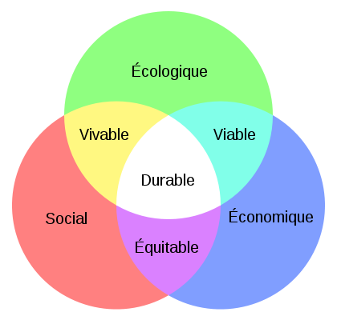

Le responsable "santé+sécurité+environnement" de mon employeur nous a présenté les 3 piliers du "[développement durable](https://fr.wikipedia.org/wiki/développement_durable)" (Ecologique, Economique et Social) avec ce joli graphique :

J'ai trouvé très judicieux d'intégrer ainsi le développement durable aux logiques économique et sociale plutôt que de le promouvoir dans un cadre purement écologiste.

En y réfléchissant, je me demande s'il n'existe pas un parallèle avec la fameuse [équation de Kaya](https://fr.wikipedia.org/wiki/équation_de_Kaya) dont j'ai [déjà parlé ici](/2009/02/15/manicore/) et que je rappelle ci-dessous :

En effet, minimiser le facteur CO2/TEP représente le souci écologique de limiter la pollution. Réduire TEP/PIB est un objectif économique : rendre la production moins coûteuse en énergie. PIB/POP est lié à l'objectif social de répartir les richesses, si possible plutôt en enrichissant les pauvres que le contraire ...

Reste le 4ème facteur de Kaya : la POPulation. Ne manquerait-il pas dans le joli diagramme coloré du développement durable ? A quoi ressemblerait ce diagramme si nous étions beaucoup plus ou beaucoup moins ?

Plus j'y pense plus je suis persuadé que la distance entre les 3 piliers dépend de la population : avec quelques millions d'humains, le monde serait plus facilement viable et vivable, et peut-être même plus équitable. Mais avec des milliards, existe-t-il encore une intersection entre les 3 piliers qui permette un "développement durable" ? Et les intersections "viable, vivable et équitable", à quels niveaux de population disparaissent-elles ?

En plus de nos louables efforts sur les 3 piliers, ne devrions-nous pas favoriser une importante baisse de la population mondiale (progressive, non violente et contrôlée, je le précise...) ?
