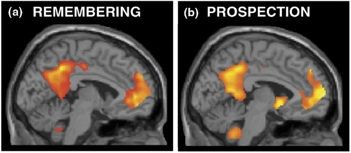

Dans son excellent blog "[Cosmic Variance](http://blogs.discovermagazine.com/cosmicvariance/)", Sean Carroll aborde souvent la passionnante question de la nature du temps et m'a inspiré plusieurs [billets sur ce thème](/tags/temps/).  Son récent article "[Remembering the Past is Like Imagining the Future](http://blogs.discovermagazine.com/cosmicvariance/2009/04/14/remembering-the-past-is-like-imagining-the-future/ "Permanent Link: Remembering the Past is Like Imagining the Future")" est  un peu moins cosmologique que d'habitude, mais tout aussi excitant.

Grâce à l'imagerie médicale, on sait aujourd'hui que les zones du cerveau activées lorsqu'on imagine une situation future sont les mêmes que celles utilisées lorsqu'on se rappelle une situation du passé.

L'idée selon laquelle notre capacité à faire un "voyage dans le temps" mental en nous projetant dans le futur reposerait sur notre mémoire du passé date de 1985, où D.H. Ingvar publia "Memory of the future" [[1]](#ref-1). En 2005, Tulving publia le résultat de nombreuses expériences astucieuses effectuées sur les animaux [[2]](#ref-2): seuls les humains sont capables de voyager dans le temps mentalement. De nombreuses autres études indiquent que les amnésiques ont plus de difficultés que la moyenne des gens à se projeter dans le futur, difficultés rencontrées aussi par les personnes atteintes de certaines maladies mentales comme la schizophrénie.

Toutes ces informations sont détaillées dans un article de Daniel L. Schacter et de son équipe à Harward [[3]](#ref-3), qui ont franchi une étape de plus en soutenant que notre cerveau est un "organe prospectif", dont une des fonctions essentielles est justement de nous permettre d'envisager des situations futures, et que que notre mémoire du passé est un élément essentiel de cette fonction. En effet, à quoi bon se souvenir du passé si nous étions incapables d'utiliser ces informations pour prendre des décisions influant sur notre futur ?

Selon Schacter, il est de ce point de vue normal que notre mémoire ne fonctionne pas comme celle d'un ordinateur qui se remplit progressivement, mais en étant plutôt capable de relier entre eux des morceaux de souvenirs avec une extrême flexibilité. Si je suis en présence d'un objet brûlant, je me rappelle instantanément des nombreuses occasions où je me suis brûlé (y compris la fameuse fois où j'ai marché pieds nus sur un fer à souder...) et je suis capable d'interpoler et d'extrapoler à la fois pour agir de façon à ne pas me brûler cette fois-ci. De plus, les scénarios imaginés rejoignent les souvenirs, parfois même en s'y confondant, mais ceci nous permet d'améliorer encore notre comportement futur.

Ainsi, le cerveau nous donnerait un avantage adaptatif important en nous permettant de "simuler" les futurs possibles, et en les intégrant au même rang que nos souvenirs.

### Références:

1. Ingvar, D. H. ,"Memory of the future : an essay on the temporal organization of conscious awareness", 1985. Human neurobiology, 4(3), 127–36. 
2. Tulving, E. (2005). Episodic Memory and Autonoesis: Uniquely Human? In H. S. Terrace & J. Metcalfe (Eds.), _The missing link in cognition: Origins of self-reflective consciousness_ (pp. 3-56). New York, NY, US: Oxford University Press. 
3. Daniel L. Schacter, Donna Rose Addis and Randy L. Buckner, "Remembering the past to imagine the future: the prospective brain", Nature Reviews, Neuroscience volume 8, september 2007, 657 ([pdf](http://dericbownds.net/uploaded_images/schacter_memory.pdf)) 
