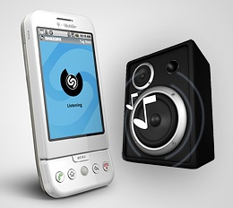

Si vous ne connaissez pas [Shazam](http://www.shazam.com/), demandez à un propriétaire d'iPhone (eux) ou de Google Phone sous Androïd ([nous](http://microclub.ch/2009/06/21/mon-google-phone-htc-magic/)) de vous montrer cette application incroyable. Si personne dans votre entourage ne vit au 21ème siècle, vous  pouvez toujours regarder [cette démonstration en video](https://www.dailymotion.com/video/x810ll).

Vous ne rêvez pas : Shazam est capable d'identifier en quelques secondes la musique que vous êtes en train d'écouter à la radio, dans un bar bruyant, ou le générique d'une émission TV ou que sais-je. On dirige le micro du téléphone vers un haut-parleur, on clique un seul bouton et Shazam! le titre du morceau apparait, avec les liens qu'il faut pour l'acheter, évidemment. Business is business.

Ce qui nous intéresse ici, c'est de savoir comment diable Shazam fait pour reconnaitre quasi-instantanément 10 secondes de son parmi 8 millions de morceaux de musique de 3 minutes chacun, soit un total de 1.44 milliards de secondes, ou 45 ans de musique, et ceci même lorsque la musique est diffusée par une mauvaise sono et captée par un mauvais micro dans un environnement bruité. Ca ne vous épate peut être pas si vous n'êtes pas dans la technique, mais moi je suis resté coi d'une hébétude aussi stupéfaite qu'interloquée. Sur le cul, quoi.

Pour comprendre, j'ai un peu fouillé et trouvé que la technologie appartient à [Landmark Digital](https://www.linkedin.com/company-beta/11105/) qui a notamment acquis la propriété intellectuelle de dénommés [Avery Wang](https://www.linkedin.com/in/averywang08/) et David Culbert. Leur brevet de 2003 \[1\] est un modèle du genre : il décrit le système en termes suffisamment généraux pour comprendre le principe, mais en évitant soigneusement de donner des informations précises sur comment ça marche vraiment. Mais voici tout de même ce que j'en ai compris.

Shazam compare des "empreintes" calculées à des instants remarquables du morceau, par exemple lorsque des notes apparaissent nettement dans le diagramme temps/fréquence du morceau. Pour des raisons expliquées plus bas il faut comparer environ une centaine d'empreintes, et comme Shazam demande d'enregistrer une dizaine de secondes de musique, j'en déduis qu'ils prennent environ 10 empreintes par seconde, donc que chaque morceau est stocké chez eux sous la forme de 1800 empreintes environ.



Le brevet est extrêmement vague sur le problème clé du calcul des empreintes. Il mentionne une liste de caractéristiques du son qui pourraient être utilisées, et indique qu'un choix judicieux permet de s'affranchir de diverses perturbations du son, en particulier de décalages fréquentiels, mais surtout que l'empreinte peut être ramenée à un nombre de 32 bits seulement. Avec ce qui précède, il en résulte que les empreintes d'un morceau complet ne nécessitent que 7K de mémoire, et que toute la base de données de Shazam tient sur 54 Gigabytes seulement, ce qui veut dire qu'elle peut tenir dans la mémoire RAM d'une vingtaine de PC actuels.

Reste à retrouver dans cette masse d'empreintes la centaine d'empreintes obtenues à partir de la musique transmise depuis votre téléphone. Et là, la méthode est génialement simple : Pour chaque empreinte, Shazam regarde à quels morceaux elle pourrait appartenir en utilisant simplement l'empreinte comme une clé dans la base de données. En effet, comme 32 bits permettent de coder plus de 4 milliards de possibilités alors que la base ne contient "que" 14 milliards d'empreintes, une empreinte donnée se retrouve en moyenne dans 3 morceaux seulement. Puisque les empreintes tirées de l'échantillon sont bruitées, il faut comparer une centaine d'empreinte qui vont chacune correspondre à 3 morceaux, donc on se retrouvera avec 300 morceaux potentiellement candidats.

C'est là que le brevet de Shazam frappe fort : si 2 empreintes seulement correspondent à un même morceau, on considère que c'est celui-là ! En effet, il n'y a qu'environ un risque sur 25'000 que l'un des 300 morceaux suspecté à cause d'une empreinte bruitée corresponde à l'un des 3 morceaux identifié par une empreinte correcte.

La technologie de Shazam/Landmark permet aussi d'autres applications, comme reconnaître la musique utilisée dans les bandes son des vidéos sur YouTube et la virer si elle est soumise à copyright, ou peut-être aussi identifier des mp3 échangés sur des réseaux p2p, des trucs comme ça ...

Car pour la reconnaissance de la musique, il y a désormais encore plus fort que Shazam : [Midomi](http://www.midomi.com/). Avec Midomi, il suffit de chantonner, siffloter ou hmmm-hmmm-er un air pour qu'il en retrouve le titre et l'auteur. Mais ça m'épate moins parce qu'avec moi, ça ne marche pas. Ni "Yellow Submarine", ni "Frère Jacques", ni même [l'air de la reine de la nuit façon Foster Jenkins](http://www.dailymotion.com/video/x4feuf_florence-foster-jenkins-reine-de-la_music), rien.

### Référence

1. WANG, Avery Li-Chun and CULBERT, Daniel, "Robust and invariant audio pattern matching", 2003, [patent WO03091990A1](http://drgoulu.files.wordpress.com/2009/07/wo03091990a1.pdf)
2. Avery Wang, "An Industrial-Strength Audio Search Algorithm", 2003, ISMIR 2003, 4th International Conference on Music Information Retrieval, Baltimore, Maryland, USA  \[article pdf](http://www.ee.columbia.edu/~dpwe/papers/Wang03-shazam.pdf)\] \[[slides pdf\](https://fr.wikipedia.org/wiki/article_pdf](http://www.ee.columbia.edu/~dpwe/papers/Wang03-shazam.pdf)\]_\[[slides_pdf\)(http://ismir2003.ismir.net/presentations/Wang.pdf)
3. \[altmetric doi="10.1145/1145287.1145312" float="right"\] Avery Wang "The Shazam music recognition service", 2006 , Communications of the ACM - Music information retrieval Volume 49 Issue 8, Pages 44-48  [DOI>10.1145/1145287.1145312](https://doi.org/10.1145/1145287.1145312)
