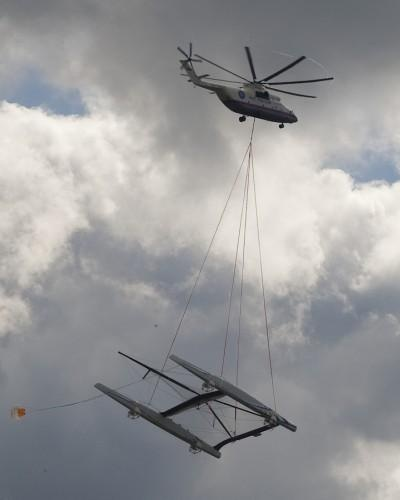

La spectaculaire [mise à l'eau d'Alinghi 5](http://www.20min.ch/ro/news/romandie/story/16004125) par une "grue volante" [Mil MI-26](http://fr.wikipedia.org/wiki/Mil_Mi-26) est l'occasion de parler un peu de ces merveilles technologiques.

Pour le bateau, visitez le [blog Foilers!](http://foils.wordpress.com/2009/07/06/alinghi-avec-ou-sans-foils/) Pour l'hélico, lisez la suite.

Le MI-26 pèse 28 tonnes à vide et peut déplacer une charge maximale de 20 tonnes à l'aide de 8 tonnes de carburant. Ses deux turbopropulseurs de 11' 240 CV chacun  peuvent soulever jusqu'à 56 tonnes au total, via un rotor de 32 m de diamètre formé de 8 pales de 16 m de long.

Si le fonctionnement d'une hélice d'avion est déjà un sujet assez complexe [[1]](#ref-1), un rotor d'hélicopère dans lequel l'incidence de chaque pale varie pendant la rotation est un véritable enfer aérodynamique.

Mais dans le cas simple du "vol stationnaire" effectué par une grue volante, on peut cependant considérer que la charge est suspendue sous une hélice simple et quelques calculs [[3]](#ref-3) donnent

$F=\sqrt[[3]](#ref-3){2\rho S P^2}$

où F est la force axiale générée, ρ la densité de l'air, S la surface balayée par l'hélice et P la puissance des moteurs. Mais une partie de cette puissance est utilisée par le rotor de queue et le fuselage de l'hélico dans le flux du rotor diminue le rendement de l'hélice ce qui fait qu'en incorporant ρ on a en pratique plutôt

$F=\sqrt[[3]](#ref-3){1.4 \rho S P^2}$

Pour le MI-26, avec S=π.16² = 804 m² et P=16.8 MW, on obtiendrait une force de levage F=681\[kN\], soit 69.5 tonnes, nettement plus que les 56 annoncées.

L'explication tient probablement au fait que les 56 tonnes sont réparties sur 804 m², ce qui donne une "charge alaire" de 68.3 daN/m², proche des valeurs au delà desquelles le rendement d'une hélice s'effondre [[1]](#ref-1). Intuitivement, pour générer une force plus importante, l'hélice doit soit être plus grande, soit tourner plus vite, soit on doit donner une incidence plus grande aux pales. Avec les deux dernières options, il arrive un moment où la pale suivante traverse de l'air perturbé par la pale précédente, ce qui fait chuter le rendement.

Ceci explique pourquoi les avions à décollage vertical n'ont que peu de succès par rapport aux hélicoptères, qui exploitent de grands rotors offrant un rendement élevé.

Cependant, avec un grand rotor l'extrémité des pales se déplace très vite. Les pales de 16m du MI-26 atteindraient la vitesse du son (env 300 m/s) si le rotor tournait à 3 tours par seconde. Le problème est encore pire lorsque l'hélicoptère avance : d'un côté de l'hélicoptère la vitesse de la pale s'ajoute à celle du déplacement, et de l'autre côté la vitesse de déplacement se soustrait à la vitesse de la pale. Ce phénomène limite la vitesse des hélicoptères autour de 300 km/h, car à 500 km/h une pale irait à la vitesse du son lorsque la pale opposée serait à l'arrêt par rapport à l'air, ne générant aucune portance ...



C'est pourquoi les rotors des hélicoptères tournent à une vitesse constante. Le pilote ne contrôle pas la vitesse du rotor, mais uniquement l'incidence des pales via un [plateau cyclique](http://fr.wikipedia.org/wiki/Plateau_cyclique), l'un des plus élégants systèmes mécaniques que l'on puisse voir.

Condamné à tourner très lentement, le rotor des grands hélicoptères comporte plus de pales (8 pour le MI-26) que celui des petits, mais il faut bien comprendre que le nombre de pales n'intervient pas directement dans la puissance d'une hélice, d'hélicoptère ou d'éolienne . Ce qui importe c'est que le compromis entre la vitesse de rotation, le nombre et l'incidence des pales donnant le meilleur rendement dans la plage d'utilisation de l'hélice.

### Références:

1. Ewald HUNSINGER - Michaël OFFERLIN - Matthieu BARREAU "[L'hélice La génération de la force de la propulsion.](http://inter.action.free.fr/publications/helices/helice.html)" (très intéressant)
2. "[Aérodynamique des hélicoptères](http://www.onera.fr/fr/daap/aerodynamique-helicopteres)" sur le site de l'ONERA (très joli)
3. [discussion "Force d'une hélice" sur Futura Sciences](http://forums.futura-sciences.com/astronautique/147694-dune-helice.html) (très pratique)
