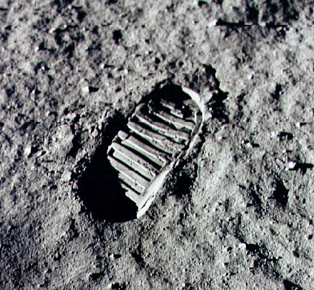

Le 20 juillet 1969, j'avais 5 ans et mes parents m'ont exceptionnellement permis de rester debout pour suivre l'alunissage d'Apollo 11 et les premiers pas d'Armstrong  et Aldrin sur la Lune. Ces images restent d'autant plus gravées dans ma mémoire qu'à l'époque, mon avenir était tout tracé : je serai astronaute!

Les choses étaient claires : au rythme où la conquête spatiale avançait dans les années 1960, on irait en vacances sur la Lune en 2000 après avoir pris un vol stratosphérique Genève-Miami si on avait les moyens de ne pas se trainer en Concorde... Finalement, "astronaute" allait devenir une profession trop commune, alors j'ai laissé [Claude Nicollier](https://fr.wikipedia.org/wiki/Claude_Nicollier) devenir le premier astronaute suisse.

40 ans plus tard, il n'y a que 12 humains à avoir passé quelques heures sur la Lune. Au 10 décembre 2006, seuls 1000 personnes avaient échappé à l'attraction terrestre, totalisant tout de même près de  82 années de missions spatiales. Il faut dire que ça coûte cher : le [programme Apollo](https://fr.wikipedia.org/wiki/programme Apollo) a coûté l'équivalent de 200 milliards de dollars actuels, la [navette spatiale américaine](https://fr.wikipedia.org/wiki/navette_spatiale_américaine) 30 milliards + 1 milliard pour chacun des 130 vols effectués jusqu'ici, la [station spatiale internationale](https://fr.wikipedia.org/wiki/station_spatiale_internationale) ISS environ 100 milliards. Avec les programmes russes, européens et chinois, le coût total de la "conquète spatiale" par les humains doit dépasser les 700 milliards de dollars, et quelques dizaines de vies humaines, accessoirement.

Qu'a rapporté cet investissement gigantesque :

- 382 kg de cailloux lunaires très instructifs.
- Quelques drapeaux américains plantés sur la Lune, d'une valeur patriotique inestimable en période de guerre froide.
- La réparation et modernisation de quelques satellites en orbite comme Hubble, qui auraient été perdus sans ça
- Beaucoup d'expériences sur la vie en apesanteur et dans l'espace, dont ma préférée est celle-ci: 
- Beaucoup de déceptions aussi : aucune usine de l'espace ne produit les matériaux ou les médicaments qu'on nous avait promis
- Mais aussi et surtout ...

### Les "retombées technologiques"

La quantité de technologies qu'il a fallu développer pour envoyer un véhicule habité dans l'espace est proprement astronomique. Les micro-ordinateurs, les piles à combustibles, les matériaux composites, les systèmes de recyclage d'eau et d'air et un nombre énorme de gadgets divers.

Une des retombées inattendue dont j'ai entendu parler directement par son inventeur est l'[algorithme de Viterbi](https://fr.wikipedia.org/wiki/algorithme_de_Viterbi). Andrew nous a expliqué que ses travaux sur la transmission de données en milieu bruité remontaient à la télémétrie des premières fusées. Aujourd'hui ses algorithmes sont gravées dans le silicium de nos téléphones portables.

Ce sont ces retombées technologiques qui ont permis aux contribuables d'accepter le coût pharaonique des missions habitées. Mais pour retourner sur la Lune aujourd'hui, il n'y a plus besoin de développer de nouvelles technologies : elles existent. Le [projet Orion](https://fr.wikipedia.org/wiki/Orion_(véhicule_spatial)) revient même plutôt à la technologie d'Apollo qu'à celle de la navette.

En fait c'est même pire que ça : les technologies issues du spatial ont tellement progressé qu'il est aujourd'hui difficile de justifier l'envoi d'humains dans l'espace. On peut désormais presque tout réaliser avec des missions automatiques, beaucoup moins couteuses et qui n'exigent pas de mettre le drapeau national en berne pendant 3 jours en cas d'échec.

Pratiquement toutes les technologies spatiales dont nous bénéficions directement (météo, GPS, télévision etc. ) viennent de satellites artificiels et tout ce que nous savons aujourd'hui du système solaire nous a été communiqué par des dizaines de sondes comme Voyager, [Phoenix](/2008/05/27/encore-une-sonde-sur-mars/) [Cassini](/tags/cassini/), [Messenger](/2008/01/19/mercure-de-mariner-a-messenger/) et toutes les autres.

Au total les missions automatiques ont couté à peu près autant que les vols habités mais en terme de résultats scientifiques et économiques, les robots sont 10 à 100 fois plus productifs que des astronautes.

### Alors [pour quoi](/2009/01/04/pourquoi-pour-quoi/) retourner sur la Lune ?

Une enquête de la NASA [[1]](#ref-1) a répertorié [181 choses](http://www.nasa.gov/pdf/163560main_LunarExplorationObjectives.pdf) intéressantes à faire sur la Lune, réparties en [6 thèmes](http://www.nasa.gov/exploration/home/why_moon.html).

- connaissances scientifiques : installation d'instruments de mesure, de télescopes et d'expériences de physique
- expansion économique : systèmes d'observation et de mesure de la Terre fournissant des données commercialisables, pour beaucoup en relation avec le climat
- civilisation humaine : recherche de sites et de matières permettant l'implantation d'une base habitée permanente
- préparation à l'exploration :  recherche de sites et de matières permettant le lancement de missions plus lointaines
- partenariat global : collaborations avec d'autres organisations ou pays (il y en a 10 sur 181...)
- engagement public : actions (30 sur 181...) permettant d'impliquer la population, comme des webcams sur la Lune ou des  manifestations sportives à faible gravité

Après un survol rapide des 181 "objectifs lune", il me semble que les seuls qui demandent réellement une présence humaine sur la Lune sont ceux dont le but est de permettre une présence humaine sur la Lune... Les objectifs scientifiques et économiques représentant la grande majorité des 181 raisons d'aller sur la Lune peuvent pratiquement toutes être réalisées par des missions automatiques dès aujourd'hui.

Pour justifier le coût colossal d'une base habitée sur la Lune, il faudra trouver un réel retour sur investissement économique. Outre le tourisme de milliardaires, ce sera peut-être un jour l'[Helium 3](https://fr.wikipedia.org/wiki/Helium_3) lunaire qui alimentera nos centrales à [fusion thermonucléaire](/tags/fusion/), mais cette éventualité est encore bien lointaine.

### Références

1. NASA "[Lunar Exploration Objectives](http://www.nasa.gov/exploration/home/why_moon_objectives.html)", 2006
2. Françoise Harrois-Monin "[Pas d'hommes dans l'espace!", interview de Jacques Blamont](http://www.lexpress.fr/informations/pas-d-hommes-dans-l-espace-l-express-va-plus-loin-avec-jacques-blamont_609822.html), 21/09/1995, L'Express
3. [La Lune: mine scientifique et tête de pont de l'exploration spatiale habitée](http://www.lematin.ch/flash-info/monde/lune-mine-scientifique-tete-pont-exploration-spatiale-habitee), Le Matin, 17 juillet 2009
