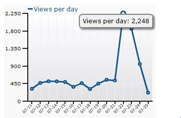

Le 22 juillet, Jacques Rosselin a consacré sa rubrique "[Un jour, un blog](http://www.france-info.com/spip.php?article321869)" sur France Info à votre serviteur. Résultat : un spectaculaire pic de visites, pas mal de commentaires et une vingtaine d['inscriptions au flux RSS](http://feeds.feedburner.com/drgoulu). Bienvenue et merci à tous.

Plus j'y pense, plus je crois à la complémentarité de la presse traditionnelle et de la blogosphère "sérieuse" à laquelle je tente d'appartenir. Nous avons la liberté de créer sans contraintes du contenu original, mais il est dissout dans les terabytes indexés chaque jour par Google, accessible uniquement à ceux qui chercheront. A l'inverse, la presse recherche ce contenu original qu'elle n'a que de plus en plus rarement les moyens de produire elle-même, mais qu'elle peut diffuser très largement.

Mesdames et messieurs les journalistes, nous sommes faits pour nous entendre...

A part ça, je prépare encore un ou deux articles pour les prochains jours, puis le mois d'août sera calme pour cause de vacances. Le [stakhanovisme](http://fr.wikipedia.org/wiki/Stakhanovisme) a ses limites.
