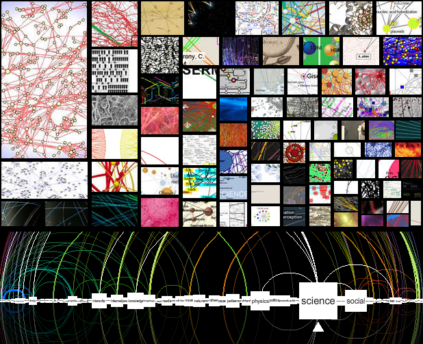

Le [Big Bang Numérique](/2008/04/10/le-big-bang-numerique/) s'accompagne de travaux intensifs sur la visualisation d'énorme quantités de données, un domaine qui combine maths (graphes, algorithmique ...) et art. Le site [VisualComplexity.com](http://www.visualcomplexity.com/vc/) répertorie des centaines de visualisation extrêmement variées réalisées pour des applications aussi diverses que la biologie, la [scientométrie](/2008/07/01/mesurer-la-science-et-la-trouver-belle/), la politique, internet et les réseaux sociaux etc.

Avec toutes ces visualisations, il devenait utile de disposer d'un visualisateur de visualisations... C'est ce qu'ont réalisé les infographistes de [Bestiario (](http://bestiario.org/)dont j'avais déjà parlé [ici)](/2008/10/10/bestiario/) avec une nouvelle réalisation épatante : [reMap](http://bestiario.org/research/remap/).

ReMap permet de naviguer de façon interactive et animée dans [VisualComplexity](http://www.visualcomplexity.com/vc/) en mettant en évidence les relations entre les visualisations.

Heures de navigation instructive et multicolore droit devant!

source : [infosthetics](http://infosthetics.com/)
