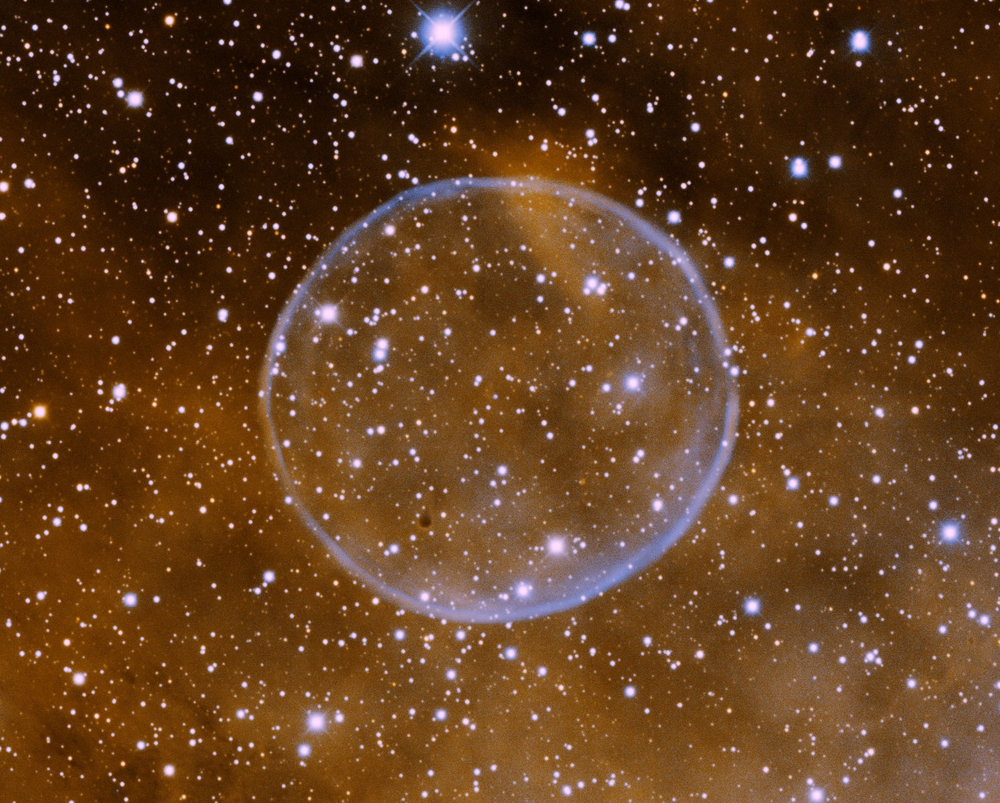
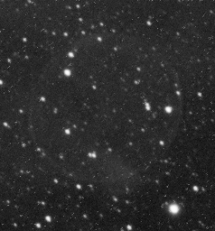
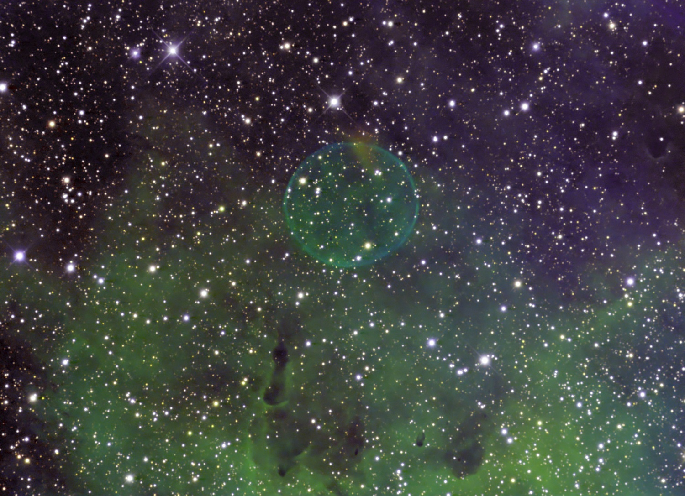

> Il y a plus de choses dans le ciel et la terre, Horatio, qu’il est rêvé dans votre philosophie.

Je n'avais jamais commencé d'article par une citation de Shakespeare (Hamlet, Acte I, Scene V). Voilà qui est fait. La raison, c'est ça :

Vous admirez la [Nébuleuse de la Bulle de Savon](https://fr.wikipedia.org/wiki/Nébuleuse_de_la_Bulle_de_Savon) (PN G75.5+1.7 pour les intimes) \[1,2\] découverte il y a un an par [Dave Jurasevich à l'observatoire du Mont Wilson](http://www.starimager.com/Image%20Gallery%20Pages/Hydrogen%20Alpha%20Images/ic%201318_AP_8%20pane%20mosaic_bubble%20nebula.htm) \[3\] et indépendamment par [Keith B Quattrocchi et Mel Helm](http://www.lostvalleyobservatory.com/page29crescentbubblenb/),\[4\] des astronomes amateurs bien équipés.

Cette bulle parfaitement sphérique de 5 années lumières de diamètre a été expulsée il y a 22'000 ans d'une étoile de la constellation du Cygne qui a eu un hoquet nucléaire. Lorsqu'une étoile épuise son hydrogène et s'étouffe dans l'hélium qu'elle a produit, elle s'éteint brièvement, s'effondre en se comprimant et se réchauffant. Si elle est assez lourde pour que la [fusion de l'hélium](https://fr.wikipedia.org/wiki/fusion_de_l'hélium) s'amorce, elle se rallume. Une fois l'hélium fusionné en carbone et oxygène, elle s'éteint à nouveau. Si l'étoile est très massive, elle peut encore enchaîner plusieurs cycles de plus en plus rapides et terminer son existence dans une spectaculaire [supernova](https://fr.wikipedia.org/wiki/supernova), mais beaucoup d'étoiles deviennent des [naines blanches](https://fr.wikipedia.org/wiki/naine_blanche) après la fusion de l'hélium, éjectant leurs couches externes dans l'espace, formant des [nébuleuses](https://fr.wikipedia.org/wiki/nébuleuse_planétaire) (dites "planétaires" pour des raisons historiques). Mais il est très rare qu'elles aient une forme aussi parfaitement sphérique (sur 1500, je crois qu'il n'y en a qu'une seule autre : [Abell 39](https://fr.wikipedia.org/wiki/Abell_39))

## Les couleurs des photos astronomiques

Parlons maintenant des jolies couleurs bleu-orange de la photo. En fait elles n'existent pas. La photo originale de Dave Jurasevich est celle-ci:

Elle a été obtenue avec un temps de pose d'une demi heure. On comprend pourquoi cette nébuleuse n'a pas été détectée plus tôt : elle est extrêmement peu lumineuse. Et on n'y distingue pas la moindre couleur pour la simple raison que les [capteurs CCD](https://fr.wikipedia.org/wiki/capteur_photographique) sont par nature "noir et blanc", ou plutôt détectent la lumière de toutes les couleurs \[5\]. Nos appareils photo utilisent des [filtres de Bayer](https://fr.wikipedia.org/wiki/filtre_de_Bayer) qui colorient un pixel sur 4 en rouge, un autre en bleu, et les deux restants en vert parce que notre oeil est plus sensible dans le vert, mais les couleurs du ciel nocturne sont bien différentes de celles de nos photos de vacances, donc il serait dommage d'atténuer la faible lumière céleste en la filtrant par des couleurs terrestres.

Les "couleurs" des astres chauds sont formées de [raies spectrales](https://fr.wikipedia.org/wiki/raie_spectrale) typiques des éléments qui les composent, ce qui permet d'ailleurs de déterminer leur composition par [spectroscopie](https://fr.wikipedia.org/wiki/spectroscopie). Par conséquent, les "bonnes" couleurs à filtrer en photographie astronomique sont celles des raies d'émission des atomes que l'on suppose être présents dans l'objet observé. L'hydrogène, élément de très loin le plus abondant dans les étoiles est un bon candidat, et en particulier sa raie [H-α](https://fr.wikipedia.org/wiki/H-α), qui correspond à un rouge vif. Pour notre nébuleuse, la raie de l'[Oxygène III](https://fr.wikipedia.org/wiki/O_III), dans le vert, s'est révélée un bon choix pour mettre en évidence la "bulle de savon".

Les clichés pris successivement avec un filtre pour H-α et un filtre O-III sont différents, mais toujours en noir et blanc. Il faut bien comprendre qu'ils ne représentent qu'une toute petite partie de la lumière reçue, dans deux "couleurs" judicieuseemnt choisies pour obtenir un contraste maximum parce que les "vraies couleurs" sont pratiquement indiscernables à l'oeil.

L'équipe du [télescope Mayall](http://www.noao.edu/outreach/kptour/mayall.html) à Kitt Peak a choisi de combiner les clichés en attribuant une couleur orange à H-α et bleue à O-III pour faire plus joli, alors que Keith B Quattrocchi et Mel Helm \[4\] ont choisi des couleurs violettes et vertes, ajoutant même un troisième filtre pour le Soufre-II.

De plus ils sont plus explicites sur la technique utilisée : ils ont pris au total 21 clichés de 20 minutes d'exposition, soit 7 heures pour chacun des 3 [filtres](http://www.astrodon.com/products/filters/narrowband/). Les clichés ont été superposés avec [CCD Stack](http://www.ccdware.com/products/ccdstack/), et [MaxIm DL](http://www.cyanogen.com/maxim_main.php), puis un peu PhotoShopés quand même.

Voilà, votre nouveau fond d'écran astronomique est disponible en [deux](http://www.noao.edu/image_gallery/html/im1059.html) [couleurs](http://www.lostvalleyobservatory.com/imagelib/sitebuilder/misc/show_image.html?linkedwidth=actual&linkpath=/wp-content/uploads/HLIC/15c628cd28101ce2ea2739ee6a599b89.jpg&target=tlx_new), et vous savez pourquoi.

## Sources:

1. [Une bulle de savon dans l'espace](http://www.techno-science.net/?onglet=news&news=6857), 17, juillet 2009, Techno Science
2. Jeff Hecht, "[Giant 'soap bubble' found floating in space](http://www.newscientist.com/article/mg20327185.100-giant-soap-bubble-found-floating-in-space.html)", 23 July 2009, New Scientist
3. Dave Jurasevich "[A New Planetary Nebula Discovered from the Mount Wilson Observatory](http://www.starimager.com/Image%20Gallery%20Pages/Hydrogen%20Alpha%20Images/ic%201318_AP_8%20pane%20mosaic_bubble%20nebula.htm)"
4. Keith B. Quattrocchi, "[Faint Bubble Nebula in Cygnus Narrow Band Image](http://www.lostvalleyobservatory.com/page29crescentbubblenb/)"
5. ["True Color Imaging : the theory behind realistic colors in astronomical images](http://starizona.com/acb/ccd/advtheorycolor.aspx)", sur Starizona
