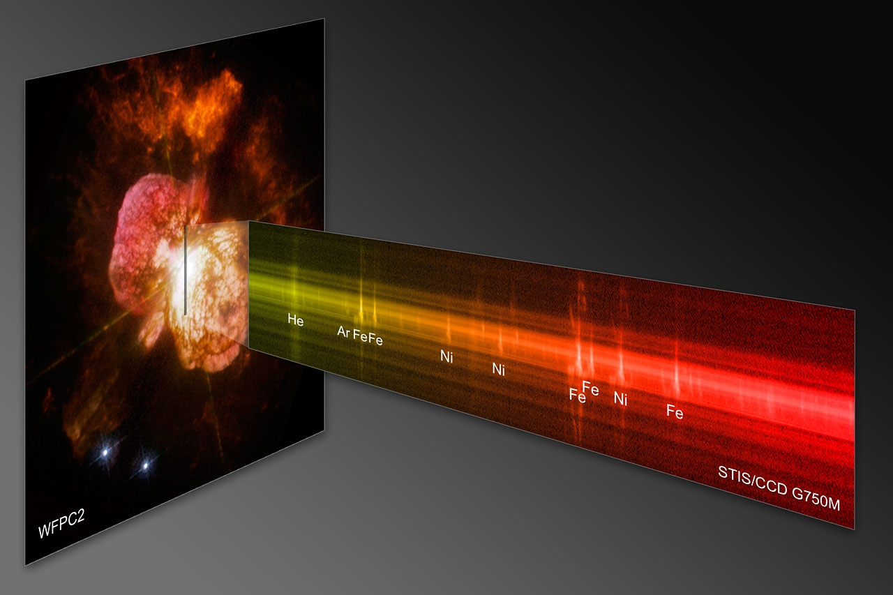
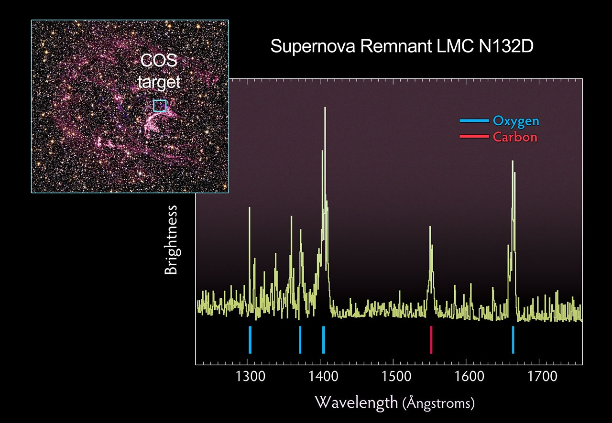
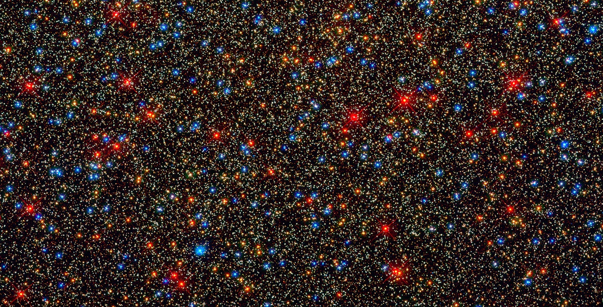
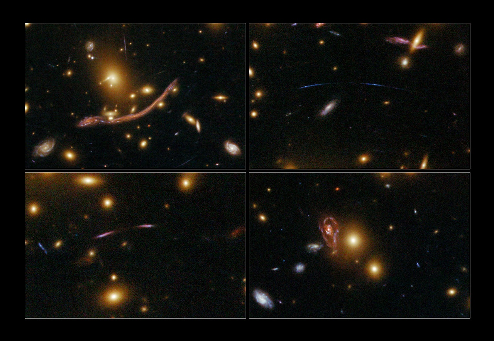

Les premières images prises par le télescope Hubble après son récent lifting ont été publiées, et elles sont... _(insérez votre liste de superlatifs favoris ici, moi je n'en ai plus)_

La video [Hubblecast No 30](http://www.spacetelescope.org/videos/heic0910a/) ([sur YouTube](http://www.youtube.com/watch?v=QXZWjxzntYw)) montre et décrit (en anglais) toutes [ces nouvelles images](http://www.spacetelescope.org/images/archive/news/heic0910//). J'en ai choisi une par instrument embarqué sur ce fantastique satellite:

### STIS

On commence par le [préféré du "Bad Astronomer"](http://blogs.discovermagazine.com/badastronomy/2009/09/09/hubble-is-back/). Le "[Space Telescope Imaging Spectrograph](http://www.spacetelescope.org/about/general/instruments/stis/)" a été installé en 1997 sur Hubble, et est tombé en panne en 2004. Sa réparation justifiait presque à elle seule la mission de la navette en mai 2009. STIS peut analyser la lumière provenant de nuages de gaz pour déterminer leur composition chimique.

Le montage ci-dessous montre une image d'Eta Carina, une grosse étoile en fin de vie à 7500 années-lumière dont j'ai [déjà parlé ici](http://drgoulu.local/2007/05/09/compte-a-rebours-stellaire/), et le spectre mesuré par STIS le long de la ligne noire au centre de l'image. On sait ainsi qu'Eta Carina crache dans l'espace des gigatonnes de fer et de nickel qu'elle a produit et qui l'asphyxient. Combien de temps arrivera-t-elle à briller avant d'exploser en supernova ? Quelques années ? quelques décennies ou quelques siècles (mais pas beaucoup plus) ? On en saura plus sur la mort des étoiles grâce à STIS.

### COS

Le "[Cosmic Origins Spectrograph](http://www.spacetelescope.org/about/general/instruments/cos/)" est un instrument qui vient d'être installé sur Hubble. Il est destiné à mesurer la composition de l'espace intergalactique, mais il peut aussi être utilisé comme spectrographe sur des sources très peu lumineuses.

COS a été braqué sur les restes d'une supernova ayant explosé il y a 3000 ans à 170'000 années-lumière d'ici. Grâce à COS, on sait maintenant que cet événement a produit du carbone et de l'oxygène en quantités astronomiques.

### WFC-3

A ceux qui préfèrent de belles images avec beaucoup de pixels, la "[Wide Field Camera 3](http://www.spacetelescope.org/about/general/instruments/wfc3/)" n'apporte que du bonheur. Jusqu'ici les photos de Hubble avaient 1600x1600 pixels, maintenant WFC-3 photographie dans le visible et l'ultraviolet en 4096x4096 et dans l'infrarouge en 1024x1024. Rincez-vous l'oeil avec les Nébuleuses [de la Carène](http://www.spacetelescope.org/images/heic0910e/) et [du Papillon](http://) ou ce [quintette de galaxies](http://www.spacetelescope.org/images/heic0910i/)

De plus, l'élargissement du spectre capté offre de nouvelles possibilités, comme de classer les étoiles d'un seul coup d'oeil sur des photos comme celle-ci, où on a rendu rouge l'infrarouge et bleu l'ultraviolet :

### ACS

Le dernier des 4 instruments de Hubble est tout neuf. La "[Advanced Camera for Surveys](http://www.spacetelescope.org/about/general/instruments/acs/)" est en fait une combinaison de 3 appareils:

1. Une caméra à large champ permettant d'observer une "grande" portion du ciel englobant plusieurs galaxies
2. Une caméra à haute résolution permettant de détailler une toute petite portion de ciel, comme le centre d'une galaxie. On espère même pouvoir distinguer des planètes extrasolaires avec cette caméro, qui a été équipée d'un [coronographe](http://fr.wikipedia.org/wiki/Coronographie) pour éviter d'être ébloui par une étoile...
3. La Solar Blind Camera observe dans l'ultraviolet sans être influencée par la lumière solaire.

ACS a débuté sa prometteuse carrière en photographiant les magnifiques lentilles gravitationnelles Abell 370, à 6 milliards d'années lumière d'ici.

Quoi ? vous ne savez pas ce qu'est une [lentille gravitationnelle](http://fr.wikipedia.org/wiki/Lentille_gravitationnelle) ? Pourtant j'en avais parlé [ici](http://drgoulu.local/2009/01/17/inventaire-des-croix-du-ciel/) ...

### Voir aussi :

- [10 choses que vous ignorez sur Hubble](http://drgoulu.local/2009/05/13/10-choses-que-vous-ignorez-a-propos-de-hubble/)
- [La nébuleuse du papillon](http://www.lecosmographe.com/blog/?p=1376) sur le Cosmographe
- [Hubble.is.Back](http://blogs.discovermagazine.com/badastronomy/2009/09/09/hubble-is-back/) sur Bad Astronomy
