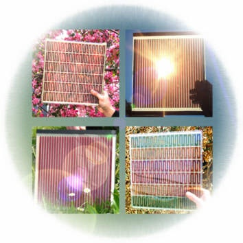

Un événement me permet de consacrer [enfin](/2009/03/06/pourquoi-comment-combien/) un article complet aux relations complexes entre science, technique (industrielle) et économie : le professeur [Michaël Grätzel](w:Michael_Grätzel) de l'EPFL vient de remporter le [prix Balzan](w:), presque aussi prestigieux que le Nobel, "[pour](http://www.balzan.org) ses nombreuses contributions à la Science des matériaux nouveaux et en particulier pour avoir inventé et développé un nouveau type de cellule solaire photovoltaïque, la [Dye Sensitized Solar Cell (DSSC)](w:en:Dye-sensitized_solar_cell), la cellule à pigments photosensibles, plus connue sous le nom de [cellule de Grätzel](w:Cellule_Grätzel)". [[1]](#ref-1), [[2]](#ref-2)

Les premières cellules de Grätzel ont fonctionné au début des années 1990 alors que j'étais étudiant à l'EPFL. Pleins d'optimisme, on les surnommait déjà "great cells". J'ai suivi (de loin) leur aventure, que je considère comme un  exemple de la difficulté à transformer une magnifique avancée scientifique en produit commercial. Comme l'avait si bien dit un prof de marketing:

> Les questions des scientifiques commencent par “[pourquoi](/2009/01/04/pourquoi-pour-quoi/)“, les techniciens se demandent “comment”, et les managers “combien”. Pour que ça marche, il faut répondre aux trois.

### Pourquoi

D'un point de vue scientifique, l'invention de Grätzel est merveilleuse : un colorant qui se comporte comme une  sorte de [chlorophylle](w:) artificielle,  convertissant le rayonnement solaire absorbé en électricité par un procédé très différent des [cellules photovoltaïques](w:Cellule_photovoltaïque) habituelles en silicium.

Les DSSC sont faites d'un mélange colorant/solvant liquide, emprisonné entre deux électrodes transparentes, ce qui permet d'en faire des panneaux transparents de diverses couleurs suivant le colorant choisi:

### Comment

Contrairement à la production de panneaux photovoltaïques en silicium, la production de cellules de Grätzel ne nécessite ni beaucoup d'énergie ni opérations délicates. On trouve même des [kits pour bricoler des DSSC](http://www.solaronix.com/technology/assembly/) soi-même. Le tout est de disposer des colorants et solvants ad-hoc, que l'on pourrait en principe produire en quantités industrielles.

Évidemment, il y a quelques problèmes à résoudre:

- Les rayons UV dégradent la cellule, il faut ajouter une couche filtrant ce rayonnement indésirable
- A basse température, le solvant peut geler : la cellule ne fonctionne plus jusqu'au dégel, ou définitivement...
- Les colorants ne convertissant qu'une fraction limitée de la lumière en énergie, le rendement des DSSC est de l'ordre de 10%, nettement inférieur à celui des cellules au silicium (à moins de combiner plusieurs colorants)
- La cellule doit être étanche pour éviter que le solvant ne fuie
- La stabilité chimique à long terme des cellules a posé, et pose encore, de sérieux problèmes [[4]](#ref-4), [[5]](#ref-5)

Depuis près de 20 ans, plusieurs entreprises suisses, européennes et plus lointaines se sont heurtées à ces problèmes d'industrialisation avec plus ou moins de succès. Leurs chercheurs contemplent désormais les arbres avec un soupçon d'envie : ils savent que l'Evolution ne fait pas repousser chaque année des feuilles gorgées de chlorophylle toute neuve pour rien...

### Combien

On a donc des cellules de rendement plus faible que les cellules au silicium, dont la durée de vie n'est pas supérieure, et dont le prix de revient actuel (2400 €/kWc) n'est pas meilleur marché que le silicium, que l'on produit désormais en couches minces et en grandes quantités...

Un avantage des cellules Grätzel que l'on voit au premier coup d'oeil, c'est la transparence, ou plutôt la translucidité. Depuis 20 ans Grätzel et les promoteurs des DSSC rêvent d'immeubles dont les vitrages produiraient de l'électricité. Mais encore beaucoup de "comment" barrent le chemin de la fortune : comment intégrer les "great-cells" a des vitrages isolants de grande surface ? Comment réaliser une connexion électrique fiable entre des centaines de fenêtres que l'on doit pouvoir ouvrir, laver ?

Un autre avantage de la technologie Grätzel est de pouvoir réaliser des cellules flexibles. [SolarPrint](http://www.solarprint.ie/) est même parvenu à rendre le mélange solvant+colorant suffisamment pâteux pour être imprimé [[3]](#ref-3). Mais [FlexCell](http://www.flexcell.com/index.php?option=com_content&task=view&id=13&Itemid=52) et d'autres arrivent à un résultat similaire avec du [silicium amorphe](http://fr.ekopedia.org/Cellules_photovolta%C3%AFques_de_silicium_amorphe), à un prix comparable....

Certains imaginent pouvoir réaliser un jour des DSSC sous forme de couches de peinture : il suffirait de passer trois ou quatre couches différentes sur un mur ou un toit pour que la surface produise de l'électricité. Ca serait vraiment fantastique, mais dans ce domaine on en est encore au début des "comment".

Après plus de 20 ans de recherche scientifique fructueuse et de développements spectaculaires de cette technologie, les cellules de Grätzel cherchent toujours un marché, une application où leurs avantages seraient décisifs. Après tant de publications, de brevets, de rapports  et de mémos sur tous les "pourquoi" et les "comment", il faut maintenant répondre aux "combien". Ils sont tout simples : combien ça coûte, combien on peut en vendre, combien ça rapportera. Sans réponses à ces questions, les cellules de Grätzel ne deviendront hélas pas des "great cells".

### Références

1. Gratzel, Liska, "Photo-electrochemical cell", 1990, [U.S. Patent 4927721](http://www.freepatentsonline.com/4927721.html)
2. Graetzel, Nazeeruddin, O'regan, "Photovoltaic cells", 1994, [U.S. Patent 5350644](http://www.freepatentsonline.com/5350644.html)
3. Bari, "Electrolyte Composition", 2009, Patent [WO/2009/103970](http://www.wipo.int/pctdb/en/wo.jsp?WO=2009103970)
4. Tributsch H., “Dye sensitization solar cells: a critical assessment of the learning curve”, Coordination Chemistry Reviews, 2004, 248, p1511-1530
5. A. Hinsch et al "[Long-term stability of dye-sensitised solar cells](http://onlinelibrary.wiley.com/doi/10.1002/pip.397/abstract)" in "Progress in Photovoltaics: Research and Applications", 2001, Volume 9 Issue 6, Pages 425 - 438
