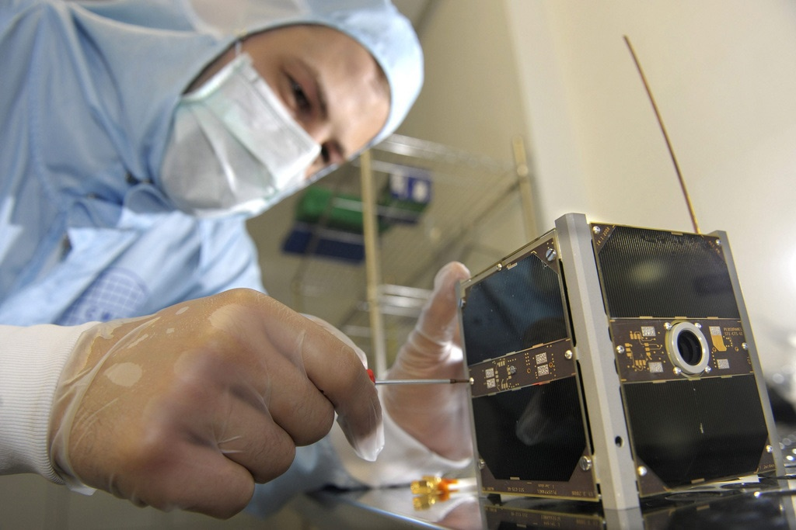
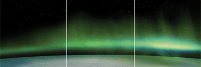

Le satellite [SwissCube](http://swisscube.epfl.ch/) conçu et construit par les étudiants de plusieurs écoles d'ingénieurs suisses a été lancé avec succès hier par une fusée indienne, et en plus il fonctionne !

SwissCube est un [CubeSat](http://www.cubesat.org/), une norme définissant des mini satellites d'une taille de 10 x 10 x 10 cm et d'une masse max. de 1 kg (SwissCube ne fait que 820 grammes). Ce format permet de grouper plusieurs CubeSats  dans un conteneur, ce qui rend le lancement d'un satellite "abordable" pour une bande de passionnés soutenus par quelques sponsors.

Malgré sa petite taille, SwissCube est un satellite scientifique complet, embarquant un système d'observation d'un phénomène peu connu : l'" [airglow](w:en)", ou "[lumière du ciel nocturne](w:)". Il s'agit d'une faible luminescence de la haute atmosphère, assez semblable aux aurores boréales, souvent observé par les astronautes.

l'"airglow" est principalement du à la recombinaison nocturne de l'Oxygène dissocié par le rayonnement solaire.

Pour observer et mesurer l'airglow pendant 3 mois, voire une année si tout va bien, SwissCube emporte une caméra qui transmet ses images vers la Terre. Il emporte donc un émetteur radio dont les signaux sont reçus non seulement par l'EPFL, mais par une armée de [radio amateurs](http://swisscube-live.ch/Home/RadioAmateurs) dont [Von](http://www.hb9afo.ch/swisscube/), un copain passionné qui a contribué à la conception du système de télécommunication (Bravo ! ça marche !)

Pour ma part, j'ai été impressionné par le système retenu pour la stabilisation de l'attitude de SwissCube. Le satellite étant trop petit pour que des volants d'inertie soient efficaces, ils ont été remplacés par 3 bobines dites "magneto torquers" car elles permettent d'appliquer un couple au satellite en interagissant avec le champ magnétique terrestre. Grâce à 3 magnétomètres embarqués dans le satellite et aux travaux de mes confrères du [Laboratoire d'Automatique](http://la.epfl.ch), des impulsions de courant bien calculées dans les bobines permettent d'orienter SwissCube très précisément par rapport au champ magnétique terrestre. (Bravo ! ça marche aussi !)

La puissance électrique nécessaire au fonctionnement de SwissCube est de l'ordre de 1.5 W seulement, mais une batterie durant des mois serait trop lourde.  Les faces de SwissCube sont tapissées de 12 cellules solaires offrant un rendement de 27%, mais coûtant CHF 650.- pièce. Dans l'espace, personne n'entend les comptables crier ...

SwissCube est aussi le premier satellite à ma connaissance dont l'état et les données transmises sont disponibles en temps réel sur le web. C'est [ici](http://swisscube-live.ch/).

### Références

1. "[SwissCube](http://swisscube.epfl.ch/pdf/plaquette_finale.pdf)", plaquette pdf
2. [SwissCube prêt pour son lancement](http://actualites.epfl.ch/presseinfo-com?id=782), EPFL
3. Fabien Jordan "[SwissCube en chiffres](http://swisscube.epfl.ch/pdf/S3-C-A3_SwissCube_en_Chiffres.pdf)", Avril 2008
