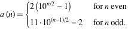

Les problèmes du [Project Euler](/2009/02/23/project_euler/) devenant vraiment très ardus, j'ai été content de trouver [ici](http://delphi.about.com/od/delphichallengesexercises/qt/delphi-palindromic-numbers.htm) un petit challenge intéressant : déterminer rapidement le nombre de nombres palindromes inférieurs à un maximum donné.



Un [nombre palindrome](https://fr.wikipedia.org/wiki/nombre_palindrome) se lit indifféremment de gauche à droite ou de droite à gauche, comme 1234321 ou 567765. Outre leur aspect esthétique, ces nombres ont aussi des [propriétés étonnantes](/2008/09/14/palindrome-de-196/).

La première idée qui vient à l'esprit est de les compter (c'est du [Delphi](https://fr.wikipedia.org/wiki/Delphi_(informatique))):

\[sourcecode language="delphi"\] function NumberOfPalindromes(const maxNumber : integer) : integer; var i:Integer; s:string; begin Result:=0; for i := 1 to maxNumber do begin s:=IntToStr(i); if s=ReverseString(s) then Inc(Result); end; end; \[/sourcecode\]

Ca marche, mais c'est très lent : pour maxNumber=1000000000, il faut un milliard de conversions en chaine de caractères, un milliard d'inversions de chaîne, et un milliard de comparaisons. Or le résultat n'est que de 109998. Comme l'[aurait dit Perlis](/2008/01/21/perlisismes-les-dictons-informatiques-dalan-perlis/) (mais c'est de moi) :

> Si ta boucle ne fait rien 99% du temps, c'est que tu n'utilises pas le bon algorithme.

De plus, notre boucle génère tous les nombres palindromes sous forme de chaine, et on les jette.

> Si tu jettes 99% des résultats, c'est que tu n'utilises pas le bon algorithme.

Une autre approche, que beaucoup utilisent avant même de programmer, voire de réfléchir, est de [chercher avec Google](http://www.google.ch/search?q=number+of+palindromic+numbers). C'est une excellente approche. On trouve immédiatement une [page très intéressante chez Wolfram](http://mathworld.wolfram.com/PalindromicNumber.html), avec une formule qui offre sur un plateau le nombre a(n) de nombres palindromes inférieurs à 10n

 La formule n'est valable que pour n entier, mais on peut tout de même la convertir en une petite fonction Delphi:

\[sourcecode language="delphi"\] function NumberOfPalindromes(const maxNumber : integer) : integer; const pow10:array\[0..9\] of integer=(1,10,100,1000,10000,100000,1000000,10000000,100000000,1000000000); var n:Integer; begin n:=Round(log10(maxNumber)); if Odd(n) then Result:=11\*pow10\[(n-1)div 2\]-2 else Result:=2\*pow10\[n div 2\]-2; end; \[/sourcecode\]

Comme il s'avère  que le [Delphi Challenge](http://delphi.about.com/od/delphichallengesexercises/qt/delphi-palindromic-numbers.htm) ne teste les algorithmes proposés qu'avec une puissance de 10, vous avez ci dessus une solution victorieuse, mais typique de la programmation agile : elle ne fonctionne (bien) que pour les tests ;-)

Tentons maintenant de rendre notre programme correct quel que soit N, si possible sans le ralentir. On va même commencer par le rendre encore plus rapide en poussant le vice de la programmation agile (= paresse) encore plus loin:

\[sourcecode language="delphi"\] function NumberOfPalindromes(const maxNumber : integer) : integer; const A050250:array\[0..9\] of integer=(0,9, 18, 108, 198, 1098, 1998, 10998, 19998, 109998); begin Result:=A050250\[Round(log10(maxNumber))\]; end; \[/sourcecode\]

Le vecteur [A050250](http://oeis.org/A050250) contient directement les résultats de la formule pour n=(0),1,2,..,9. Son nom provient de [sa référence dans la célèbre encyclopédie des suites entières de Sloane](http://oeis.org/A050250).

L'algorithme ci-dessous commence par utiliser cette série pour compter les palindromes inférieurs à la puissance de 10 juste inférieure à maxNumber, puis considère successivement les chiffres de maxNumber en partant du plus significatif et compte le nombre de palindromes possibles sur les digits intermédiaires.

Par exemple pour maxNumber=5832476 :

1. on compte 1998 palindromes inférieurs à 1000000, le plus grand étant 999999
2. on ajoute (5-1) fois le nombre de palindromes de 5 chiffres, soit 1000 (de 000|00 à 999|99), ce qui donne le nombre de palindromes jusqu'à 4999994
3. on ajoute 8 fois le nombre de palindromes de 3 chiffres, soit 100. On a donc compté les palindromes jusqu'à 5799975
4. on ajoute 2 fois les 10 nombres possibles au centre, ce qui compte jusqu'à 5829285
5. reste à ajouter les (2+1) nombres palindromes obtenus en changeant le chiffre central : 5830385, 5831385 et 5832385

\[sourcecode language="delphi"\] function NumberOfPalindromes(const maxNumber : integer) : integer; const A050250:array\[0..18\] of integer =(0,9, 18, 108, 198, 1098, 1998, 10998, 19998, 109998, 199998, 1099998, 1999998, 10999998, 19999998, 109999998, 199999998, 1099999998, 1999999998); const pow10:array\[0..9\] of integer =(1,10,100,1000,10000,100000, 1000000,10000000,100000000,1000000000); var n,i,j,k:Integer; d:array\[0..18\] of integer; // digits begin i:=0; n:=maxNumber; while n>0 do begin // extract digits d\[i\]:=n mod 10; n:=n div 10; inc(i); end; n:=i-1; // n=Trunc(log10(maxNumber)) Result:=A050250\[n\]; i:=n; j:=0; k:=n div 2; dec(d\[n\]); // because we counted palindromes to 1000..00 while i-j>=2 do begin // loop from outer digits to inner Result:=result+d\[i\]\*(pow10\[k\]); dec(i); inc(j); dec(k); end; inc(Result,d\[i\]); // handle 1 or 2 center digits if d\[j\]>=d\[i\] then inc(Result); end; \[/sourcecode\]

Cet algorithme étant nettement plus rapide et compact que les solutions existantes du challenge, je viens de le soumettre au [challenge](http://delphi.about.com/od/delphichallengesexercises/qt/delphi-palindromic-numbers.htm) bien qu'il y ait encore une petit bulle... Pour certains maxNumber "rares", le résultat est 1 de trop. Saurez-vous trouver pourquoi avant moi ?
