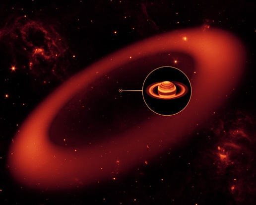

Après des millénaires d'observation du ciel à l'oeil nu, la lunette de Galilée et les grands télescopes nous ont permis de voir des objets beaucoup plus lointains et beaucoup moins lumineux, mais toujours "visibles".

L'atmosphère diffusant les infrarouges et nous protégeant des rayonnements ultraviolets et à haute énergie, les seuls autres rayonnements que nous pouvons capter au niveau du sol sont les ondes radio et millimétriques. Mais depuis quelques années, les instruments placés en orbite permettent de fournir des informations sur le cosmos qu'il serait impossible d'obtenir depuis le sol.



Désormais, nous sommes capables de capter les photons de toutes les fréquences, donc de toutes les énergies. Ces instruments combinés aux techniques d'imagerie informatique élargissent le spectre des couleurs visibles à l'œil en produisant des images visibles à partir de rayonnements invisibles.

Voici  un petit tour d'horizon des principaux instruments qui complètent Hubble et les télescopes optiques traditionnels, illustré avec les dernières images qu'ils ont fourni.

Dans l'infrarouge, la découverte par [Spitzer](http://fr.wikipedia.org/wiki/Spitzer_%28t%C3%A9lescope_spatial%29) d'un gigantesque anneau de poussière entourant Saturne montre qu'on peut encore découvrir des choses surprenantes dans notre propre système solaire. (L'image ci-dessous est un dessin d'artiste, la [vraie image](http://www.spitzer.caltech.edu/search/image_set/20?search=ssc2009-19a) étant moins sexy, mais il y aura certainement bientôt une image de l'anneau complet)

Dans l'ultraviolet, ce sont principalement [Galex](http://fr.wikipedia.org/wiki/GALEX) et [Swift](http://fr.wikipedia.org/wiki/SWIFT_%28t%C3%A9lescope_spatial%29) qui scrutent le ciel. Swift a produit une [magnifique image de la galaxie d'Andromède](http://www.nasa.gov/mission_pages/swift/bursts/uv_andromeda.html) (M31) dans laquelle on peut distinguer 20'000 sources, principalement de jeunes étoiles. Admirez ça :



[Chandra](http://fr.wikipedia.org/wiki/Chandra_%28t%C3%A9lescope_spatial%29) est le télescope spatial à rayons X  le plus productif actuellement. Les rayons X sont produits par des phénomènes très violents, souvent liés aux trous noirs. Récemment Chandra a produit la partie orange de cette image de NGC 6240 :



On distingue au centre deux sources très lumineuses. Il s'agit de deux trous noirs supermassifs qui furent les centres de [deux galaxies qui ont fusionné](http://drgoulu.local/2008/04/25/un-festival-de-galaxies/) pour former NGC 6240. Ils se tournent autour en irradiant d'énergie les environs, baignant une bonne partie de la galaxie de rayons X. Dans quelques dizaines de millions d'années, lorsque les deux trous noirs fusionneront , ce sera [l'Apocalypse selon OJ 287](http://drgoulu.local/2008/04/18/ca-cest-du-trou-noir-du-vrai/).

Ce phénomène produira a coup sur une flambée de rayons gamma, la "lumière" la plus violente que l'on puisse imaginer. [Fermi](http://fr.wikipedia.org/wiki/Fermi_Gamma-ray_Space_Telescope) (anciennement nommé GLAST) et [Swift](http://fr.wikipedia.org/wiki/SWIFT_%28t%C3%A9lescope_spatial%29) sont les télescopes dédiés à l'observation des [sursauts gamma](http://drgoulu.local/2008/03/21/sursaut-gamma-la-folie-celeste/), ces événements si violents qu'ils ont été confondus avec des explosions nucléaires sur Terre par les premiers satellites de surveillance militaires. Ils détectent environ [un "Gamma Ray Burst" par jour](http://grb.sonoma.edu/), et on ne sait toujours pas exactement ce qui peut en provoquer autant.

Il ne faudrait pas pour autant oublier les radiotélescopes. Après [Arecibo](http://fr.wikipedia.org/wiki/Radiot%C3%A9lescope_d%27Arecibo) qui ne captait que des signaux, le [Very Large Array](http://fr.wikipedia.org/wiki/Very_Large_Array) (VLA) et  le [Very Long Baseline Array](http://fr.wikipedia.org/wiki/VLBA) (VLBA) fournissent désormais des images "radio" avec une résolution comparable aux télescopes optiques. En combinaison avec d'autres instruments, la [radioastronomie](http://fr.wikipedia.org/wiki/Radioastronomie) permet de mieux comprendre des phénomènes aussi titanesques que les [jets des trous noirs](http://drgoulu.local/2008/05/03/le-jets-des-trous-noirs/):


