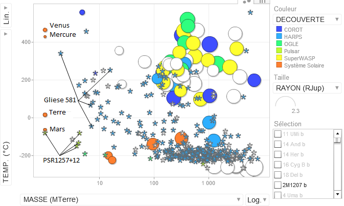

Les [32 nouvelles exoplanètes découvertes](http://www.alphagalileo.org/ViewItem.aspx?ItemId=62066&CultureCode=fr) récemment portent à plus de 400 le nombre de planètes découvertes autour d'autres étoiles que notre Soleil, assez pour commencer quelques statistiques et faire le point sur les progrès rapides  en [planétologie](https://fr.wikipedia.org/wiki/planétologie).

Le site [exoplanet.eu](http://exoplanet.eu/) fournit les caractéristiques mesurées des exoplanètes connues et de leurs étoiles. J'ai complété ces données sur [ce tableau](https://www.google.com/accounts/ServiceLogin?service=wise&passive=1209600&continue=https://spreadsheets.google.com/ccc?key%3D0Al_D4zS2T4QodFRYZkJUN3ItTmhZdllIMUdGRXIwMWc%26hl%3Den%26pref%3D2&followup=https://spreadsheets.google.com/ccc?key%3D0Al_D4zS2T4QodFRYZkJUN3ItTmhZdllIMUdGRXIwMWc%26hl%3Den%26pref%3D2&hl=en)\* en y ajoutant:

- les planètes du système solaire pour comparaison
- les périodes de révolution ou demi grand axe manquants en utilisant la [3ème loi de Kepler](http://www.astrosurf.com/luxorion/zone-habitable-geante.htm)
- une estimation de la température de surface en utilisant la [formule trouvée ici](http://www.astrosurf.com/luxorion/zone-habitable-geante.htm)¹

Le graphique ci-dessous représente la masse et la température de toutes les planètes connues, ainsi que leur taille lorsqu'elle est connue.

La plupart des exoplanètes connues sont de la masse de notre Jupiter (le plus gros point orange le plus à droite) ou bien plus grosses encore. Celles découvertes en premier sont les "Jupiter chaudes" en haut du graphique, et plus récemment on a découvert les nombreuses "Jupiter froides" du bas, ainsi qu'une vingtaine de planètes orbitant dans la "[zone habitable](https://fr.wikipedia.org/wiki/zone_habitable)" où la vie serait envisageable.

Mais aucune qui ressemble à la Terre.

En fait, le problème vient de la précision encore insuffisante des méthodes et instruments de détection.

### La [méthode des vitesses radiales](https://fr.wikipedia.org/wiki/méthode_des_vitesses_radiales).

C'est la plus performante jusqu'ici. Appelée aussi "spectroscopie Doppler", cette méthode consiste à mesurer les variations de vitesse de l'étoile qui oscille un peu sous l'effet de l'attraction de ses planètes en mesurant le décalage spectral de la lumière de l'étoile:



En 1995, la première planète extra-solaire [51 Pegasi b](https://fr.wikipedia.org/wiki/51_Pegasi_b) a été découverte par [Michel Mayor](https://fr.wikipedia.org/wiki/Michel_Mayor) et [Didier Queloz](https://fr.wikipedia.org/wiki/Didier_Queloz) de l'Observatoire de Genève à partir de ces mesures des variations de la vitesse de l'étoile :



En tournant en 4 jours seulement autour de son étoile alors que sa masse est la moitié de celle de Jupiter, 51 Pegasi b  fait varier la vitesse de son étoile de ±60 m/s, et en 1995 on était capables de mesurer ceci avec une précision de l'ordre de  ±8 m/s.

Aujourd'hui, l'instrument [HARPS](http://www.eso.org/sci/facilities/lasilla/instruments/harps/index.html)² permet des mesures de vitesses avec une précision de ±1 m/s, soit ±3.6 km/h. On peut littéralement voir une étoile se promener à pied !  Mais ce n'est pas suffisant pour voir une Terre, il faudrait encore augmenter la précision de la mesure d'un facteur 10 au moins.

### La [méthode des transits](https://fr.wikipedia.org/wiki/Transit_astronomique)

Cette technique est théoriquement capable de détecter aujourd'hui des planètes de la taille de la Terre, mais seulement si leur orbite les conduit par chance exactement sur l'axe entre nous et l'étoile. Des instruments comme [SuperWASP](https://fr.wikipedia.org/wiki/SuperWASP) ou le récent satellite [Corot](http://sci.esa.int/science-e/www/area/index.cfm?fareaid=39) sont  capables de mesurer la minuscule éclipse qui se produit alors, et de déterminer ainsi le diamètre de la planète, une information que ne fournit pas la vitesse radiale. En février 2009, Corot a ainsi détecté [CoRoT-7b](https://fr.wikipedia.org/wiki/CoRoT-7b), une planète de 5 masses solaires seulement, un record...



Mais deux mois plus tard, HARPS reprend la tête de la course avec la découverte de [Gliese 581 e](https://fr.wikipedia.org/wiki/Gliese_581_e), qui ne fait que 2 masses terrestres, mais orbite extrêmement près de [Gliese 581](http://media4.obspm.fr/exoplanetes/base/systeme.php?etoile=Gl+581), une étoile 3x plus légère que le Soleil et très peu lumineuse. HARPS y a découvert [4 petites planètes](http://media4.obspm.fr/exoplanetes/base/systeme.php?etoile=Gl+581), dont 2 traversent la zone habitable.

Aujourd'hui et demain, de [nombreuses expériences](http://exoplanet.eu/searches.php) exploite(ro)nt ces deux méthodes et d'autres plus spéciales pour détecter des planètes de plus en plus petites.

Parmi ces "méthodes spéciales", l'une mérite d'être citée ici car elle a permis la détection de petites exoplanètes en 1992 déjà, 3 ans avant la découverte de Pegase 51b par mes compatriotes. Il s'agit de l'étude par [Alexander Wolszczan](https://fr.wikipedia.org/wiki/Alexander_Wolszczan) du pulsar  [PSR B1257+12](https://fr.wikipedia.org/wiki/PSR_B1257+12). Ce minuscule résidu de supernova  tourne sur lui-même en 6.219 millisecondes, émettant un signal radio d'une régularité qui devrait être parfaite, mais se trouve perturbé par 4 ou 5 planètes, dont [une de la taille de la Lune](http://www.extrasolar.net/planettour.asp?StarCatId=&PlanetId=26).



Il ne fait pas bon vivre à proximité d'un pulsar, mais PSR B1257+12 nous indique que des planètes se forment partout, et qu'avec un peu de chance et beaucoup d'astuce, on pourra très bientôt découvrir des Terres lointaines. Et elles seront probablement nombreuses : aujourd'hui on estime que 20% des étoiles au moins ont des planètes. Certains chercheurs pensent que ce pourcentage pourrait être de 60% pour les étoiles comparables au Soleil, et il y en a beaucoup.

Parallèlement, on commence à identifier les caractéristiques chimiques des étoiles à planètes, par exemple leur [teneur en lithium](http://www.lecosmographe.com/blog/?p=1575). On pourra ainsi mieux cibler la recherche de planètes, et établir des statistiques à l'échelle de la Galaxie.  Très bientôt, on connaîtra enfin un facteur de plus de l'[équation de Drake](https://fr.wikipedia.org/wiki/équation_de_Drake).

### Références:

1. [La vie autour des étoiles géantes rouges](http://www.astrosurf.com/luxorion/zone-habitable-geante.htm) sur Astrosurf
2. [HARPS High Accuracy Radial velocity for Planetary Search](http://www.astrosurf.com/rondi/harps/harps.htm) sur Astrosurf (article très complet)

Note\* : mon tableau n'a aucune prétention scientifique, je n'ai fait que remplir les cases vides de celui de [exoplanet.eu](http://exoplanet.eu/) pour produire le graphique. En particulier les températures de surface sont très hypothétiques.
