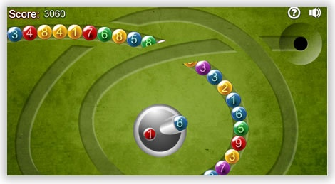
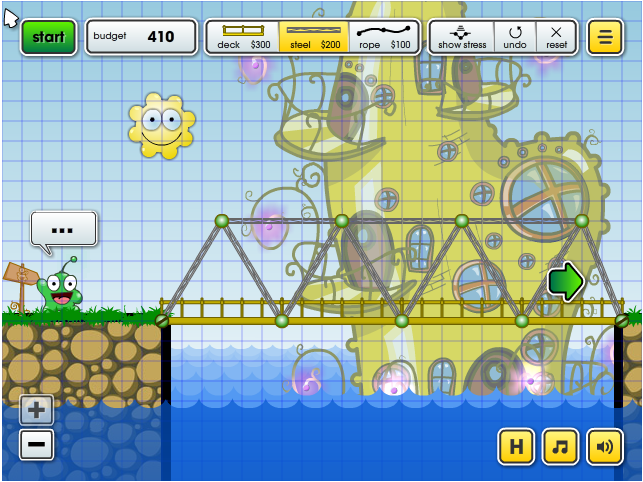
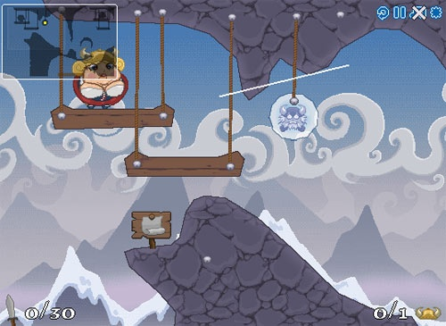
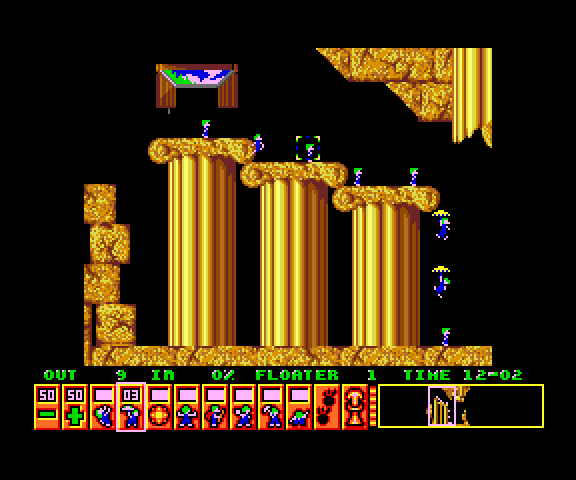
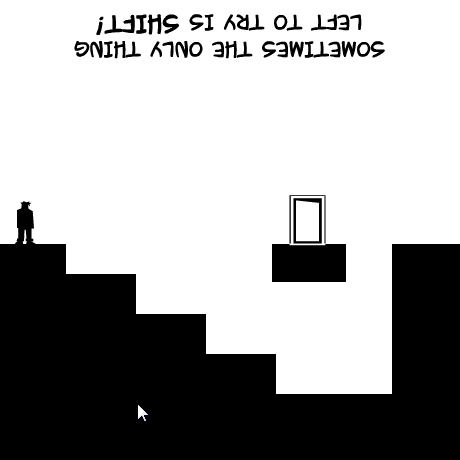

Bientôt Noël... Un peu de temps à tuer ou des jeunes à occuper intelligemment quelques heures ? Explorez les petits jeux gratuits découverts sur le web.

### Un peu  de [Math Lines](http://www.coolmath-games.com/0-math-lines)

Le canon tire des billes portant des chiffres qui s'insèrent dans un petit train roulant inéluctablement vers le trou de la défaite. Lorsque deux billes en contact forment une somme de 10, elles disparaissent. Simple ? Essayez... Puis tentez de créer des réactions en chaine pour marquer plus de points.

### Un peu de Physique: [BridgeCraft](http://picasogames.com/games/bridgecraft/) et [IceBreaker](http://www.nitrome.com/games/icebreaker/)

Ne vous fiez pas au look enfantin de [BridgeCraft](http://picasogames.com/games/bridgecraft/) pour en conclure qu'ils s'adresse aux tout petits. Construire un pont, même virtuel, exige d'avoir quelques connaissances... ou de les acquérir par l'expérience.

Les casse-têtes mécaniques d' [IceBreaker](http://www.nitrome.com/games/icebreaker/) se résolvent à coup de sabre virtuel, en tranchant des cordes et des blocs de glace. Addictif et marrant.

### Un peu de nostalgie : les Lemmings

Je vous parle d'un temps que les moins de vingt ans ne peuvent pas connaître, mais devraient : le temps des [Lemmings](w:), un des jeux les plus géniaux de l'histoire. On peut jouer en ligne à la version quasi originale [ici](http://www.elizium.nu/scripts/lemmings/). D'accord, le graphisme est d'époque, mais le challenge reste actuel : amener des hordes de bestioles suicidaires à la porte du salut.

(En fait c'est un [peu limite côté légal](http://crisp.home.xs4all.nl/lemmings/lemmings.html), mais la performance vaut un coup de chapeau : réécrire le [code en Javascript](http://crisp.home.xs4all.nl/lemmings/lemmings.zip) ...)

### Beaucoup d'originalité : [Shift](http://armorgames.com/play/751/shift)

Ce jeu de plateforme en noir et blanc est l'un de mes préférés. A chaque pression de la touche \[Shift\], un renversement de situation total permet de progresser vers la porte de sortie, ou de tomber dans un piège fatal. Un jeu absolument excellent.

Une fois que vous aurez fini Shift, vous pourrez vous attaquer à [Shift 2](http://armorgames.com/play/964/shift-2), [Shift 3](http://armorgames.com/play/1846/shift-3), [Shift 4](http://armorgames.com/play/3810/shift-4), ... Il existe aussi sur Android, iPhone et facebook

Dans le genre jeu de plateforme revisité, il y a aussi l'excellent [Continuity](http://www.koreus.com/jeu/continuity.html) que je viens de découvrir [grâce à Sirtin](http://www.sirtin.fr/2009/12/17/continuity/). Dès que j'ai fini cet article, j'y retourne!

En fait, pour finir plus vite, je colle ci-dessous un vieux brouillon d'article que j'avais commencé sur...

### [Gimme Friction Baby](http://www.addictinggames.com/puzzle-games/gimmefrictionbaby.jsp)

Encore un jeu en noir/blanc au look des années 70, et en plus tellement simple que j'hésite à le qualifier d' "intelligent". Il suffit de cliquer au bon moment pour qu'un canon oscillant régulièrement tire un boulet qui s'immobilise après quelques rebonds et enfle alors jusqu'à toucher un boulet voisin ou le cadre de jeu. Chaque boulet est initialement marqué du chiffre 3, chiffre qui se décrémente à chaque choc avec un boulet en mouvement. Heurté 3 fois, le boulet disparait et le joueur marque un point. Si le boulet rebondit en bas de l'écran, on a perdu.

 _(video un peu barbante : [jouez](http://www.addictinggames.com/puzzle-games/gimmefrictionbaby.jsp), ce sera plus clair)_

Ça à l'air tout bête, mais il s'avère extrêmement difficile de marquer plus de 10 points. Après des heures passées sur [Friction Mobile](http://www.cyrket.com/asset/-7975233236161029989), la version pour [mon téléphone Androïd](http://microclub.ch/2009/06/21/mon-google-phone-htc-magic/), mon record est de 17 points, assez loin des 37 points nécessaires pour figurer dans le Top25 des meilleures scores sur internet et très loin du record de 62 points détenu par CBC...

La difficulté du jeu tient essentiellement à la difficulté de prévoir les rebonds du boulet contre les autres : comme le savent les joueurs de billard, on peut assurer le résultat d'un choc entre 2 billes, en risquer un second, mais à partir de 3 on entre dans le royaume du chaos.

Pour visualiser ceci, j'ai utilisé pour la première fois [GeoGebra](http://www.geogebra.org/cms/) pour montrer les rebonds possibles d'une toute petite balle qui rebondirait entre 2 grosses en fonction de l'angle de tir :



[Gimme Friction Baby](http://www.addictinggames.com/puzzle-games/gimmefrictionbaby.jsp) est un jeu qui cache son jeu : en le prenant comme un jeu d'adresse, vous n'avez aucune chance de faire un bon score. C'est un jeu de minimisation des risques. Il ne faut absolument pas tirer une bille qui ait le moindre risque de revenir derrière la ligne, et éviter à tout prix de boucher un angle de tir "sur" futur. C'est à l'usage qu'on s'aperçoit que Gimme Friction est un jeu de stratégie redoutable.

### Sources de jeux intelligents

1. [http://www.mathplayground.com](http://www.mathplayground.com/)
2. la rubrique ["vendredi" du Techno-Blogue à Steph](http://www.stephguerin.com/category/vendredi/)
3. [Fun-Motion](http://www.fun-motion.com/), le blog des jeux basés sur la physique
