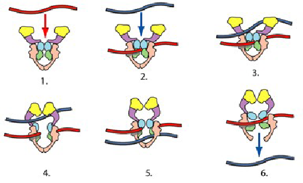

Excellente présentation vendredi passé au [Microclub](http://microclub.ch/) [[1]](#ref-1) par Sandor Kasas, du [Laboratoire de Physique de la Matière Vivante](http://lpmv.epfl.ch/) (LPMV) de l'EPFL. Il nous a expliqué comment les microscopes à force atomique permettent d'observer, de filmer voire de palper les "briques de la vie" (protéines, enzymes, ADN) en plein action.

Il a commencé par nous expliquer comment fonctionne un [microscope à force atomique](w:), AFM pour les intimes. C'est une évolution du [microscope à effet tunnel](w:) (STM) inventé (en Suisse) en 1981 par [Gerd Binnig](w: "Gerd Binnig") et [Heinrich Rohrer](w: "Heinrich Rohrer"). Ils ont obtenu pour ça le prix Nobel 5 ans plus tard seulement (un record récemment battu par Obama).

Le principe du STM consiste à promener une pointe ultra fine au dessus d'une surface à observer, et à mesurer le "courant tunnel" produit par les électrons passant de l'échantillon à la pointe, ce qui permet de mesurer la distance entre les deux et de produire des images avec une résolution sub atomique. Plus fort encore : en appliquant une plus forte tension entre la pointe et l'échantillon, on parvient à coller un atome à la pointe, puis aller le déposer à un endroit précis, pour réaliser des choses incroyables comme celle-ci:

{{< figure src="./images/30eab8ab5cc6b1ffeb9aa2eef60c0886.gif" alt="cercle de 48 atomes de fer déposés sur du cuivre. Diamètre = 14 nanomètres. les vagues au centre sont produites par la superposition des fonctions donde des atomes, preuve que la mécanique quantique nexiste pas que dans les livres." caption="cercle de 48 atomes de fer déposés sur du cuivre chez IBM. Diamètre = 14 nanomètres. les vagues au centre sont produites par la superposition des fonctions d" link="https://web.archive.org/web/20100107181627/http://www.almaden.ibm.com/vis/stm/stm.html" align="aligncenter" width="400" >}}

Le STM souffre toutefois de quelques limitations: il ne fonctionne que dans un vide très poussé, avec des échantillons conducteurs d'électricité refroidis bien en dessous de 0°C.



Ces inconvénients n'existe pas avec l'AFM, qui "palpe" la surface en mesurant avec un laser la nanométrique flexion  d'une minuscule poutre portant la pointe, sous l'effet combiné des [forces  de Van der Waals](w:Forces_de_Van_der_Waals) (attractive) et électrostatique (répulsive). Avec un AFM, on peut observer des échantillons dans l'eau, à température ambiante. On peut observer de la matière vivante !

Sandor Kasas nous a ainsi montré de spectaculaires images de brins d'ADN  comme celle-ci, qui sera expliquée en détail plus bas:



Mieux encore : on arrive à  appliquer des forces très précises sur l'échantillon, en appuyant les quelques atomes de l'extrémité de la pointe dessus.  Après avoir déposé  des [microtubules](w:Microtubule) sur un substrat percé, l'équipe du LPMV est ainsi parvenue à mesurer les modules d'élasticité et de cisaillement de ces constituants de la paroi cellulaire [[2]](#ref-2)!



Plus fort encore : l'AFM permet de mesurer la force avec laquelle des protéines se lient entre elles, et de mieux comprendre des phénomènes biochimiques inaccessibles jusqu'ici. Sandor Kasas nous a ainsi présenté une étude sur le "complexe snare" , la membrane cellulaire du bout des axones où les neurotransmetteurs sont libérés pour transmettre l'influx nerveux entre les neurones. En mesurant les forces d'adhésion entre les protéines syntaxin 1 (_sx1_), SNAP-25 (_S25_) et VAMP 2 (_V2_), les chercheurs sont parvenus à  comprendre comment elles étaient agencées et comment  la [toxine du tetanos (TeTx)](w:Tétanospasmine) perturbe le fonctionnement de ces protéines. [[3]](#ref-3) Wow !

Mais la recherche qui m'a le plus excité est celle qui a produit les images d'ADN plus haut. L'ADN est une très longue molécule : chacune de nos cellules en contient environ 1 mètre, super enroulée en une minuscule pelote, ce qui cause inévitablement des noeuds. Mais des "têtes de lecture" se promènent le long des brins d'ADN pour les décoder ou les [répliquer](/2008/01/06/replication-de-ladn/), et les noeuds risquent de bloquer ce mécanisme vital.

Heureusement, il y a la [topoisomérase II](w:ADN_topoïsomérase). C'est la présence de cette enzyme qui permet à la pelote de la première photo de se dénouer complètement en un petit quart d'heure. On n'est pas encore certains de comment elle fait, mais les chercheurs du LPMV aimeraient bien poursuivre leurs travaux [[4]](#ref-4) et prouver qu'elle triche en coupant un brin et en le raccommodant après avoir croisé l'autre! Un [éviteur d'axe](/2005/12/29/eviteur-daxe/) biologique ! incroyable, non ?

Cette présentation fait partie des 10 meilleures auxquelles j'aie assisté, toutes catégories confondues. Merveilleusement multidisciplinaire, on naviguait en toute confiance entre mécanique quantique et biologie, entre chimie, optique et dynamique. Un régal. Merci Dr. Kasas !

### Références:

1. S Kasas, "[Presentation Microclub 2009](/wp-content/uploads/2009/10/Presentation-Microclub-2009.pdf)", (pdf des slides avec encore plus d'images)
2. A Yersin et al "[Interactions between synaptic vesicle fusion proteins explored by atomic force microscopy](https://web.archive.org/web/20180602182228/http://www.pnas.org/content/100/15/8736)", Proceedings of the National Academy of Sciences (PNAS), July 22, 2003 vol. 100 no. 15, p 8736-8741
3. A. Kis, S. Kasas et al "Nanomechanics of Microtubules", Physical Review Letter, 2002, Vol. 89, Nr 24
4. Erika Ercolini "Scaling Properties of DNA Knots Studied by Atomic Force Microscopy", EPFL [Thèse No 4041](http://library.epfl.ch/theses/?nr=4041), 2008
