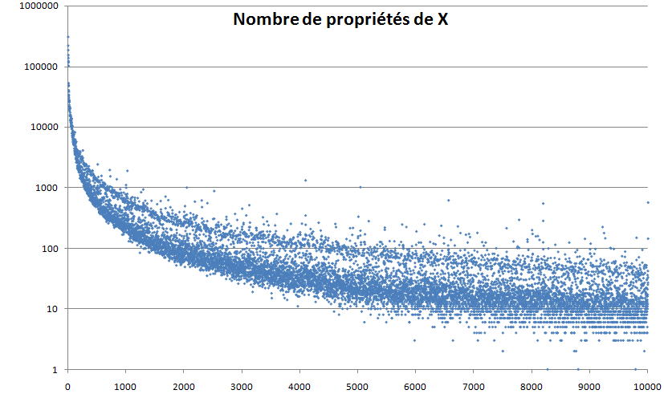
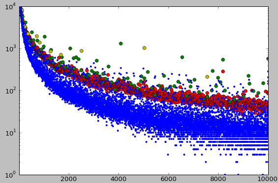



Après mon article sur les [nombres acratopèges](/2008/08/24/nombres-acratopeges/), j'avais contacté [Jean-Paul Delahaye](w:) pour lui demander si quelqu'un avait déjà étudié ce sujet. Il m'avait répondu qu'à sa connaissance ce n'était pas le cas, et trouvait étrange de rechercher les nombres ayant peu de propriétés plutôt que ceux en ayant beaucoup. Mais mon idée d'utiliser la [base de données](http://oeis.org/Seis.html) de l'[Encyclopédie en ligne des suites de nombres entiers](http://oeis.org/Seis.html) pour mesurer l'intérêt des nombres l'a séduit et les résultats de la petite collaboration qui s'en est suivie figurent dans l'article "Mille collections de nombres" de Jean-Paul Delahaye qui vient paraitre dans "Pour la Science" \[1\].

A l'aide de quelques lignes de Python, j'ai créé une [feuille Excel](http://www.box.net/shared/3yefxar19b) donnant le nombre de propriétés connues des nombres de 2 à 65536\*, que j'appelle "minéralisation" par analogie avec les eaux minérales riches en ions supposés apporter bienfaits et saveur comparativement à une eau "plate", voire "acratopège", sans propriété particulière.

En réalisant un simple graphique de la minéralisation, j'ai remarqué un phénomène très intriguant : le graphique  présente deux bandes distinctes, nettement visibles à tous les ordres de grandeur :

Autrement dit, les nombres entiers se divisent assez clairement en 2 groupes : les nombres "intéressants" et les nombres "inintéressants". Il y a étonnament peu de nombres moyennement intéressants. L'article de Delahaye se termine par un appel à expliquer ce phénomène.

J'ai un peu profité de ma longueur d'avance en demandant à Python de colorier sur le nuage de points les nombres appartenant à quelques séries particulières :

- les nombres premiers en rouge,
- les nombres de la forme an en vert,
- les nombres ayant plus de diviseurs que n'importe quel nombre inférieur en jaune :

Bingo ! On voit que ces nombres recouvrent la quasi totalité des nombres particulièrement minéralisés, ou intéressants.

Il me semble que la bande claire entre les nombres fortement minéralisés et les nombres "plats" pourrait résulter du fait que de nombreuses suites de l'encyclopédie de Sloane sont définies par combinaison de critères. Par exemple si on [cherche "2,3,5,7,11,13,17"](http://oeis.org/), on ne trouvera pas seulement les nombres premiers, mais aussi:

- les nombres de Chen : les nombres premiers  p tels que p + 2 est soit premier soit semipremier
- les nombres premiers palindromiques : en inversant leur chiffres, ils sont toujours premiers
- les nombres n tels que n et 6n+1 sont premiers
- et encore 120 autres propriétés combinant la primalité avec d'autres propriétés.

De ce fait, les nombres premiers ont des chances d'être aussi présents dans ces nombreuses autres séries, alors que les nombres composés n'en ont aucune. Le même raisonnement vaut pour les nombres ayant beaucoup de diviseurs ([1, 2, 4, 6, 12, 24, 36, 48, 60, 120](http://oeis.org/search?q=1%2C+2%2C+4%2C+6%2C+12%2C+24%2C+36%2C+48%2C+60%2C+120) ...) : ils vont naturellement se retrouver dans de nombreuses autres suites en tant que multiples. Pour les puissances parfaites ([1, 4, 8, 9, 16, 25, 27, 32, 36, 49, 64, 81, 100](http://oeis.org/search?q=1+4+8+9+16+25+27+32+36+49+64+81+100), ...) il me semble plus étonnant qu'elles "méritent" d'appartenir à de nombreuses propriétés dérivées, mais c'est comme ça.

Ces 3 propriétés me semblent être fondamentales, ou "minéralisantes" car à part 1,2 et 4, aucun nombre entier ne peut avoir deux de ces propriétés, ou les trois, mais les nombres qui possèdent une de ces trois propriétés sont systématiquement plus intéressants que ceux qui n'est possèdent pas. Reste à trouver une ou deux de ces propriétés de plus que partagent les nombres fortement minéralisés encore bleus dans le graphique ci-dessus.

Au vu de ce qui précède, il y a probablement quand même des choses très intéressantes à trouver parmi les nombres peu minéralisés. Existe-t-il des propriétés "déminéralisantes", telles que les nombres qui en jouissent ne peuvent qu'avoir un nombre limité d'autres propriétés ?

Note\* : 65536 est un nombre bien connu des informaticiens : 2^16 donne le nombre de codes binaires possibles sur 16 bits, et le format de fichier (.xls) d'Excel a été défini au bon vieux temps des processeurs 16 bits ...

### Référence:

1. Jean-Paul Delahaye, "[Mille collections de nombres](https://web.archive.org/web/20130612215037/http://www.pourlascience.fr/ewb_pages/f/fiche-article-mille-collections-de-nombres-21524.php)", Pour la Science N°379 - mai 2009, p 88-93 ([(fair use pdf)](/wp-content/uploads/2020/08/Mille-collections-de-nombres-.pdf)
