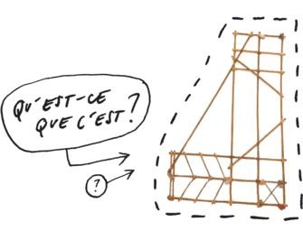
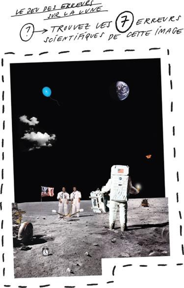
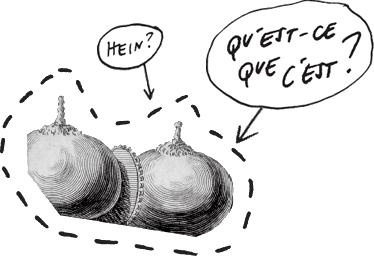

En ballade dominicale au [Signal de Bougy](http://www.signaldebougy.ch/) (un parc surplombant le Lac Léman, entre Genève et Lausanne), je suis tombé sur une excellente initiative : le "Parcours Alph@" de "[Rezoscience](https://web.archive.org/web/20090705044928/http://www.rezoscience.ch/rp/index.html)".

Rezoscience est le "Réseau Romand Science&Cité", une association regroupant [les universités et une trentaine de musées de Suisse Romande](https://web.archive.org/web/20090618064555/http://www.rezoscience.ch/rp/bref/membres.html). Elle coordonne un [agenda de manifestations](https://web.archive.org/web/20091209052112/http://www.rezoscience.ch/rp/agenda.html?locale=fr), des [activités pour enfants](https://web.archive.org/web/20090627060546/http://www.rezoscience.ch/rp/enfants/activ.html). Le site web est un peu "statique" et  mériterait un lifting 2.0 (des flux RSS svp !) car on y trouve beaucoup de contenu intéressant qui devrait être mieux mis en valeur, comme l'espace [questions](https://web.archive.org/web/20090922062438/http://www.rezoscience.ch/rp/questions.html).

Les "[Parcours Alph@](https://web.archive.org/web/20090429191603/http://www.rezoscience.ch/rp/parcours-alpha.html)" sont une vraiment bonne idée : avec Madame G. et nos deux adolescentes, nous avons passé un bon moment à nous triturer les neurones et à apprendre des choses intéressantes avec [les 16 panneaux de "Matière à réflexion"](https://web.archive.org/web/20090429195614/http://www.rezoscience.ch/rp/parcours-alpha/matieres.html) que vous pouvez [consulter en ligne](https://web.archive.org/web/20090429195614/http://www.rezoscience.ch/rp/parcours-alpha/matieres.html). Les thèmes abordés sont variés, tous intéressants et favorisent plutôt la réflexion que les connaissances, ce qui permet aux plus jeunes de ne pas être frustrés.

Mon poster préféré est celui là :

La [réponse est vraiment étonnante..](https://web.archive.org/web/20071027124211/http://www.rezoscience.ch/rp/parcours-alpha/matieres/p02/complem.html). Un autre panneau nous a retenu assez longtemps:

On voit bien des choses étonnantes sur cette photo, mais à mon humble avis certaines [explications de la solution](https://web.archive.org/web/20091208015200/http://www.rezoscience.ch/rp/parcours-alpha/matieres/p13/reponse.html) sont discutables:

- Le drapeau ne [flotte pas plus au vent](https://web.archive.org/web/20091004114145/http://www.rue89.com/2009/07/20/pourquoi-le-drapeau-dapollo-flottait-il-sans-vent-sur-la-lune) que sur la photo originale de la mission Apollo. On voit bien la tige, ce n'est donc pas une erreur.
- Pour le réveil, ok on ne peut pas l'entendre sonner dans le vide, mais on peut aussi arguer qu'il n'y a pas d'heure sur la Lune puisqu'elle ne tourne pas sur elle-même...
- Pas sur du tout que le ballon aurait explosé. Tout dépend de la pression avec laquelle il a été gonflé. La pression dans un ballon de baudruche est d'environ 20 hectopascals supérieure à l'extérieur, donc un ballon gonflé à cette pression devrait survivre dans le vide.

On trouve aussi un peu d'auto-dérision science-fictionesque grâce à cette magnifique contribution de la [Maison d'Ailleurs](http://www.ailleurs.ch/) d'Yverdon:

J'avoue avoir voté en désespoir de cause pour "Des yeux de phocapotame" alors qu'il s'agissait de "deux globes de verre surmontant [un engin volant électrique](https://web.archive.org/web/20091209052123/http://www.rezoscience.ch/rp/parcours-alpha/matieres/p04/reponse.html)", plus [visible ici](https://web.archive.org/web/20100717193307/http://blogs.princeton.edu/rarebooks/phil.JPG) et dont le principe de fonctionnement me parait décidément très nébuleux...

J'espère que rezoscience continuera à proposer des "parcours alph@", ou mieux encore, que cette excellente idée soit reprise un peu partout pour stimuler les neurones scientifiques des promeneurs. Bravo !
