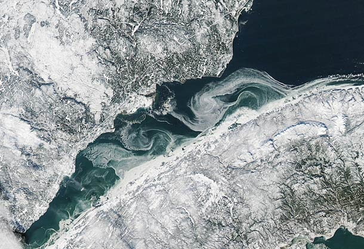

A l'origine de cet article il y a cette photo : [Publiée sur Bad Astronomy](https://web.archive.org/web/20100127124822/http://blogs.discovermagazine.com/badastronomy/2010/01/20/fleuve-avec-glace-de-lespace/), on y voit la glace en train de se former en janvier sur l'estuaire du Saint-Laurent au Québec, une merveilleuse région à visiter. Mais on y distingue aussi, et mieux encore sur [la photo complète](https://web.archive.org/web/20150915063321/http://eoimages.gsfc.nasa.gov/images/imagerecords/42000/42329/StLawrenceRiver_AMO_2010017_lrg.jpg), des lignes blanches bien droites taillées dans la forêt (la plus visible part du bord de mer en haut de la photo et descend vers le sud-ouest). Autoroutes visibles depuis l'espace ? Oui, mais pas destinées aux "chars" de nos trop peu nombreux amis francophones éparpillés dans cette vaste contrée.

Ce sont des autoroutes à électrons, des lignes à très haute tension parmi les plus puissantes du monde.  [Hydro-Québec](w:) possède plus de [11'000 km de lignes à 735 kV et 765 kV](https://web.archive.org/web/20120827000219/http://www.hydroquebec.com/transenergie/fr/reseau-bref.html), qui ont transporté en 2008 près de 192 TWh d'électricité renouvelable 100% propre vers les villes des Grands Lacs. Même New York reçoit de l'énergie des nombreux barrages hydro-électriques québécois comme Manic-5, dont le lac remplit  [le cratère de Manicouagan](/2009/04/16/de-manicouagan-a-rochechouart/).

Pourquoi de telles installations ?

Selon l'équation bien connue W=U.I : la puissance (en watts) est égale au produit de la tension (en volts) par le courant (en ampères). Pour transporter une puissance donnée, on pourrait a priori soit faire de la haute tension, soit du "haut courant" à basse tension. Mais selon l'autre équation bien connue, la Loi d'Ohm U=R.I, la "résistance" des fils R (en ohms)  s'oppose au passage du courant I en créant une chute de tension U, et en dégageant une puissance P=R.I² sous forme de chaleur, par effet Joule. Pour réduire les pertes, il faut donc réduire R, mais surtout réduire le courant I en augmentant la tension. Depuis quelques années il existe au Japon, en Chine et même en Italie des lignes fonctionnant à plus d'un million de volts. Pour la même raison, il est souvent plus avantageux de construire 2 lignes à haute tension parallèles : en fonctionnant chacune avec la moitié du courant, les pertes sont divisées par 4.

Cependant, la distance d'isolation entre les conducteurs dépend directement de U, et la très haute tension oblige donc à construire des pylônes énormes, et à écarter les lignes les unes des autres. Je n'ai pas retrouvé les dimensions exactes, mais j'ai vu au Québec 3 lignes parallèles dans une coupe déboisée sur environ 100m de large. C'est visible de l'espace...



L'isolation est l'obstacle principal à l'enfouissement des lignes. Pour la basse et moyenne tension, l'isolation par une gaine plastique suffit et est même meilleure que celle des lignes aériennes. Mais pour la très haute tension, l'air est un excellent isolant, et bon marché. Actuellement, les lignes souterraines et sous marines les plus puissantes fonctionnent à 450 kV "seulement" et coûtent environ 10x plus cher qu'une ligne aérienne équivalente. La plupart sont des "[HVDC](w:)", fonctionnant en courant continu, qui nécessite d'impressionnantes installations d'électronique de puissance aux extrémités pour convertir le courant [triphasé](w:) des réseaux en continu et vice-versa, moyennant quelques pertes supplémentaires. Le sommet de la technologie actuelle est le "[NorNed](w:)" de 580 km sous la Mer du Nord qui transmet 700 MW des barrages norvégiens aux Pays-Bas ou des centrales au charbon hollandais vers Oslo.

L'autre voie pour réduire les pertes de transport consiste à diminuer la résistance R des conducteurs. Les 4 meilleurs conducteurs d'électricité sont l'argent ([résisitivité](w:) de 14.7  nano-Ohm\*Mètre) , le cuivre (17.2), l'or (24.4) et l'aluminium (28.2). Lequel choisiriez-vous pour en suspendre des tonnes dans la nature ? Gagné : les lignes sont en aluminium. En toronnant plusieurs brins d'aluminium autour d'un câble d'acier, on obtient simultanément la résistance mécanique nécessaire et on contourne une difficulté : "l'[effet de peau](w:)". Pour conduire beaucoup de courant, il faut en principe des conducteurs de forte section, mais avec le courant alternatif, le courant ne circule que sous les premiers millimètres de la surface : il vaut donc mieux utiliser beaucoup de conducteurs de faible section plutôt qu'un gros. A l'inverse, l'[effet corona](w:) produit des grésillements audibles et des perturbations électromagnétiques autour des conducteurs à haute tension de petit diamètre. Pour minimiser cet effet, on groupe 2 à 4 câbles en parallèle pour conduire une même phase, l'ensemble se comportant comme un seul câble de fort diamètre.

Toutes ces mesures techniques permettent aujourd'hui d'obtenir des lignes d'une puissance de 1GW (la production d'un gros barrage ou d'une centrale nucléaire) dont la résistance ne vaut que 0.01 Ohm par kilomètre !  Une ligne d' 1GW à 765 kV conduisant environ 300 ampères de [valeur efficace](w:courant_efficace) par phase, elle ne dissipe que 3x300²=270 kW par effet Joule sur 100 km, soit 0.027% de la puissance transportée.

Les fournisseurs d'électricité comme Hydro-Québec ou EDF annoncent des pertes totales de l'ordre de 5% de leur production, mais le transport à longue distance de l'énergie n'en représente qu'une toute petite part. C'est paradoxalement les derniers kilomètres qui approvisionnent les consommateurs à moyenne et basse tension qui génèrent la grande majorité des pertes.

Les très faibles pertes du transport à longue distance ont quelques conséquences intéressantes:

1. ce n'est pas demain qu'on verra se généraliser les lignes à supraconducteurs. Actuellement il n'existe qu'un seul câble supraconducteur transportant environ 500MW sur 600m  à New-York, fabriqué par [American Supraconductor](w:). Son refroidissement à l'hélium liquide consomme plus d'énergie que ce  que perdrait un câble normal...
2. Une installation solaire donnée produirait environ 10% de plus d'énergie si on la déplaçait de 100 km plus au sud (voir la [carte](/2007/08/26/energie-eolienne-et-solaire-a-prix-coutant/)) et qu'une éolienne donnée produit environ 10% en la plaçant 100 km plus au nord (voir l'autre [carte](/2007/08/26/energie-eolienne-et-solaire-a-prix-coutant/)). Or les pertes de transport sont largement inférieures à ces gains : plutôt que de produire de l'énergie renouvelable à un endroit peu adapté, il est plus économique et rationnel d'acheter du courant éolien de la Mer du Nord, ou de l'électricité solaire espagnole en attendant celle du Sahara. Et faire de l'hydroélectrique là où il y a de l'eau, même si c'est très loin,  comme le fait très bien Hydro-Québec.

### Sources:

1. "[lignes à haute tension](w:)" sur Wikipedia
2. "[Hydro-Québec](w:)" sur Wikipédia
3. "[MÉTHODOLOGIE DE CALCUL DU TAUX DE PERTES DE TRANSPORT](https://web.archive.org/web/20080214075604/http://www.regie-energie.qc.ca/audiences/3401-98/Req-revisee/Hqt-10/HQT10_Document3.PDF)", Document Hydro-Québec
4. "[Le transport du courant électrique](http://www.leseoliennes.be/economieolien/transportcourant.htm)" du groupe d'information sur les éoliennes (un peu polémique, mais très bien documenté)
